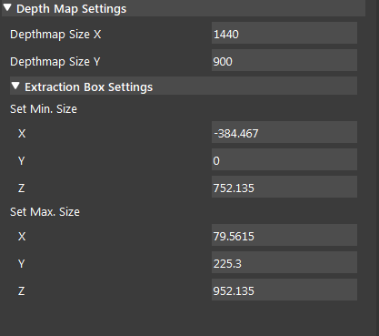

Da DepthNCloud Conv Node 
========================

Overview
-----------------

Generate calibrated depth map image from point cloud, or generate point cloud from calibrated depth map. 
Generally used when we need a calibrated depth image from point cloud to do 3d searching in node such as 3d mod_finder, metrology node, measurement node.  


Input and Output
-----------------

+----------------------------------------+-------------------------------+---------------------------------------------------------------------------------+
| Input                                  | Type                          | Description                                                                     |
+========================================+===============================+=================================================================================+
| Object                                 | Point Cloud                   | The point cloud data used to convert into depth map.                            |
+----------------------------------------+-------------------------------+---------------------------------------------------------------------------------+


+-------------------------+-------------------+----------------------------------------------------------------------------+
| Output                  | Type              | Description                                                                |
+=========================+===================+============================================================================+
| 8bit_depth              | Image             | 8 bit grey scale image.                                                    |
+-------------------------+-------------------+----------------------------------------------------------------------------+
| Cloud                   | int               | The input point cloud used for depth map conversion.                       |
+-------------------------+-------------------+----------------------------------------------------------------------------+
| depth                   | Image             | 16 bit depth-image composed of 8bit grey scale image and 8-bit depth info  |
+-------------------------+-------------------+----------------------------------------------------------------------------+

Node Settings
-----------------

Depth Map Settings
~~~~~~~~~~~~~~~~~~



- **Depthmap Size X**:

   Size of the depth image x (width) dimension in pixels.

- **Depthmap Size Y**:

   Size of the depth image y (height) dimension in pixels.

Extraction Box Settings
```````````````````````

- **Set Min. Size**:

	- **X** : Bounding box minimum x value.
	- **Y** : Bounding box minimum y value.
	- **Z** : Bounding box minimum z value.

- **Set Max. Size**:

   	- **X** : Bounding box maximum x value.
	- **Y** : Bounding box maximum x value.
	- **Z** : Bounding box maximum x value.

Procedure to use
-----------------

1. Right click insert node and insert a Da DepthNCloud Conv node
	.. image:: images/da_cloudNdepth_conv/node_steps_1.png
		:scale: 50%

2. Link the source input to an appropriate node (eg. camera & cloud process node).
	.. image:: images/da_cloudNdepth_conv/node_steps_2.png
		:scale: 60%

3. Run the node and select a bounding box region that captures the area of interest.
	.. image:: images/da_cloudNdepth_conv/node_steps_3.png
		:scale: 60%

4. If you see the following result which contains visible grid lines, you need to adjust the Depthmap Size X & Y dimensions to downsample your image until there are no visible grid lines.
	.. image:: images/da_cloudNdepth_conv/node_steps_4_1.png
		:scale: 50%
	.. image:: images/da_cloudNdepth_conv/node_steps_4_2.png
		:scale: 50%


Exercise
--------

Try to come up with the setting on **Da DepthNCloud Conv** node according to the requirements below. You can work on these exercise with the help of this article. We also have answers attached at the end of this exercise.

This is some helpful resource when you are working on the exercise:

Scenario 1
~~~~~~~~~~

There is a project which requires the robot to pick all the occurrences of the T-tube in scene. 
Your colleague has setup the 3D camera and robot in the lab for experiment. 
Here's a `link to .dcf file <https://daoairoboticsinc-my.sharepoint.com/:u:/g/personal/tzhang_daoai_com/EUaL8LFp-JlJugrB-VYSCr8BODvs7cyJszjIywupMCNDDg?e=XCPFjb>`_ which are used as camera input.

You need to help him setup the **Da DepthNCloud Conv** node in main_flowchart. Please choose the all correct answers from the options:

1. You are given a worskpace that has the camera and Da DepthNCloud Conv node set up, but you find that the result of Da DepthNCloud Conv is strange, as image below. How should you fix this?
	.. image:: images/da_cloudNdepth_conv/node_exercise.png
		:scale: 50%

	A. Increase the X Y value in Extraction Box settings/ Set Min. Size.
	B. Decrease the X Y value in Extraction Box settings/ Set Max. Size.
	C. Decrease the X Y value in Deptmap Size X/Y. 
	D. Increase the X Y value in Deptmap Size X/Y. 

Answers for Excercises
~~~~~~~~~~~~~~~~~~~~~~

Scenario 1
```````````````

1. **Answer: C**
	.. image:: images/da_cloudNdepth_conv/node_answer.png
		:scale: 50%
**Explanation**: Recall in "Procedure to use" step 4, if you encouter the result containing grid lines, that means the width and height of the depthmap is too high.
Should reduce them accordingly to remove the gridlines.


