Measurement Node 
==================

Overview
--------------------
The Measurement node is used to find and measure edge, circle, stripe on a gray image, based on differences in pixel intensities. 
User can define search region in the image to search for the three types of markers (edge, circle, or stripe) in the image.
Upon finding a marker, the node outputs the marker’s spatial reference position and measures features such as its angle and radius. 


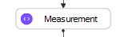

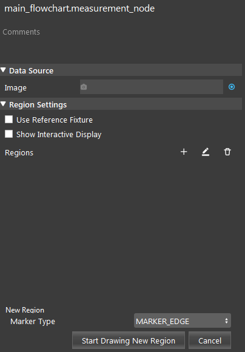

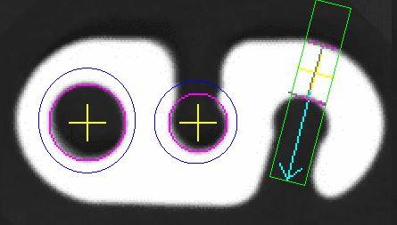

Inputs and Outputs
--------------------

+----------------------------------------+-------------------------------+---------------------------------------------------------------------------------+
| Input                                  | Type                          | Description                                                                     |
+========================================+===============================+=================================================================================+
| Image                                  | png                           | The gray image to be measured. (from Camera, Reader etc.)                       |
+----------------------------------------+-------------------------------+---------------------------------------------------------------------------------+

+-------------------------+---------------------+------------------------------------------------------------------------+
| Output                  | Type                | Description                                                            |
+=========================+=====================+========================================================================+
| results                 | MapSMeasResultData  | - Includes corresponding measurement results based on the marker type: |
|                         |                     |     - Circle Feature: radius, x, y                                     |
|                         |                     |     - Edge Feature: angle, x, y                                        | 
|                         |                     |     - Stripe Feature: angle, x, y                                      |
+-------------------------+---------------------+------------------------------------------------------------------------+

Node Settings
--------------------

Data Source
```````````````````
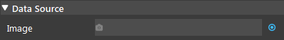

- **Image**:
     - The gray image to be measured. (from Camera, Reader etc.)

Region Settings
```````````````````
- **Use Reference Fixture**:
    - The name of the Mod Finder node to use the reference frame (optional). Please refer to :ref:`Reference Fixture System` for more information.

- **Show Interactive Display**:
    - Check this field to enable "Interactive Display" which allows editing markers on the display window.


Markers Parameters
```````````````````
There are three types of markers available: Edge, Circle, Stripe.

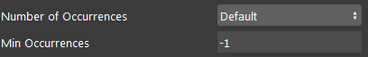

- **Number of Occurences** (Default: 1):
   The maximum number of markers to detect.

- **Min Occurances** (Default: -1):
   The minimum number of markers to detect. 

Circle Marker Fields
~~~~~~~~~~~~~~~~~~~~~~~~~

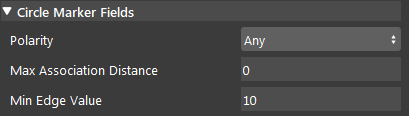

- **Polarity** (Default: Any):
   The polarity of edge to detection direction. Positive is from black to white; Negative is from white to black.

- **Max Association Distance** (Default: 0):
   The maximum distance (pixel) between a marker’s edge and its associated sub-edges during fit operation.
   For circle markers, it is measured from the circle marker center.

- **Min Edge Value** (Default: 10):
   The minimum grayscale variation threshold value for an edge.

Ring Region Fields
~~~~~~~~~~~~~~~~~~~~~~~~~

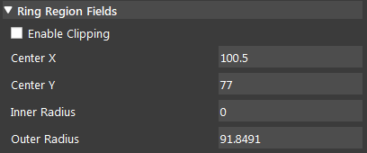

- **Enable Clipping** (Default: false):
   Apply a clipped search region to search the marker. Useful when search region includes region outside of the image.

- **Center X, Center Y**:
   Ring Region coordinates, measured from the center.

- **Inner Radius, Outer Radius**:
   Ring region dimensions.

Edge Marker Fields
~~~~~~~~~~~~~~~~~~~~~~~~~

- **Polarity** (Default: Any):
   The polarity of edge to detection direction. Positive is from black to white; Negative is from white to black.

- **Max Association Distance** (Default: 0):
   The maximum distance (pixel) between a marker’s edge and its associated sub-edges during fit operation.
   For edge markers, it is measured perpendicular from the fitted edge position, along to the search direction.

- **Min Edge Value** (Default: 2):
   The minimum grayscale variation threshold value for an edge.

Stripe Marker Fields
~~~~~~~~~~~~~~~~~~~~~~~~~

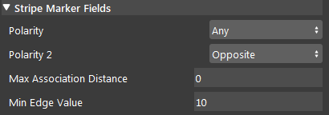

- **Polarity** (Default: Any):
   The polarity of edge to detection direction. Positive is from black to white; Negative is from white to black.

- **Polarity 2** (Default: Opposite):
   Only available for stripe markers. Decides the polarity of the second edge of stripe, related to stripe’s first edge.

- **Max Association Distance** (Default: 0):
   The maximum distance (pixel) between a marker’s edge and its associated sub-edges during fit operation.
   For stripe markers, it is measured perpendicular from the fitted edge position, along to the search direction.

- **Min Edge Value** (Default: 10):
   The minimum grayscale variation threshold value for an edge.

Box Region Fields
~~~~~~~~~~~~~~~~~~~~~~~~~

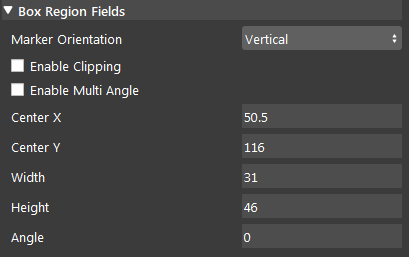

- **Marker Orientation** (Default: Vertical):
   Direction of the edge to be detected.

- **Enable Clipping** (Default: false):
   Apply a clipped search region to search the marker. Useful when search region includes region outside of the image.

- **Enable Multi Angle** (Default: false):
   Enable or disable multi-angle search. The marker that most closely matches the specified angle is returned.

- **Center X, Center Y**:
   Ring Region coordinates, measured from the center.

- **Width, Height**:
   Box region dimensions.


Procedure to Use
--------------------
We will need a few more nodes to demonstrate the usage of Measurement node.

1. Insert a Reader node. You may use the data `here <https://daoairoboticsinc-my.sharepoint.com/:u:/g/personal/xchen_daoai_com/ETnjM6E8D89FsYDUfeMeBIUBSBxAuxVoCqcmJZMgbIYKdg?e=l4fBZ3>`_. Read from this folder.


2. Insert a 2D Mod Finder node. Link the image output from Reader. Define the object as the model, this will be the reference fixture. You might want to read :ref:`Reference Fixture System` for more information. 

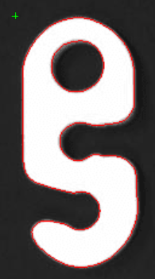

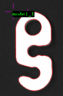

3. Insert a Measurement node. Select the Mod Finder node in step 2 as the Reference Fixture Node.

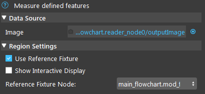

4. Enable "Show Interactive Display". Then click '+', choose a marker type, click "Start Drawing New Region" to add markers. Click "Stop Drawing New Region" after you finished drawing the marker. In this case, we will draw a Circle Marker.

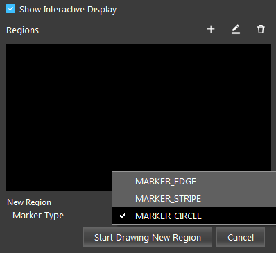

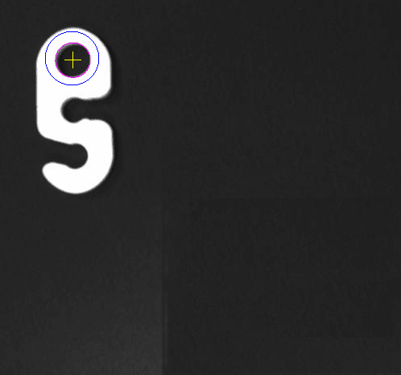

5. Run the flowchart, the Measurement node will find the feature using the reference fixture from Mod Finder.

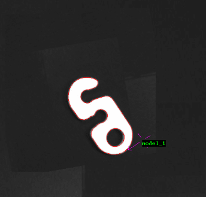


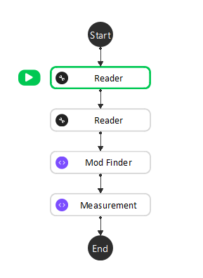

6. In Quick Evaluate, type the marker's name in marker[''] to check its evaluated results. In this case, the circle marker is named "Circle_Marker_Region_1" and we can check the circle's radius, x, and y values by typing in the circle marker's name. You can see the circle's radius under the Evaluated Value column.

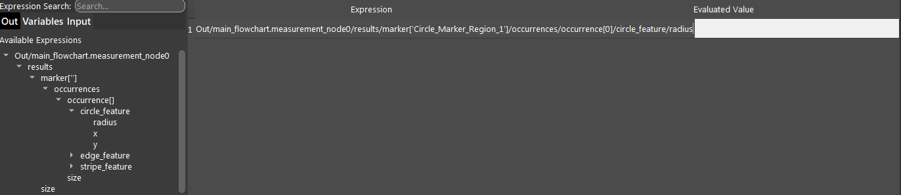

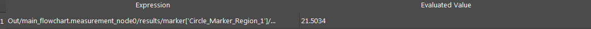


Exercise
--------------------
1. What would be a good marker for measuring the length of this region?

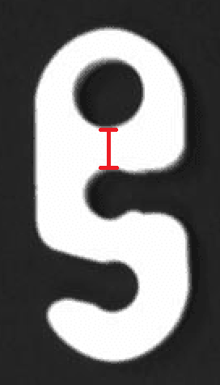

A. Edge Marker
B. Stripe Marker 
C. Circle Marker

2. The marker added from Question 1 did not detect the segment in the box region. How do I fix this?

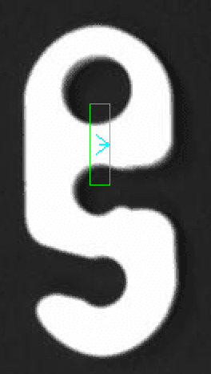

|

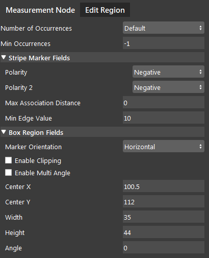

|
|
|
|
|
|
|
|
|
|
|
|
|
|
|

Answers to Exercise
--------------------
1. B. Stripe Marker. We can make use of the changes in polarity to detect the segment.

2. Change Polarity to Positive, Polarity 2 to Opposite, and change Marker Orientation to Horizontal. The Makrer Orientation determines the detection direction of the stripes. Since the stripes are horizontal, the Marker Orientation should also be horizontal. For the first stripe, the Polarity is Positive because it changes from black to white. For the second stripe, the Polarity 2 is Negative because it changes from white to black.

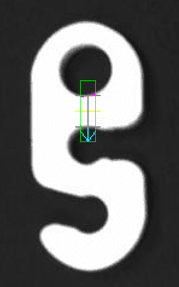