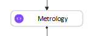
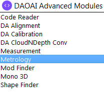
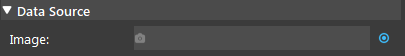
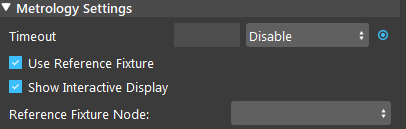
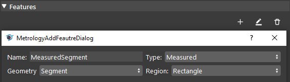
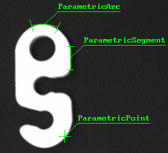
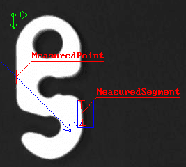
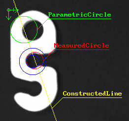
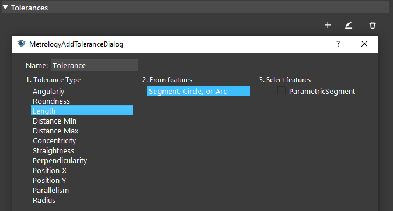

Metrology Node
==================
Overview
-------------------
| The Metrology node is used to define, detect or calculate features such as edge, circle, and point on a gray image.
| It can also calculate value information such as length of a segment and radius of a circle or arc. 





Inputs and Outputs
-------------------

+----------------------------------------+-------------------------------+---------------------------------------------------------------------------------+
| Input                                  | Type                          | Description                                                                     |
+========================================+===============================+=================================================================================+
| Image                                  | png                           | The image to be measured (Camera, Reader etc.).                                 |
+----------------------------------------+-------------------------------+---------------------------------------------------------------------------------+
| Timeout                                | Double                        | The maximum measurement and validation time for calculating in milliseconds.    |
+----------------------------------------+-------------------------------+---------------------------------------------------------------------------------+
| Use Reference Frame                    | String                        | The name of the mod finder node to use the reference frame from.                |
+----------------------------------------+-------------------------------+---------------------------------------------------------------------------------+
| Show Interactive Display               | Bool                          | Whether Interactive Display is being used.                                      |
+----------------------------------------+-------------------------------+---------------------------------------------------------------------------------+

+-------------------------+-------------------+------------------------------------------------------------------------+
| Output                  | Type              | Description                                                            |
+=========================+===================+========================================================================+
| allTolerancesPassed     | bool              | Whether all tolerances are passed.                                     |
+-------------------------+-------------------+------------------------------------------------------------------------+
| numFailedTolerances     | int               | The number of tolerances that are failed.                              |
+-------------------------+-------------------+------------------------------------------------------------------------+
| numWarningTolerances    | int               | The number of tolerances that are in warning.                          |
+-------------------------+-------------------+------------------------------------------------------------------------+
| toleranceResult         | SMetrologyResult  | The metrology results.                                                 |
+-------------------------+-------------------+------------------------------------------------------------------------+

Node Settings
-------------------

Data Source
~~~~~~~~~~~~~~~~~~~~~~~~~~~~



|

- **Image**: 
	The image to be measured (From Camera, Reader etc.).

Metrology Settings
~~~~~~~~~~~~~~~~~~~~~~~~~~~~



|

- **Timeout** (Default: Disable):
	The maximum measurement and validation time for calculating in milliseconds.

- **Use Reference Fixture** (Default: False):
	Check this box to use reference fixture (e.g. from Mod Finder).
	Please refer to :ref:`Reference Fixture System` for more information.

- **Show Interactive Display** (Default: False):
	Check this box to edit features on images.

|

Features
~~~~~~~~~~~~~~~~~~~~~~~~~~~~



|

| There are three types of features: Parametric, Measured, Constructed.
| After a feature is defined, the feature (or region for measurement features) will appear in the interactive display at position (0,0).
| You can drag it to the proper position or change its position by typing in the values. 

- **Parametric Feature**: 
    - Define fixture in absolute position by drawing in the image. 
    - Parametric features are displayed in green colour.
    - Available parametric features: Local Frame, Arc, Line, Segment, Edgel, Point, Circle.



|

- **Measured Feature**:
    - Define a feature by finding it from the search region (relatively fixed with global frame), which is defined by the user.
    - Region setting: decides the blue search region of the feature (one of Ring/Ring Sector/Rectangle/Segment/Arc).
	
        - The arrow indicates the detection direction of the search region.
        - For Ring and Ring Sector region, the arrow's direction indicates the Start Radius and End Radius. (Tail: Start Radius; Head: End Radius)
        - Red = detected geometry; Blue = search region.
    - Available measured features: Segment, Edgel, Arc, Circle, Point.

Measured Feature Parameters
`````````````````````````````
- Threshold:
    - A high threshold only keeps edge with strong contrast. A low threshold will include fainter edges.

- Smoothness:
    - Strength of the noise reduction filter when detecting edges.
    - Range [0.0 ~ 100.0]

- Data Angle Tolerance:
    - Whether edges along a transition are considered is based on the angle (direction) of the transition compared to the scan direction of the search region. 
    - This angle tolerance determines the range of accepted angle (direction).

- Edge Selection Rank:
    - Setting rank “1” will fit the segment to the edges closest to the beginning of the search box. 
    - Setting “Disable” will fit to all the edges found in the search-box.



|

- **Constructed Feature**: 
	- Define fixture from other base features, such as define a mid_point from a segment, or define a circle base on 2 points.
	- The base features used can be a combination of Parametric, Measured, and Constructed features.
	- Available constructed features: Local Frame, Arc, Line, Segment, Edgel, Point, Circle.



|
	
Tolerances
~~~~~~~~~~~~~~~~~~~~~~~~~~~~



|

Tolerances' labels will be displayed when "Show Interactive Display" is not checked. 

- Green: Passed
	pass_min > value > pass_max
- Yellow: Warning
	warning_min > value > warning_max
- Red: Failed
	value < warning_min OR value > warning_max

1. Tolerance Type
	Pick a Tolearnce Type from the list.
2. From Features
	Select a method to calculate the tolerance value.
3. Select Features
	Select the Features to be used to calculate the tolerance. (Follow Step 2's Feature Type)

Example:
	1. Angularity
	2. One Linear, One Edgel
	3. Select 1 ParametricLine & 1 Parametric Edgel

Procedure to Use
-------------------

1. We will need a few more nodes to demonstrate the Metrology node. Insert Reader, (2D) Mod Finder, Metrology.
    .. image:: images/Metrology/metrology_procedure_1_1.png
       :align: center

|

    .. image:: images/Metrology/metrology_procedure_1_2.png
       :align: center

|

2. In Reader node, select the metrology node sample data folder. You can get the data `here <https://daoairoboticsinc-my.sharepoint.com/:u:/g/personal/xchen_daoai_com/ETnjM6E8D89FsYDUfeMeBIUBSBxAuxVoCqcmJZMgbIYKdg?e=jIEhFz>`_.
    .. image:: images/Metrology/metrology_procedure_2_1.png
       :align: center

|

    .. image:: images/Metrology/metrology_procedure_2_2.png
       :align: center

|

3. In Mod Finder, link the Reader's image output, define a model, and click "Define Ref Point" to define a reference point.
    .. image:: images/Metrology/metrology_procedure_3_1.png
       :align: center

|

    .. image:: images/Metrology/metrology_procedure_3_2.png
       :align: center

|

4. In Metrology, link Reader's image output. Then check "Use Reference Fixture" and "Show Interactive Display". Select the Mod Finder node as the Reference Fixture Node.
    .. image:: images/Metrology/metrology_procedure_4_1.png
       :align: center

|

    .. image:: images/Metrology/metrology_procedure_4_2.png
       :align: center

|

    .. image:: images/Metrology/metrology_procedure_4_3.png
       :align: center

|

5. Add a measured circle feature. The red circle with label is the circle found in the blue search region.
    .. image:: images/Metrology/metrology_procedure_5_1.png
       :align: center

|

    .. image:: images/Metrology/metrology_procedure_5_2.png
       :align: center

|

6. Add a parametric point feature. Drag it on the image to change its location.
    .. image:: images/Metrology/metrology_procedure_6_1.png
       :align: center

|

    .. image:: images/Metrology/metrology_procedure_6_2.png
       :align: center

|

7. Add a Distance Max tolerance. Change its name to "t_distMax" with the following settings. Uncheck the "Show Interactive Display". The tolerance is shown in red (failed) in the image.
    .. image:: images/Metrology/metrology_procedure_7_1.png
       :align: center

|

    .. image:: images/Metrology/metrology_procedure_7_2.png
       :align: center

|

    .. image:: images/Metrology/metrology_procedure_7_3.png
       :align: center

|

8. Check the t_distMax's value from Quick Evaluate. Enter "t_distMax" as the tolerance_name and click "Re-Evaluate".
    .. image:: images/Metrology/metrology_procedure_8_1.png
       :align: center

|

    .. image:: images/Metrology/metrology_procedure_8_2.png
       :align: center

|

    .. image:: images/Metrology/metrology_procedure_8_3.png
       :align: center

|

9. Change t_distMax's Min pass to 100, and Max pass value to 200. Since tolerance value is between 100 and 200, it is now passed (green).
    .. image:: images/Metrology/metrology_procedure_9_1.png
       :align: center

|

    .. image:: images/Metrology/metrology_procedure_9_2.png
       :align: center

|

    .. image:: images/Metrology/metrology_procedure_9_3.png
       :align: center

|

10. Click "Run to Selected Step". You should see that the features are moved relatively to the reference fixture and a new tolerance is calculated.
     .. image:: images/Metrology/metrology_procedure_10_1.png
        :align: center

|

     .. image:: images/Metrology/metrology_procedure_10_2.png
        :align: center

|

     .. image:: images/Metrology/metrology_procedure_10_3.png
        :align: center

|

Exercise
--------------------------------------
In steps, explain how to use the Metrology node that check if a hook's circle's Y position is less than 200.

|
|
|
|
|
|
|
|
|
|
|
|
|
|
|

Answers for Exercise
--------------------------------------

1. Insert a Reader node and Metrology node. Link a hook image in Reader, and in Metrology link the image input to Reader's image output. (Refer to Procedure to Use section for detailed steps)
     .. image:: images/Metrology/metrology_exercise_add_nodes.png
        :align: center

|

2. Add a parametric local frame at the position (0,0).
    .. image:: images/Metrology/metrology_exercise_add_local_frame.png
       :align: center

|

3. Add a measured circle.
    .. image:: images/Metrology/metrology_exercise_add_circle.png
       :align: center

|

4. Add a tolerance ("t1") with the Position Y Tolerance Type.
    .. image:: images/Metrology/metrology_exercise_add_tolerance.png
       :align: center

|

5. Change t1's max pass to 200.
    .. image:: images/Metrology/metrology_exercise_edit_tolerance.png
       :align: center

|

6. Disable "Show Interactive Display" and run the node. The tolerance is failed.
    .. image:: images/Metrology/metrology_exercise_fail_tolerance.png
       :align: center

|

7. Evaluate the tolerance value from Quick Evaluate. 334.48 > 200, hence it fails the tolerance.
    .. image:: images/Metrology/metrology_exercise_evaluate_tolerance.png
       :align: center

|
