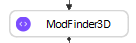
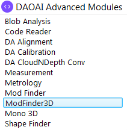
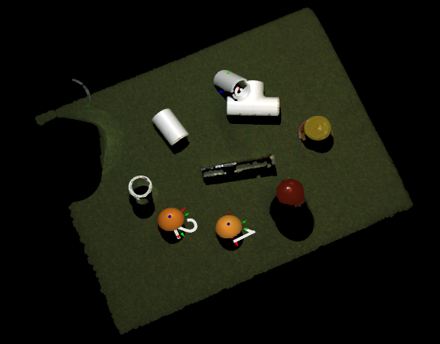
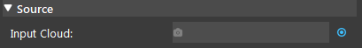
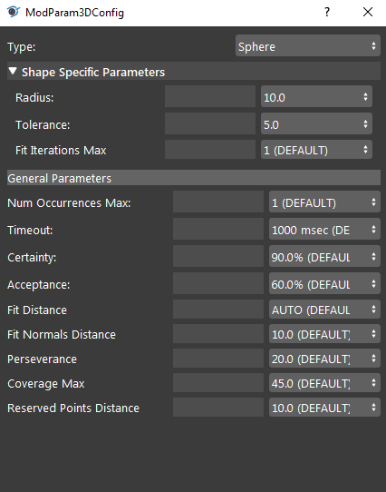
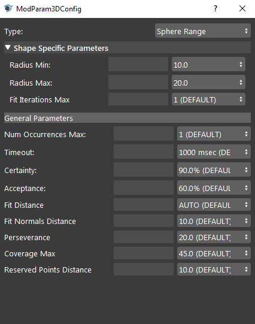
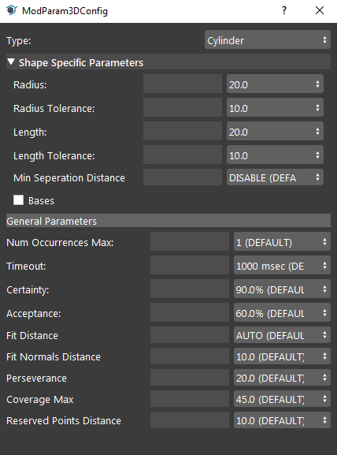
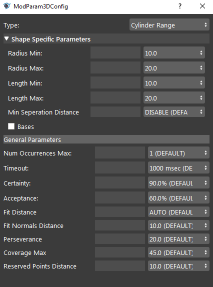

Mod Finder 3D
===============

Overview
----------------

**Mod Finder 3D** node finds spheres and cylinders in point clouds.







Input & Output
----------------

.. list-table:: 
   :widths: 25 25 50
   :header-rows: 1

   * - Input
     - Type
     - Description
   * - Input Cloud
     - Cloud
     - The point cloud of the scene to find the models in. Usually from Camera, Cloud Process, etc.

.. list-table:: 
   :widths: 25 25 50
   :header-rows: 1

   * - Output
     - Type
     - Description
   * - bases
     - MapBool
     - Whether each cylinder model includes base.
   * - isCylinder['']
     - bool
     - Whether the specified model is a cylinder model.
   * - lengths
     - MapVecDouble
     - Lengths for each model.
   * - numCylinderModels
     - int
     - Number of cylinder and cylinder range models saerched for.
   * - numSphereModels
     - int
     - Number of sphere and sphere range models saerched for.
   * - poses
     - MapVecPose
     - Map containing vectors of occurences poses for each model.
   * - radii
     - MapVecDouble
     - Map containing vectors of occurences radii for each model.
   * - totalNumOccurences
     - int
     - Total number of occurences over all models.

Node Settings
-----------------

Source
~~~~~~~~~~~



**Input Cloud**
    The point cloud of the scene to find the models in. 
    Usually from Camera, Cloud Process, etc.

Models
~~~~~~~~~~~

Shape Specific Parameters
```````````````````````````

Spheres:
****************





- **Radius** (Default: 10.0)
    Available in Sphere type model. The nominal radius of the spheres to be found.

- **Radius Min** (Default: 10.0)
    Available in Sphere Range type model. The minimum radius of the spheres to be found.

- **Radius Max** (Default: 20.0)
    Available in Sphere Range type model. The maximum radius of the spheres to be found.

- **Tolerance** (Default: 5.0)
    The tolerance of the radius within which spheres will be found.

- **Fit Iterations Max** (Default: 1)
    Maximum number of fit iterations to perform.    

Cylinders:
****************





- **Radius** (Default: 20.0)
    Available in Cylinder type model. The nominal radius of the cylinders to be found.

- **Radius Tolerance** (Default: 10.0)
    Available in Cylinder type model. The tolerance of the radius within which cylinders will be found.

- **Length** (Default: 20.0)
    Available in Cylinder type model. The nominal length of the cylinders to be found.

- **Length Tolerance** (Default: 10.0)
    Available in Cylinder type model. The tolerance of the length within which cylinders will be found.

- **Radius Min** (Default: 10.0)
    Available in Cylinder Range type model. The minimum radius of the cylinders to be found.

- **Radius Max** (Default: 20.0)
    Available in Cylinder Range type model. The maximum radius of the cylinders to be found.

- **Length Min** (Default: 10.0)
    Available in Cylinder Range type model. The minimum length of the cylinders to be found.

- **Length Max** (Default: 20.0)
    Available in Cylinder Range type model. The maximum length of the cylinders to be found.

- **Min Separation Distance** (Default: Disabled)
    Minimum gap of a cylinder in order for it to be considered a separated cylinder.

- **Bases** (Deafult: False)
    When enabled, includes the circular faces of a cylinder.

General Parameters
`````````````````````

- **Num Occurences Max** (Default: 1)
    Maximum number of occurences to find the model.

- **Timeout** (Default: 1000 ms)
    Time limit before the node stop searching for occurences of models. 

- **Certainty** (Default: 90.0%; Range: [0, 100.0])
    The minimum score above which a candidate occurrence is immediately accepted without searching for other higher-scoring candidate occurrences.

- **Acceptance** (Default: 60.0%; Range: [0, 100.0])
    The minimum matching score where an occurence is accepted.

- **Fit Distance** (Default: AUTO)
    Maximum distance from the occurence at which a point can still be included.

- **Fit Normal Distance** (Default: 10.0)
    The maximum normal angular distance from the occurrence at which a point can still be included.

- **Perseverance** (Default: 20.0; Range: [0, 100.0])
    The Model Finder3D algorithms search perseverence, which determines how long the algorithm runs.

- **Coverage Max** (Default: 45.0)
    Maximum expected model coverage.

- **Reserved Points Distance** (Default: 10.0)
    The area around each occurence which is reserved, expressed as a percentage of the model radius.

Procedure to Use
------------------

We will demonstrate the general use of ModFinder3D in this section.

1. Insert Camera, Cloud Process, and ModFinder3D node.

    .. image:: images/mod-finder-3d/mf3d_1.png
        :align: center
        :scale: 80%

    .. image:: images/mod-finder-3d/mf3d_1_1.png
        :align: center

2. Add a virtual camera (refer to :ref:`Camera`) and run the node. You can use the data `here <https://daoairoboticsinc-my.sharepoint.com/:u:/g/personal/xchen_daoai_com/ESOqi4B-IQVOvtcZZVCIq5AB3GlCCqHjIBWn9C4pKVUujg?e=h0OMgZ>`_ .

    .. image:: images/mod-finder-3d/mf3d_2.png
        :align: center

3. In Cloud Process node, link camera's cloud output as the input cloud (data source). 

    .. image:: images/mod-finder-3d/mf3d_3.png
        :align: center
        :scale: 100%

4. In Cloud Process node, add an "Adjust Bounding Box" operation. Run the node, and select the targeted area with the bounding box.

    .. image:: images/mod-finder-3d/mf3d_4.png
        :align: center
        :scale: 74%

    .. image:: images/mod-finder-3d/mf3d_4_1.png
        :align: center
        :scale: 90%

5. In ModFinder3D, link Cloud Process's cloud output as the data source.

    .. image:: images/mod-finder-3d/mf3d_5.png
        :align: center
        :scale: 80%

6. Let's try to find the sphere in the scene. Add a model in ModFinder3D and choose the shape ``sphere``. Then, input the appropriate parameters for the spheres in the scene.

    .. image:: images/mod-finder-3d/mf3d_6.png
        :align: center
        :scale: 80%

7. Run the ModFinder3D node. The node has found two sphere occurences and it is printed in the console.

    .. image:: images/mod-finder-3d/mf3d_7.png
        :align: center
        :scale: 80%

Exercise
----------

You noticed that not all of the spheres are found in the following scene.
Given the model's parameters, how would you improve the search results?

    .. image:: images/mod-finder-3d/mf3d_exercise_1.png
        :align: center
        :scale: 80%

    .. image:: images/mod-finder-3d/mf3d_exercise_1_1.png
        :align: center
        :scale: 80%
        
|
|
|
|
|
|
|
|
|
|
|
|
|
|
|

Answers to Exercise
----------------------

    .. image:: images/mod-finder-3d/mf3d_exercise_ans_1.png
        :align: center
        :scale: 80%

Observe that the spheres are in different sizes. 
One way to improve this is to switch to the "Sphere Range" type to detect all of them using only one sphere type model.