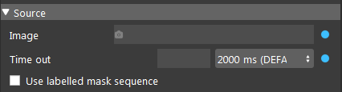
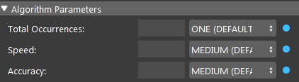
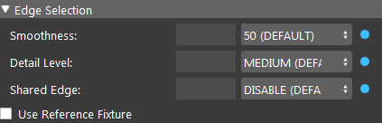

Mod Finder Node 
================

Overview 
--------------------
	The DaoAI Mod Finder engine used images pattern feature to find the object in 2D space, then used 3D space conversion to map it to 3D space. Usually at the end, it will go through point cloud alignment node to improve the 3D position accuracy.
	
	The Mod Finder can be configured to find 2D or 3D model.

Input and Output 
--------------------
	
+----------------------------------------+-------------------------------+-------------------------------------------------------------------------------+
| Input                                  | Type                          | Description                                                                   |
+========================================+===============================+===============================================================================+
| Image (2D Mod Finder)                  | Map<Image>                    | The source that is used to search for model.                                  |
+----------------------------------------+-------------------------------+-------------------------------------------------------------------------------+
| or                                     |                               |                                                                               |
+----------------------------------------+-------------------------------+-------------------------------------------------------------------------------+
| DA_Depth_Cloud_result (3D Mod Finder)  | Da_Depth_N_Cloud_Conv_Result  | - The source that is used to search for model.                                |
|                                        |                               | - The DA_Depth_Cloud_result is the output of the "DA CloudNDepth Conv" node.  |
|                                        |                               | - It is the combination of a Da Depth Map and a Point Cloud.                  |
+----------------------------------------+-------------------------------+-------------------------------------------------------------------------------+

+-------------------------+-------------------+------------------------------------------------------------------------+
| Output                  | Type              | Description                                                            |
+=========================+===================+========================================================================+
| labelledPose2dSequence  | Vec<Pose2D>       | Vector of pose 2d preserving order from labelled mask sequence.        |
+-------------------------+-------------------+------------------------------------------------------------------------+
| labelledPose3dSequence  | Vec<Pose3D>       | Vector of pose 3d preserving order from labelled mask sequence.        |
+-------------------------+-------------------+------------------------------------------------------------------------+
| modelMasks              | Map<Image>        | A map of model masks.                                                  |
+-------------------------+-------------------+------------------------------------------------------------------------+
| modelPoses2D            | Map<Vec<Pose2D>>  | A map of vector of 2d poses.                                           |
+-------------------------+-------------------+------------------------------------------------------------------------+
| modelPoses3D            | Map<Vec<Pose3D>>  | A map of vector of 3d poses.                                           |
+-------------------------+-------------------+------------------------------------------------------------------------+
| numFound                | Int               | The total number of occurrences found.                                 |
+-------------------------+-------------------+------------------------------------------------------------------------+
| result                  | ModFinderResult   | A map, mapping “model_name” to “vector of occurrences of this model”.  |
+-------------------------+-------------------+------------------------------------------------------------------------+
| success                 | Bool              | Boolean value indicating the search is successful.                     |
+-------------------------+-------------------+------------------------------------------------------------------------+

Node Settings
---------------
	The following screen shots demonstrate the settings of the 2D mod finder.

	The only difference between the settings of 2D mod finder and the 3D mod finder is the "Image" input in the "Source" section for 2D is replaced by "Da Depth Map And Point Cloud" for 3D.

Source Parameters
~~~~~~~~~~~~~~~~~

- **Image**: 

	The source that is used to search for model. Using link expression to link the image.

- **Time Out**: (Default value: 2000 ms) 

	The time limit for the node to run. When the running time of the node reaches the time limit. The node will terminate and return the current output. 

- **Use labelled mask sequence**: TODO

Algorithm Parameters
~~~~~~~~~~~~~~~~~~~~

- **Total Occurrences**: Range [0,∞) (Default value: ONE)

	The number of occurrences for each model to search. 
	The occurrence can be set to any positive number. 
	If the number of detected object is larger than the total occurrences number, 
	the objects with the highest acceptance will be returned. 
	If the occurrences number is larger than the number of detected objects, 
	all of them will show. The Total Occurrences can be set to "ALL". 

	(left: occurrences = 1, middle: occurrences = 2, right: occurrences = ALL)

	.. image:: images/mod_finder_5.jpg
		:scale: 60%
	.. image:: images/mod_finder_6.jpg
		:scale: 60%
	.. image:: images/mod_finder_7.jpg
		:scale: 60%

- **Speed**: Range [1,4] (Default value: MEDIUM)

	The speed of searching. Larger value means faster speed but less accuracy.

- **Accuracy**: Range [1,3]  (Default value: DISABLE)

	The accuracy of searching. Larger value means higher accuracy but slower speed.
	

Edge Selection Parameters
~~~~~~~~~~~~~~~~~~~~~~~~~

- **Smoothness**: Range [0,100) (Default value: 50)

	The noise reduction used during edge extraction. Larger value means stronger noise reduction.
	A high smoothness will only accept smooth edges, and low smoothness will accept sharp edgeds. 
	
	(left: smoothness = 100, right: smoothness = 1)

	.. image:: images/mod_finder_8.jpg
		:scale: 60%

	.. image:: images/mod_finder_9.jpg
		:scale: 60%

- **Detail Level**: Range [1,3] (Default value: MEDIUM)

	The level of detail during edge extraction. The detail level determines what is considered as an edge/background. Larger value means more edges are extracted.

- **Shared Edge**: Range [0,1]  (Default value: DISABLE)

	Whether edges are shared bewteen different occurrences.

Models
~~~~~~
	The model is defined from the scene, or it can be imported from a DL_Segment node using a labelled mask sequence.
	For the details of the defining or import process, please check the "Procedure to use" section. 
	This section focuses on the properties of models.

	You can adjust the detail of the model in the model config page. 
	Double click or select model and click edit button to open model config page.

	.. image:: images/mod_finder_settings_4.png
		:scale: 60%

- **Label**: (Default value: -1)

	TODO

- **Acceptance**: Range [0,100] (Default value: MEDIUM)

	The minimum matching score where an occurrence is accpeted. 
	An occurrence will be returned only if the match score between the target and the model is greater than or equal to this level.

- **Certainty**: Range [0,100] (Default value: HIGH)

	Sets the certainty level for the score, as a percentage. 
	If both the score and target scores are greater than or equal to their respective certainty levels, 
	the occurrence is considered a match, without searching the rest of the target for better matches 
	(provided the specified number of occurrences has been found).

- **Polarity**: 

	The expected polarity of occurrences, compared to that of the model. 
	If the model is a white circle in black background, 
	“SAME” will search for white circle in black background, “REVERSE” will search black circle in white background, 
	and “ANY” will search any circle in any background as long as the it is an edge.

	.. image:: images/mod_finder_11.jpg
	:scale: 100%

- **X, Y**:

	The offsets to set the reference point. The X and Y is the X-offset (in pixels) and the Y-offset (in pixels) 
	of the origin of the model's reference axis, relative to the model origin. The top left corner is (0, 0). 

	You can also define reference point in the model image by clicking “Define Ref Point” of the model. 
	This will enter interactor mode where you need to select a point as a reference point. 
	Normally the reference point is the center of all the edge pixels. 
	It is recommended to use the default reference point.

- **Angle**: Range [0, 360]

	The nominal search angle in degrees. This is the angle to find the model's reference axis.

- **Search Region**: (Default value: Whole Image)

	The search region can be set to the "Whole Image" or a specified region of the Image. 
	
	.. image:: images/mod_finder_settings_5.png
		:scale: 100%

	*Top Left X*:
		The top left starting X pixel value.

	*Top Left Y*:
		The top left starting Y pixel value.

	*Size X*:
		The X dimension size of the search area in pixels.
	
	*Size Y*:
		The Y dimension size of the search area in pixels.

	For example, if the interested search region is in the top left corner of the image with a size of 1000*1000 pixels, the parameters should 
	be set as (0, 0, 1000, 1000).

	Alternatively, you can define the search region in the target image by clicking “Define Search Region” 
	and draw a rectangle ROI on target image.

- **Search Scale**:

	Sets whether to search for only models within a specified scale range. 

	.. image:: images/mod_finder_settings_6.png
		:scale: 100%
	
	Nominal scale: Range [0.5, 2.0] (Default value: 1.0)
		The nominal scale used in scale range calculations.

	Min scale: Range [1.0, 2.0] (Default value: 2.0)
		The min scale used in scale range calculations.

	Max scale: Range [0.5, 1.0] (Default value: 0.5)
		The max scale used in scale range calculations.

- **Search Angle**:

	Sets whether to search for only models within a specified angle range.

	.. image:: images/mod_finder_settings_7.png
		:scale: 100%

	Delta Neg Angle: 
		Controls the lower limit of the angular range, relative to the reference angle (Model Ref Angle).

	Delta Pos Angle: 
		Controls the upper limit of the angular range, relative to the reference angle (Model Ref Angle).

Procedure to use
-----------------

2D Mod Finder Example
~~~~~~~~~~~~~~~~~~~~~~~

1. Open a workspace in DaoAI Vision Studio.
	.. image:: images/mod_finder_procedure_1.png
		:scale: 30%

2. Insert a Camera node to get the source image.
	.. image:: images/mod_finder_procedure_2.png
		:scale: 60%

3. A virtual image is used to demonstrate. Refer to System Overview, Tutorials on how to connect to camera.
	.. image:: images/mod_finder_procedure_3.png
		:scale: 50%

4. Insert a Mod Finder node to find the T tube, select "2D" when creating the node.
	.. image:: images/mod_finder_procedure_4.png
		:scale: 60%

5. Click on the blue dot on the right side of "Image" to link the image from the camera node above as input.
	.. image:: images/mod_finder_procedure_5.png
		:scale: 70%

6. Expand the "Out/main_flowchart.camera_node" on the left window of the LinkExpressionDialog. Click the "image" then Apply. 
	.. image:: images/mod_finder_procedure_6.png
		:scale: 70%

7. Create a model to let the node know what it should looking for. Click on the "+"" to create a model.
	.. image:: images/mod_finder_procedure_7.png
		:scale: 70%

8. Name the model then "Confirm".
	.. image:: images/mod_finder_procedure_8.png
		:scale: 100%

9. The display on the left window enters Interactor mode. Use mouse to carefully 
select the region that contains the desired model.
	.. image:: images/mod_finder_procedure_9.png
		:scale: 70%

10. Run the Mod Finder node. The edge of found objects are extracted by red line in the image display.
	.. image:: images/mod_finder_procedure_12.png
		:align: center

11. The default value of "Total Occurrences" is one. Set it to all to detect all the object.
	.. image:: images/mod_finder_procedure_13.png
		:scale: 60%

12. Run the Mod Finder node. Five objects are detected.
	.. image:: images/mod_finder_procedure_14.png
		:scale: 50%

13. Adjust the parameter of the model to find all the objects. The model appears under the "Models" section. Double click it to open the model parameters configurator.
	.. image:: images/mod_finder_procedure_10.png
		:scale: 70%

14. Click on the "Draw Mask", then use mouse to cover all the area until only the edge of the model is extracted by red lines.
	.. image:: images/mod_finder_procedure_16.png
		:scale: 70%

15. Run the Mod Finder node. All of the objects are detected.
	.. image:: images/mod_finder_procedure_17.png
		:scale: 45%

3D Mod Finder Example
~~~~~~~~~~~~~~~~~~~~~~~

1. **Repeat the step 1 to 3 from the above example.**

2. Insert a Mod Finder node to find the T tube, select "3D" when creating the node.
	.. image:: images/mod_finder_procedure_4.png
		:scale: 60%

3. **The 3D Mod Finder takes a "Da Depth Map And Point Cloud" as input. Insert a "DA CloudNDepth Conv" node under Camera node.
Select "DA PointCloud -> DA depth map" when creating the node.**

	.. image:: images/mod_finder_procedure_18.png
		:scale: 80%

	.. image:: images/mod_finder_procedure_19.png
		:scale: 80%

4. Link the point cloud from the above camera node as the input of the "DA CloudNDepth Conv" node.
	.. image:: images/mod_finder_procedure_20.png
		:align: center

5. Run the "DA CloudNDepth Conv" node. The display enters interaction mode. Adjust the adjust box to contain the region of interest.
	.. image:: images/mod_finder_procedure_22.png
		:scale: 45%

6. Exit the interactor, the depth map is dispalyed.
	.. image:: images/mod_finder_procedure_23.png
		:scale: 60%

7. Select the Mod Finder node. Link the result from the "DA CloudNDepth Conv" node as the input.
	.. image:: images/mod_finder_procedure_24.png
		:scale: 60%

8. Create a model to let the node know what it should looking for. Click on the "+"" to create a model.
	.. image:: images/mod_finder_procedure_26.png
		:scale: 70%

9. Name the model then "Confirm".
	.. image:: images/mod_finder_procedure_8.png
		:scale: 100%

10. The display on the left window enters Interactor mode. Use mouse to carefully select the region that contains the desired model.
	.. image:: images/mod_finder_procedure_25.png
		:scale: 70%

11. Run the Mod Finder node. One object is found.
	.. image:: images/mod_finder_procedure_27.png
		:scale: 70%

12. The default value of “Total Occurrences” is one. Set it to all to detect all the object.
	.. image:: images/mod_finder_procedure_28.png
		:scale: 70%

13. Run the Mod Finder node. Three objects are found.
	.. image:: images/mod_finder_procedure_29.png
		:scale: 70%

14. Open the Model Parameter Configurator. Set the "Acceptance" to low.
	.. image:: images/mod_finder_procedure_30.png
			:scale: 70%

15. Run the Mod Finder node again. All of the objects are found.
	.. image:: images/mod_finder_procedure_31.png
			:scale: 40%

General process of Using Mod Finder Node
----------------------------------------

	1. Link input model image. For 3d mod finder node, the input must be the output of DA CloudNDepthConv Node.
	2. Run node once so the input image shows on the display.
	3. Define model, click on "+" button to add a model, and draw a bounding box in the input image to define the model.
	4. (Optional) adjust model in the model config page.
	5. Run the node with other images. The found occurrences of the model will be displayed in the target image.
	6. Use the position vector  for further processing to get the picking pose of the objects in the scene.

Model Masking
-----------------
The model in this node is edgel model. Edge model use their edge-based geometric features (geometric features from extracted edges) to find the position of object.
		
The model is defined by drawing a rectangle box on display. 
 .. image:: images/mod_finder_1.jpg
	:scale: 60%
	
You may draw mask on the model to erase unwanted edges. After draw mask, run this node to apply changes
 .. image:: images/mod_finder_2.jpg
	:scale: 60%
 .. image:: images/mod_finder_3.jpg
	:scale: 60%

The model can be searched on image. 
 .. image:: images/mod_finder_4.jpg
	:scale: 100%

.. Model Configuration
.. -------------------------

.. 	You can adjust the detail of the model in the model config page. Double click or select model and click edit button to open model config page.

.. 	.. image:: images/mod_finder_config.png
.. 		:scale: 60%

.. 	The red lines are the extracted edges of the model, which will be used for searching. You can mask out or unmask area that you are not interested in by clicking "Draw Mask" or "Erase Mask" button.
.. 	This will enter interactor mode where you can edit mask. You can also change "Edit Pixel Map Size" to change the brush size when drawing and erasing mask.

.. 	You can also define reference point in the model image by clicking "Define Ref Point" of the model. This will enter interactor mode where you need to select a point as a reference point.
.. 	Normally the reference point is the center of all the edge pixels. It is recommended to use the default reference point.

.. 	Additionally, you can define the search region in the target image by clicking "Define Search Region" and draw a rectangle ROI on target image.

Search Model In Labelled Mask Sequence 
--------------------------------------

	This is a special use case of mod finder where the input is the result of segmentation (a vector of image, each contains an object) instead of a single image.

	1. Use DL segmentation node to obtain segments and their labels.
	2. In mod finder node, define models. Assign correct labels to the models.
	3. Check "Use Labelled Mask Sequence", and link the labelled mask sequence to mask sequence output of of the DL segmentation node.
	4. Run the node. For each mask image in the sequence the node will search for the model based on the model of the mask image (label of the segment).
	5. The result pose (sorted in labelledPose2dSequence or labelledPose3dSequence) will have the same order of the segments vector of the DL segmentation node.

Reference Fixture 
---------------------
	Please refer to Reference Fixture System. 

	This node can be used for generating fixture.