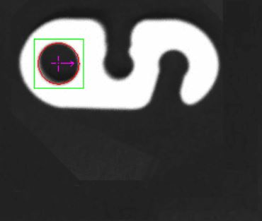
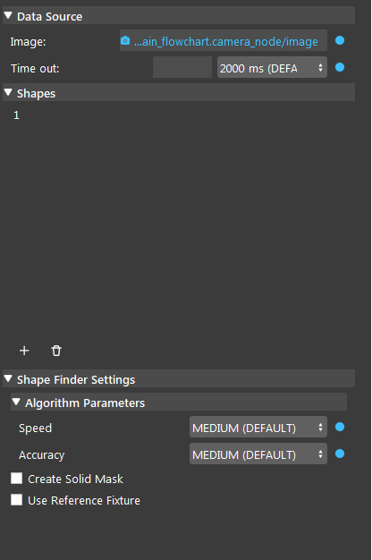

Shape Finder Node 
=========

Overview 
--------------------
Shape finder node is used to find shapes on gray scale images using edge based searching. 

Input and Output 
-----------------

+----------------------------------------+-------------------------------+-------------------------------------------------------------------------------+
| Input                                  | Type                          | Description                                                                   |
+========================================+===============================+===============================================================================+
| Image                                  | Image                         | The source that is used to search for shape.                                  |
+----------------------------------------+-------------------------------+-------------------------------------------------------------------------------+
| Time out                               | Int                           | Time in miliseconds that the shape finder will search before terminatation    |
+----------------------------------------+-------------------------------+-------------------------------------------------------------------------------+

+-------------------------+-------------------+------------------------------------------------------------------------+
| Output                  | Type              | Description                                                            |
+=========================+===================+========================================================================+
| labelledPose2dSequence  | Vec<Pose2D>       | Vector of pose 2d preserving order from labelled mask sequence.        |
+-------------------------+-------------------+------------------------------------------------------------------------+
| shapeMasks              | Map<Image>        | A map of model masks. (Mask is created using the shapes edges)         |
+-------------------------+-------------------+------------------------------------------------------------------------+
| shapeLocation           | Map<Vec<Pose2D>>  | A map of vector of 2d shape locations (Pose2D of shape center).        |
+-------------------------+-------------------+------------------------------------------------------------------------+
| numFound                | Int               | The total number of Shapes found.                                      |
+-------------------------+-------------------+------------------------------------------------------------------------+
| success                 | Bool              | Boolean value indicating the search is successful.                     |
+-------------------------+-------------------+------------------------------------------------------------------------+

Node Settings
---------------

The following image demonstrates the shape finder node settings

Source Parameters
~~~~~~~~~~~~~~~~~

- **Image**:

The source that is used to search for shape. Using link expression to link the image.

- **Time Out** (Default value: 2000 ms):

The time limit for the node to run. When the running time of the node reaches the time limit. The node will terminate and return the current output.

Shape finder settings
~~~~~~~~~~~~~~~~~~~~

- **Create Solid Mask**:

WIP

- **Use Reference Fixture**:

This node can be used for generating fixture.
Please refer to `Reference Fixture System <https://daoai-robotics-inc-daoai-vision-user-manual.readthedocs-hosted.com/en/latest/nodes/DA%20Modules/Reference%20Fixture%20System.html>`_.

Algorithm Parameters
^^^^^^^^^^^^^^^^^^^^

- **Speed** (Default value: MEDIUM):

The speed of searching. Larger value means faster speed but less accuracy.

- **Accuracy** (Default value: MEDIUM):

The accuracy of searching. Larger value means higher accuracy but slower speed.

Shapes
~~~~~~

General Settings
^^^^^^^^^^^^^^^^

	.. image:: images/shape_finder_shapes_general.png
		:scale: 90%

- **Name**:

Name for the shape created, you can give whatever name you like.

- **Dedicated Mode** (Default value: No):

WIP

- **Shape** (Default value: Circle):

List of shapes available for shape finder.

- **Foreground Color**:

WIP

- **Param[2-5]**:

Shape dimension parameters, number of parameter needed varies on different shapes.

- **Min Acceptance** (Default value: 60): 

The minimum matching score where an occurrence is accpeted. 
An occurrence will be returned only if the match score between the target and the model is greater than or equal to this level.

- **Total Occurrences** (Default value: One): 

Maximum number of Shapes to search before terminatation.
When the number of found matching shapes is equal to the set Total Occurrences value, the node will terminate and return the current result.

- **Whole Image** (Default: Checked):

When checked, the node finder will search on the whole image.
When unchecked,  the node finder will search on the restricted area of the image that you need to define.

- **Enable Search Scale** (step: 0.1): 

When checked, the node finder will also search on scaled image of the input image from scale Min to Max with a step of 0.1.
When unchecked, the node finder will only search on the input (non-scaled) image.

Advanced Settings
^^^^^^^^^^^^^^^^^

	.. image:: images/shape_finder_shapes_advanced.png
		:scale: 90%

WIP

- **Smoothness**(Default value: 50):

- **Detail Level**(Default value: Medium):

- **Certainty**(Default value: 90):

- **Polarity**(Default value: Same Or Reverse):

- **Fit Score Min**(Default value: 0):

- **Sagitta Tolerance**(Default value: 25):

- **Coverage Max**(Default value: 100):

Procedure to use
-----------------

1. Open a workspace in DaoAI Vision Studio.
	
   .. image:: images/mod_finder_procedure_1.png
      :scale: 30%

2. Insert a Camera node to get the source image.
	
   .. image:: images/mod_finder_procedure_2.png
      :scale: 60%

3. A virtual image is used to demonstrate. Refer to System Overview, Tutorials on how to connect to camera.
	
   .. image:: images/shape_finder_step_3.png
      :scale: 50%

4. Add a Shape Finder node after the camera node
	
   .. image:: images/shape_finder_step_4.png
      :scale: 50%

5. Link the input Image to Camera node output
	
   .. image:: images/shape_finder_step_5.png
      :scale: 50%

6. Click the '+' sign to add a shape, give it a name you prefer and click confirm
	
   .. image:: images/shape_finder_step_6.png
      :scale: 70%

7. Double click the shape you just created, select a shape, and fill in the params, you can also adjust other settings, close the window when you are done.
	
   .. image:: images/shape_finder_step_7.png
      :scale: 50%

8.  Select the Shape Finder node if its not selected already, and click run select step, then you should see the result on the left view port.
	
   .. image:: images/shape_finder_step_8.png
      :scale: 50%

General process of Using Mod Finder Node
----------------------------------------

WIP

Excercise
---------

WIP

