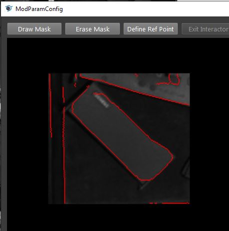
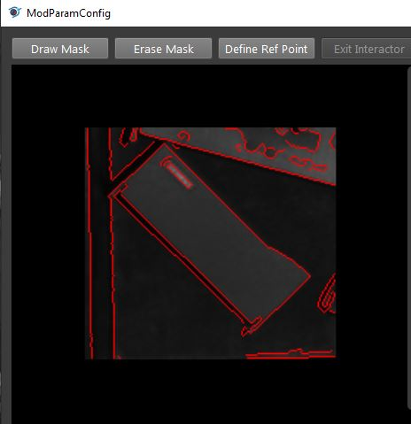
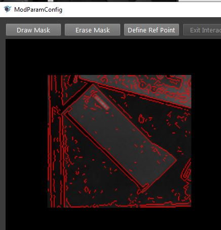
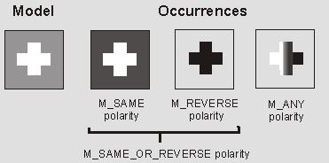

Parameter Tunning 
======================

Settings 
--------------------

The occurrence for each model to search. If it is 1, then node will only search 1 object on image. If labelled_mask_sequence is enabled, then node will search 1 model on each matched mask region. 

 .. image:: images/mod_finder_5.jpg
	:scale: 60%
 .. image:: images/mod_finder_6.jpg
	:scale: 60%
 .. image:: images/mod_finder_7.jpg
	:scale: 60%

Speed: 

    Range [1, 4]	
    
    The speed of searching. 

Accuracy: 

    Range [1, 3]
    
    The accuracy of searching

Smoothness: 

    Range [1, 100]
   
    A high smoothness will only accept smooth edges, and low smoothness will accept sharp edgeds. 
    Below the first image is when smoothness=100, and the second one is when smoothness=1.

		
Detail Level: 

	Range [1, 3]
		
	Sets the level of details to extract from model images and target images during edge extraction. The detail level determines what is considered an edge/background. A higher detail level will include more edges than a lower detail level.
		

Shared Edge: 
    
    Range [0, 1]
	
    Sets whether to allow sharing of edges between occurrences.

Model Parameters 
------------------

Acceptance: 

    Range [0,100]
    
    Sets the acceptance level for the score. An occurrence will be returned only if the match score between the target and the model is greater than or equal to this level. 

Certainty: 
    
    Range [0,100]
    
    Sets the certainty level for the score, as a percentage. If both the score and target scores are greater than or equal to their respective certainty levels, the occurrence is considered a match, without searching the rest of the target for better matches (provided the specified number of occurrences has been found). 

Polarity: 

    Sets the expected polarity of occurrences, compared to that of the model. If the model is a white circle in black background, "SAME" will search for white circle in black background, "REVERSE" will search black circle in white background, and "ANY" will seach any circle in any background as long as the it is an edge. 

