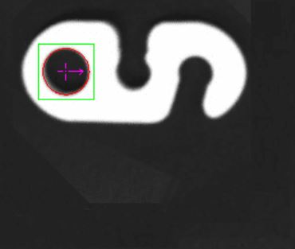

Overview 
==============

Reference Fixture 
-------------------

	Please refer to Reference Fixture System
	
    This node can be used for generating fixture. 

Shape 
-------------------
You can define shape and shape parameters.
The parameters for different shape is labelled on the shape model.
Please note that the unit of parameters is pixel unit. 
 
.. image:: images/shape_finder_2.jpg
	:scale: 90%
	:align: center

	
On the screen, the pixel units are labelled if you click "Show Ruler" in display setting.

.. image:: images/shape_finder_1.jpg
	:scale: 100%
	:align: center

The result of shape search is as below

Output 
-----------------------

* numFound: (DataType:Int) The total number of occurrences found. 
* shapeLocations: (DataType:Vector<Pose2D>) Shape 2D poses map. 
* shapeMasks: (DataType:Vector<Image>)Shape masks map. 
* success: (DataType:Bool) If all shape search are performed successfully. 
		
		