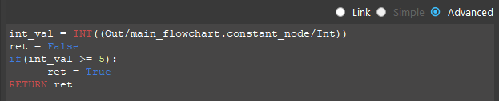
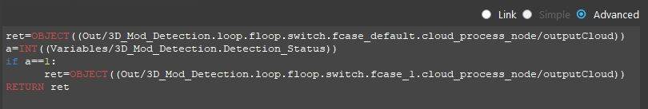
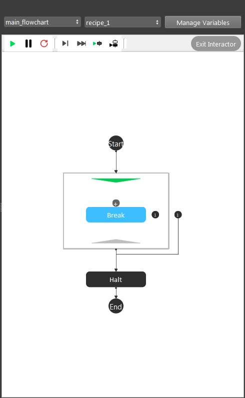
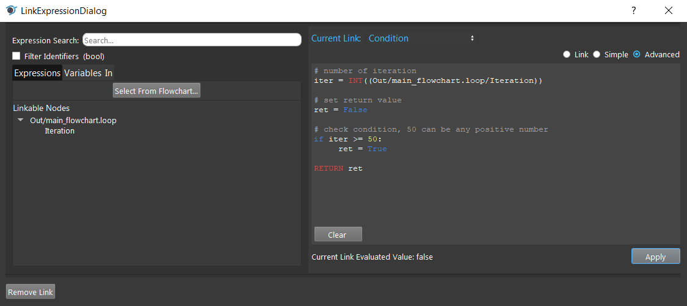
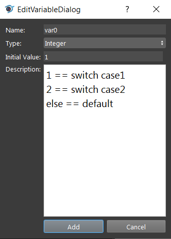
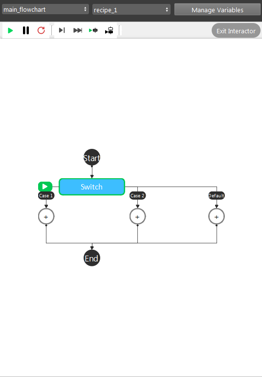
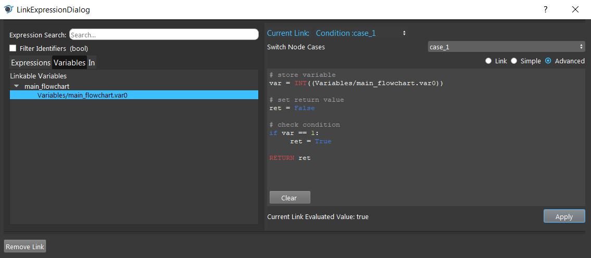
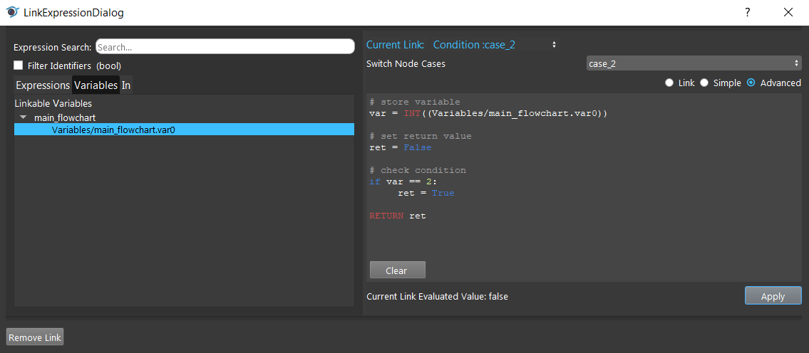
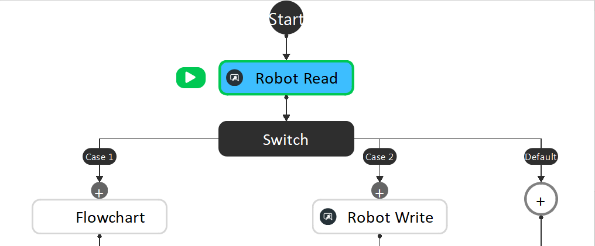
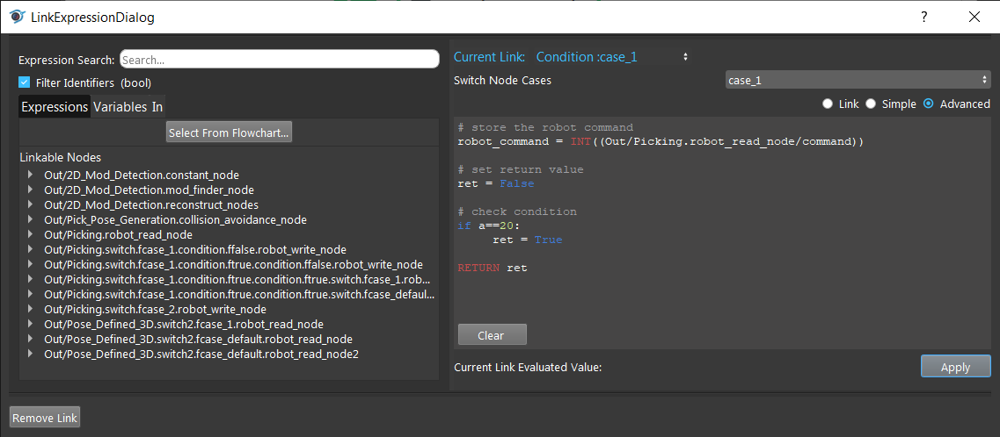

Python Interpreter and Advanced Expressions
===========================================
A python interpreter is used in the evaluation of Advanced Expressions. An Advanced Expression is a way a you can define an input by writing short snippets of simple code which can reference other pieces of information in the system, such as the fields stored in a Constant Node or the number of models found in the Mod Finder V2 Node. An example of an advanced expression is shown below:

In this expression, if the value stored in the integer field of the Constant Node in the flowchart main_flowchart is greater or equal to 5, the advanced expression evaluates to True, otherwise it evaluates to False. 

Here is another example of an advanced expression which returns different Point Clouds based on if a 3D Model Finder Node performed a successful detection:

Advanced expressions are evaluated using a Python Interpreter, so all logic used must follow Python syntax (':' after 'if' statements, proper tabbing, etc), however advanced expressions must also contain a 'RETURN' keyword to signify what the output of the expression should be. 

Other keywords specific to DaoAI Advanced Expressions are INT((...)), DOUBLE(...), BOOL((...)), STRING((...)), and OBJECT((...)) which are used to evaluate expressions referring to data in other nodes of the system. 

Usage Example
--------------

Break loop
~~~~~~~~~~~

Looping 50 times.

Check Variable value
~~~~~~~~~~~~~~~~~~~~

Using variable value as switch case conditions.

Setting up the variable.

Case 1

Case 2

Robot Command Input
~~~~~~~~~~~~~~~~~~~

Reading the status of a robot, and react on different status.

Using a Robot Read node to read the command from robot.

Robot Command: 20 (RC_DAOAI_CAPTURE_AND_PROCESS ). The flowchart moves to the next stage.

