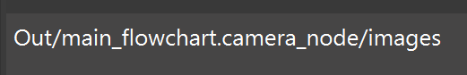
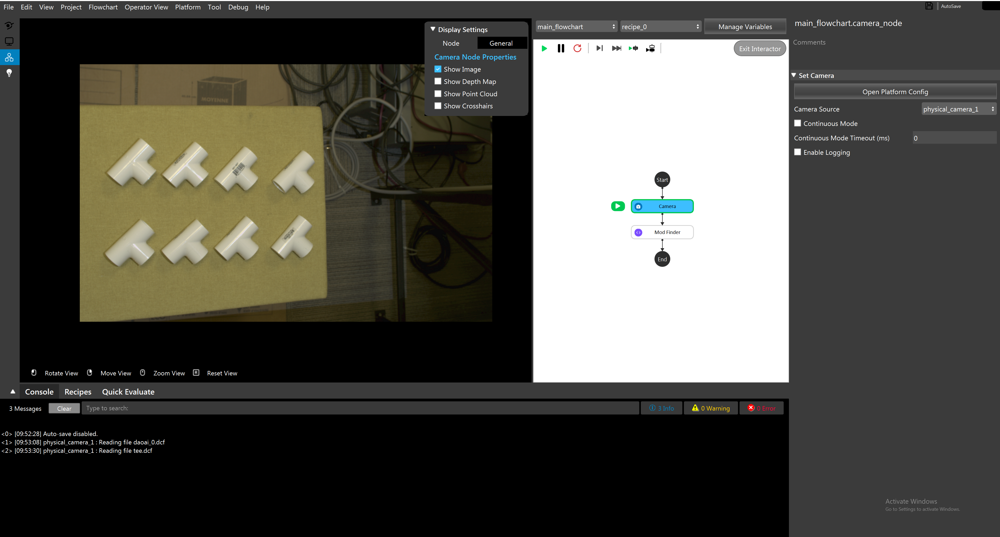
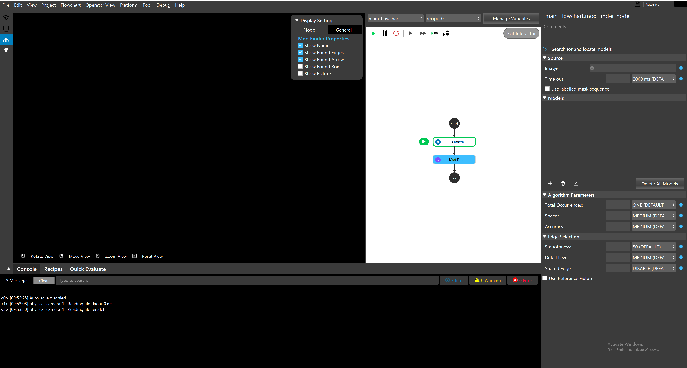
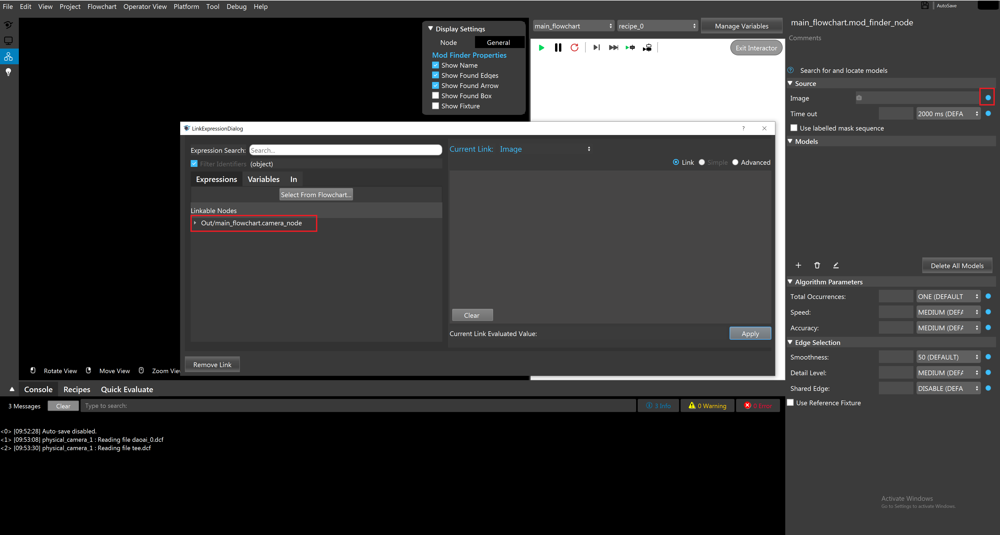
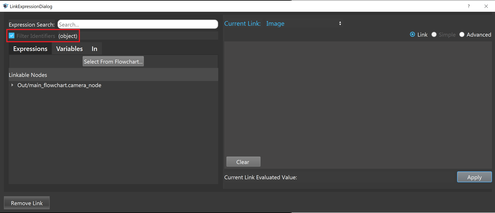
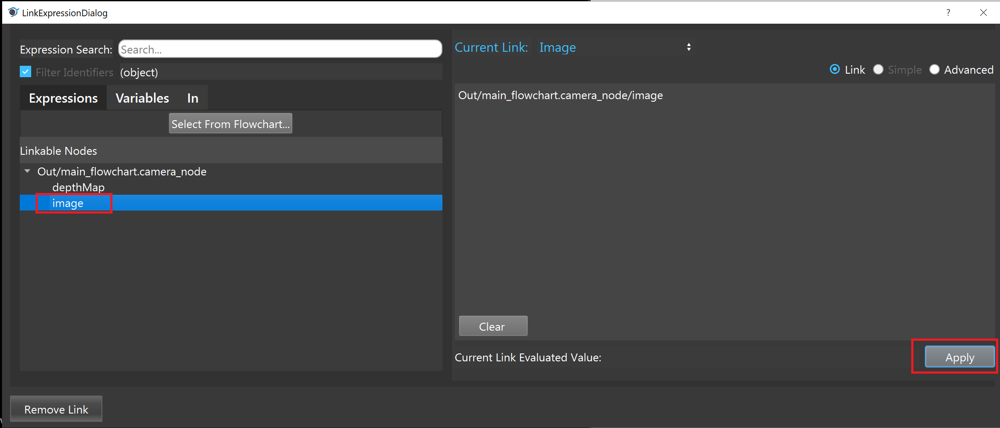
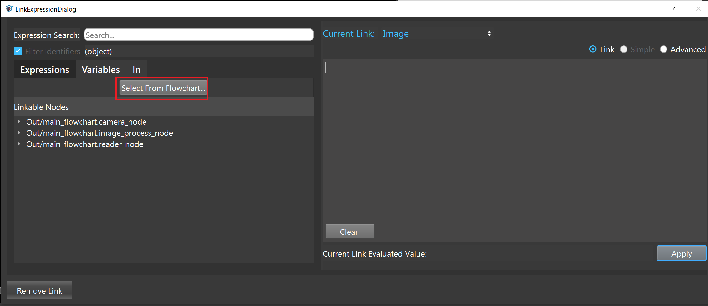
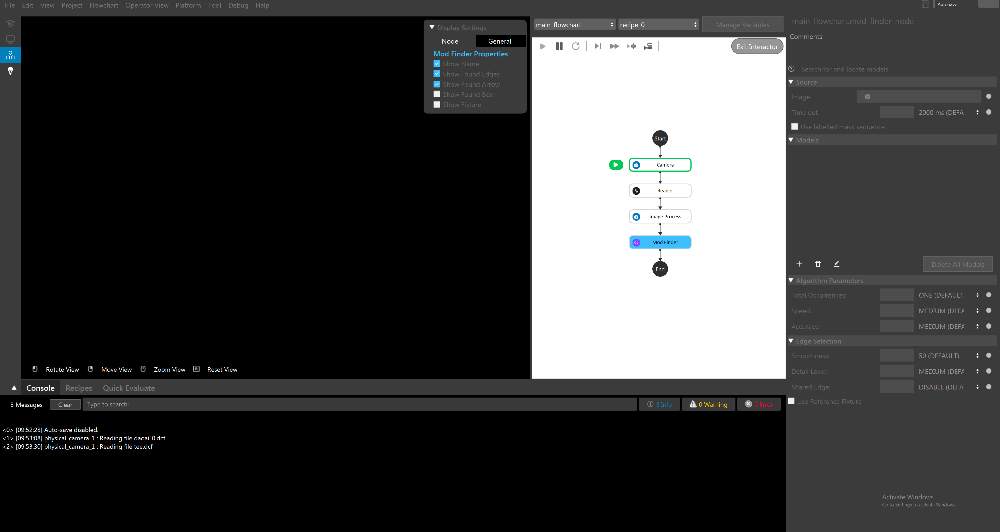
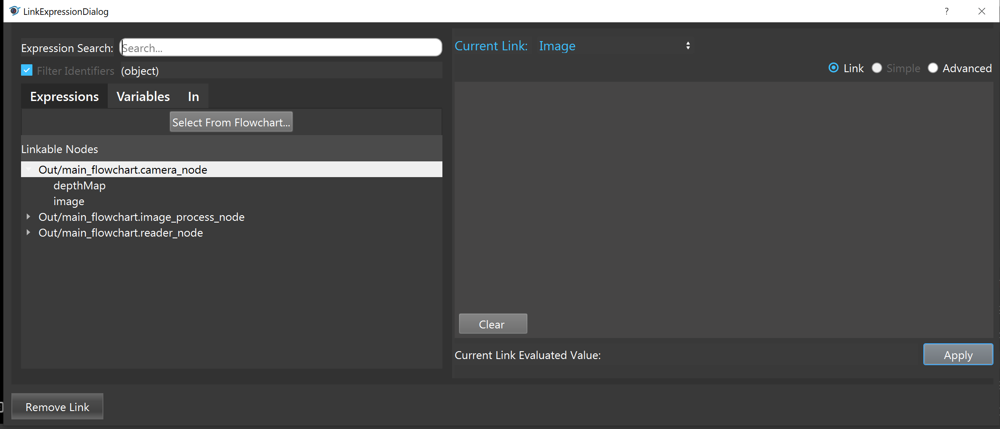

Link Expression
===============

For a node to take the output of other nodes as an input, link expression is used. The link expression links the data from one node to another.

Link expression is like a file location system. The "Out" represent this is an output of a node. "main_flowchart.camera_node" represents the target node location. 
And the "images" means the output images are taken.

Normally the link expression will be generated by selecting node and the desired attribute. Users do not need to type the entire link expression. 

.. note::
	Link expression only supports the simplest usage. It use the output based on the location as an input. If logic control is needed, please refer to "Python Interpreter and Advanced Expression".
	

For example, there is a Camera node that takes images.

The goal is to use the Mod Finder Node to detect tees. The Mod Finder Node need to know where is the image.

Click on the blue dot next Image to select the link to the image. A "LinkExpressionDialog" shows up, and it displays available links.

The filter automatically set to "object", therefore, only objects are shown under the linked node. 

Select "image" under the camera node, and the corresponding link expression will be generated automatically on the right window. Hit "Apply" to save the change.

A more convenient way to select the node when there are many nodes in the flowchart is using the function "Select From Flowchart...".

Open the "LinkExpressionDialog" and hit the "Select From Flowchart...".

Click on the node that has the output. In this case, the camera node is the target so choose the camera node.

Now the camera node is selected in the "LinkExpressionDialog", and user only need to choose the attribute (image)

 

