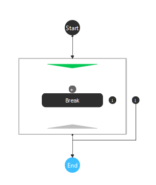
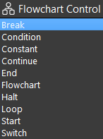
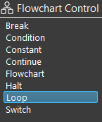
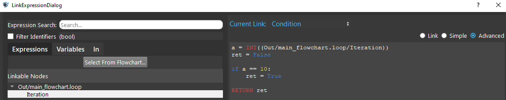
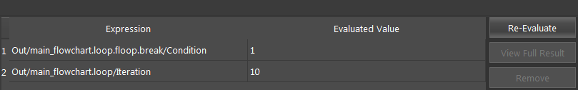

Break Node
===============

Overview
-------------------
The **Break Node** is used inside of a :ref:`Loop Node` to terminate the loop's execution. 
It has a single field 'Condition', which when evaluates to true, causes the loop which the **Break Node** is in to be broken out of. 

A **Break node** is automatically placed at the end of the sub-flowchart when inserting a Loop Node. 
A **Break node** cannot be inserted outside of a Loop.

		
|

Output 
-------------------

+-------------------------+-------------------+---------------------------------------------------------------------------------------------------------------------------------------------------+
| Output                  | Type              | Description                                                                                                                                       |
+=========================+===================+===================================================================================================================================================+
| Condition               | Bool              | When true, the loop which the Break Node is in will terminate. The execution will continue at the node after the loop node that is broken out of. |
+-------------------------+-------------------+---------------------------------------------------------------------------------------------------------------------------------------------------+

|

Procedure to use
-------------------

1. Insert a Loop node.

|

2. A Break node is automatically inserted from the Loop node.

|

3. You can define the break condition with the Advance mode.

|

4. The loop stops executing when the Break condition is reached. The execution will continue at the node after the loop node that is broken out of.

|

