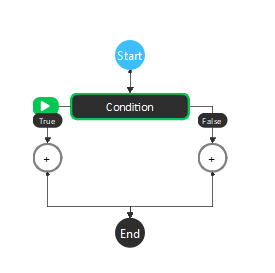
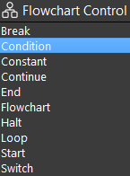
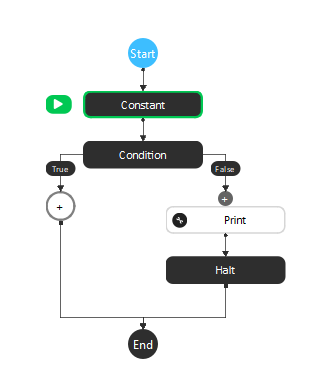
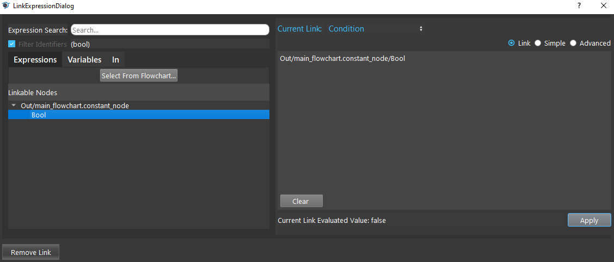
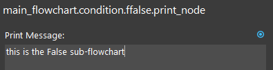
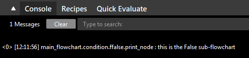

Condition Node
=========

Overview
---------

The **Condition node** is used to execute either of two sub-flowcharts based on an inputted expression.
The **Condition node** takes an expression which must evaluate to a boolean. 
When true, the sub-flowchart corresponding to True is executed; when false, the sub-flowchart corresponding to False is evaluated. 

|

Output 
---------

+-------------------------+-------------------+-----------------------------------------------------------------------------------+
| Output                  | Type              | Description                                                                       |
+=========================+===================+===================================================================================+
| Condition               | bool              | The boolean value of the input Condition expression.                              |
+-------------------------+-------------------+-----------------------------------------------------------------------------------+

|

Procedure to Use
------------------

1. Set up the flowchart as in the following image.

|

2. Click the Condition node, link the Constant node's Bool output. Some other way of controlling the branches is to use variables in the Advanced mode, or you can link other nodes' outputs.

|

3. Click the Print node. Type a print message.

|

4. Click the Halt node. Set the Halt value to True.

.. image:: images/Condition/condition_procedure_4.png
   :scale: 80%	

|

5. Run the flowchart. You can see that the False sub-flowchart is executed and the print message is printed to the console.

|