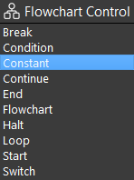
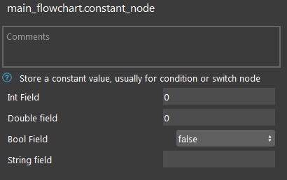
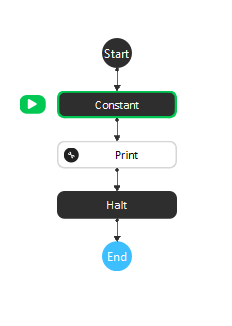
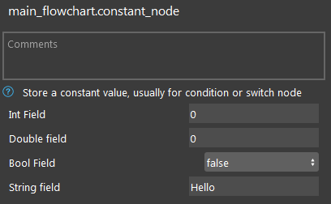
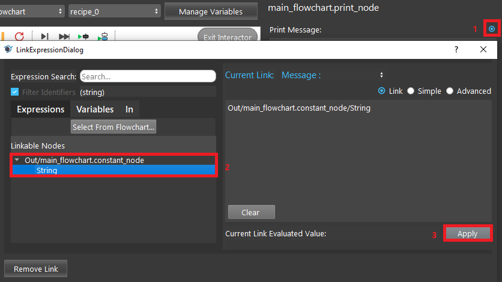
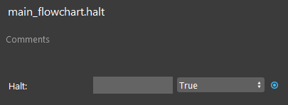
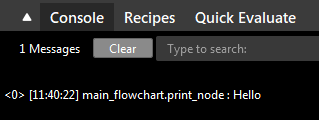

Constant Node
==============

Overview
---------
Continue Node holds constant values which can be referenced in other nodes. 
It can hold integer, double, string, or boolean values as constants.

		

|

Output 
---------
+-------------------------+-------------------+-----------------------------------------------------------------------------------+
| Output                  | Type              | Description                                                                       |
+=========================+===================+===================================================================================+
| Int                     | int               | Integer-type value inputted by the user.                                          |
+-------------------------+-------------------+-----------------------------------------------------------------------------------+
| Double                  | double            | Double-type value inputted by the user.                                           |
+-------------------------+-------------------+-----------------------------------------------------------------------------------+
| Bool                    | bool              | Boolean-type value inputted by the user.                                          |
+-------------------------+-------------------+-----------------------------------------------------------------------------------+
| String                  | string            | String-type value inputted by the user.                                           |
+-------------------------+-------------------+-----------------------------------------------------------------------------------+

|

Node Settings
---------------

- Int Field (Default: 0):
   Integer-type value to be inputted by user.

- Double Field (Default: 0):
   Double-type value to be inputted by user.

- Bool Field (Default: False):
   Boolean-type value to be inputted by user.

- String Field: 
   String-type value to be inputted by user. 

|

Procedure to Use
-----------------

1. Set up the flowchart as in the following image:

|

2. Click the Constant node. Type in a string into the String Field.

|

3. Click the Print node. Link the string output from the Constant node.

|

4. Click the Halt node, change the boolean to True. 

|

5. Run the flowchart. You can see the string you typed into the Constant node is printed onto the console.

|

