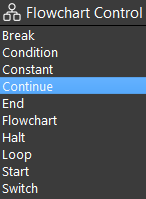
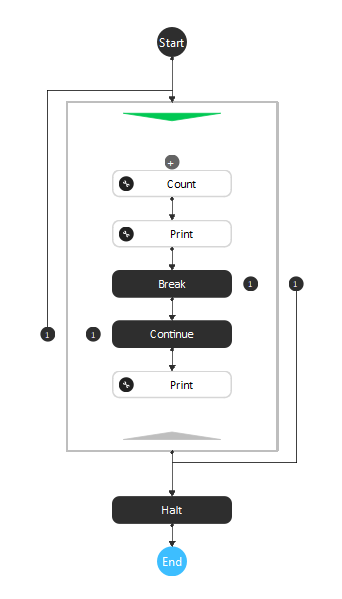
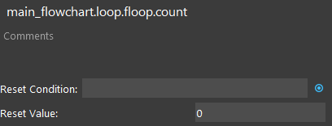
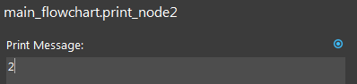
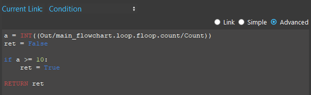
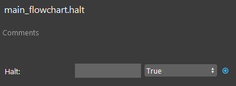
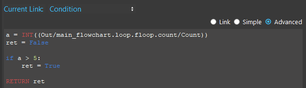
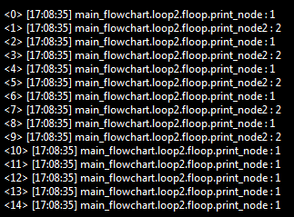

Continue Node
==============

Overview
---------
Continue Node is used inside of Loops to forward the loop execution to the next loop iteration. 
This node allows the you to skip part of a Loop sub-flowchart by simply going to the next iteration. 

The Continue node cannot be inserted outside of a Loop.

Output 
---------

+-------------------------+-------------------+----------------------------------------------------------------------------------------------------------------------------------+
| Output                  | Type              | Description                                                                                                                      |
+=========================+===================+==================================================================================================================================+
| Condition               | Bool              | The boolean value of the Condition expression. When true, the loop is forwarded to its next iteration from the Continue node.    |
+-------------------------+-------------------+----------------------------------------------------------------------------------------------------------------------------------+

Procedure to Use
-------------------

We will need a few more nodes in order to demonstrate the usage of the Continue node.

1. Set up the flowchart as in the following image. Insert a Loop node, Constant node, Continue node, two Print nodes, and a Halt node.
   

|

2. Keep the default settings in the Count node.

|

3. Click the first Print node, and type "1" as the Print Message.

.. image:: images/Continue/continue_procedure_3.png
   :scale: 80%

|

4. Click the second Print node, and type "2" as the Print Message.

|

5. Click the Break node, set the Break Condition as in the following image.

|

6. Click the Halt node, set it to True.

|

7. Click the Continue node, select Advanced mode and type in the following as the Continue conditon.

|

8. Run the flowchart. From the console messages, we can see that the other Print node is skipped for the latter iterations since the condition in the Continue Node is met. 

|