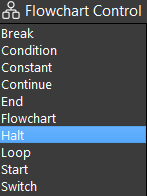
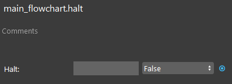
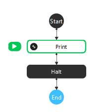
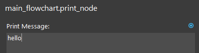
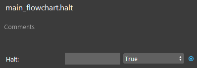
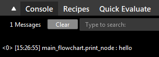

Halt Node
=========

Overview
---------
**Halt node** is used to stop a flowchart's execution. 
The **Halt node** halts flowchart execution whenever the Halt value evaluates to True. 

	
|

Output 
---------

+-------------------------+-------------------+-----------------------------------------------------------------------------------+
| Output                  | Type              | Description                                                                       |
+=========================+===================+===================================================================================+
| Halt                    | Bool              | When true the execution of the flowchart is halted at this node.                  |
+-------------------------+-------------------+-----------------------------------------------------------------------------------+

|

Node Settings
----------------

- **Halt** (Default: False):
	The first box is an expression which must evaluate to a boolean, which can be set by clicking the blue dot. When true the execution of the flowchart is halted at this node. 
	The second field is a list, which can choose from either True or False.

|

Procedure to Use
-----------------

1. Insert a Print node, and a Halt node.

|

2. Click the Print node, enter "hello" as the print message.

|

3. Click the Halt node, change the Halt value to True.

|

4. Run the flowchart. You can see the message "hello" once in the console, and the flowchart is stopped by the Halt node. 

|
