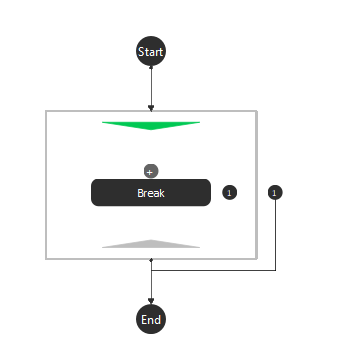

Loop Node
=========

Overview
------------------
Create a loop which executes until a break condition is met. 
Generates a sub-flowchart with a Break Node that executes iteratively until the condition defined in a Break Node (which can be the one generated upon placing the Loop Node, or by another Break Node placed by the user) evaluates to True. 

.. image:: images/Loop/loop_overview_2.png
   :align: center
		
The image above shows a Loop Node placed without any modifications. The Break node is automatically inserted. 

Output 
------------------

+-------------------------+-------------------+-----------------------------------------------------------------------------------+
| Output                  | Type              | Description                                                                       |
+=========================+===================+===================================================================================+
| Iteration               | int               | The number of loops completed. Resets to 0 every time the loop begins executing.  |
+-------------------------+-------------------+-----------------------------------------------------------------------------------+

Procedure to Use
------------------

1. Insert a Loop.
	.. image:: images/Loop/loop_procedure_0.png
	   :scale: 80%	

|

2. Insert a Halt node after the loop.
	.. image:: images/Loop/loop_procedure_1.png
	   :scale: 80%	

|

3. Click the Break node insdie the loop. Define the break condition. Use the Advance mode here and you can specify your break condition. In this case, the loop will execute 10 times.
	.. image:: images/Loop/loop_procedure_2.png
	   :scale: 80%	

|

4. Check the variables in Quick Evaluate. You can see that the break condition is 1 (True) and Iteration is 10 (ran 10 times).
	.. image:: images/Loop/loop_procedure_3.png
	   :scale: 80%	

	.. image:: images/Loop/loop_procedure_4.png
	   :scale: 80%	

|
