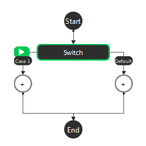
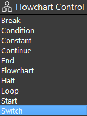
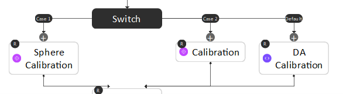
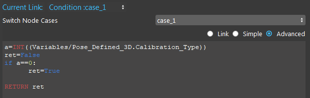
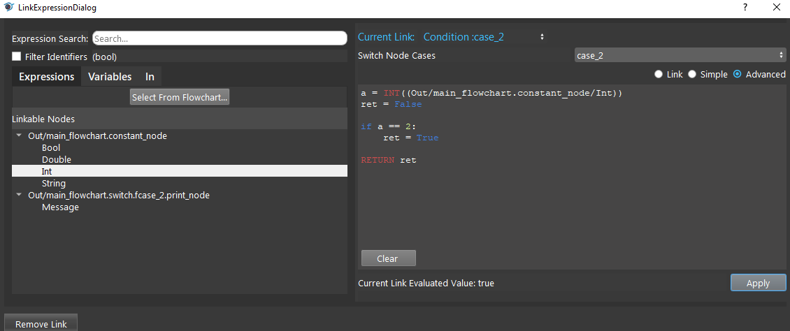
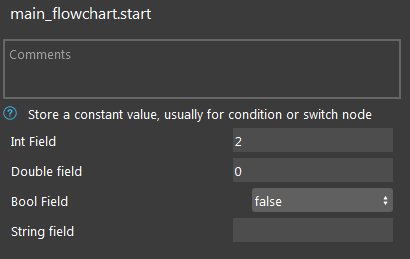
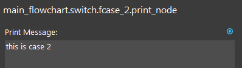
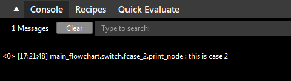

Switch Node
=============

Overview
---------

The Switch node is a generalization of the Condition Node to at least 2 cases used to execute one of many sub-flowcharts based on expressions for each case.

Upon placing a Switch node, generates two sub-flowcharts, 'Case 1' and 'Default'.

Each case has an input 'Condition: case_x' which when evaluates to true, causes that case's sub-flowchart to be executed when the switch node is hit. 
If multiple cases have conditions evaluate to True, then the smallest number case's sub-flowchart will be executed (i.e. if Case 1 and Case 2 both have input conditions that evaluate to True, only Case 1's sub-flowchart would be executed). 
The Default case's sub-flowchart will execute when all other cases are evaluated to false.

Below is an example of using the Switch node to switch between different calibration types.

		
|

Output 
---------

+-------------------------+-------------------+-----------------------------------------------------------------------------------+
| Output                  | Type              | Description                                                                       |
+=========================+===================+===================================================================================+
| Condition               | bool              | The boolean value of the input Condition expression.                              |
+-------------------------+-------------------+-----------------------------------------------------------------------------------+

Procedure to Use
-----------------

1. Set up the flowchart as in the following image.

.. image:: images/Switch/switch_procedure_1.png
   :scale: 80%	

|

2. Click the Constant node. Change the Int Field to 2.

|

3. Click the Switch node, select case_2 and Advanced mode. Let condition: case_2 evaluates to True when the Constant Int is 2.

|

4. Click the Print node. Type a print message.

|

5. Click the Halt node. Set the Halt value to True.

.. image:: images/Switch/switch_procedure_5.png
   :scale: 80%	

|

6. Run the flowchart. You can see the print message from Case 2, and the flowchart is halted.

|

Exercise
---------
1. Given there are case_1, case_2, case_3, and case_default. If both case_2 and case_3 are true, which case is run?

A. case_1
B. case_2
C. case_3
D. case_default

|
|
|
|
|
|
|
|
|
|
|
|
|
|
|

Answers for Exercise
-----------------------

1. B. case_2 is run. When two cases evaluate to True, the sub-flowchart of the case with smaller number is run.