Procedure for Using Image Process Node
------------------------------------------

Image processing node gives you the ability to perform several image processing operations on input images. The input of
this node is an image which is usually linked to the reader or the camera node. An example of an input image and linking the input is shown below. 

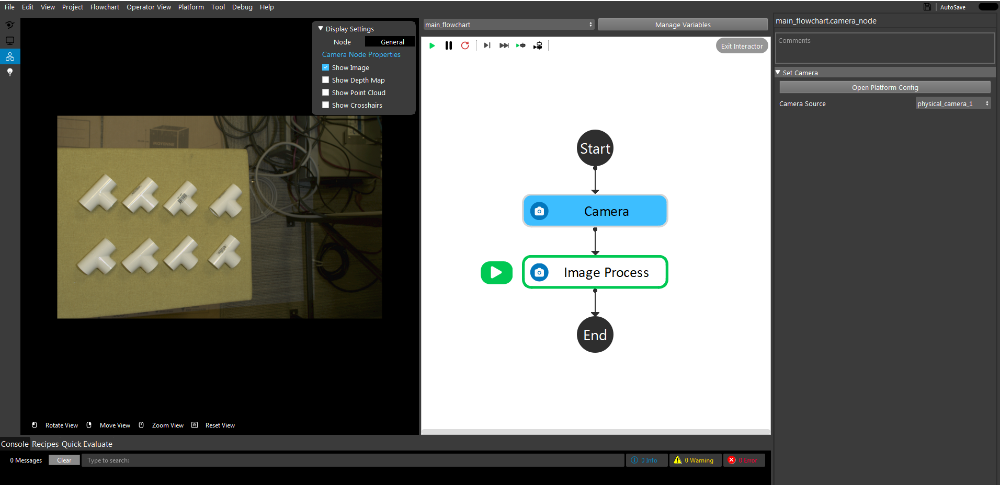
    
|

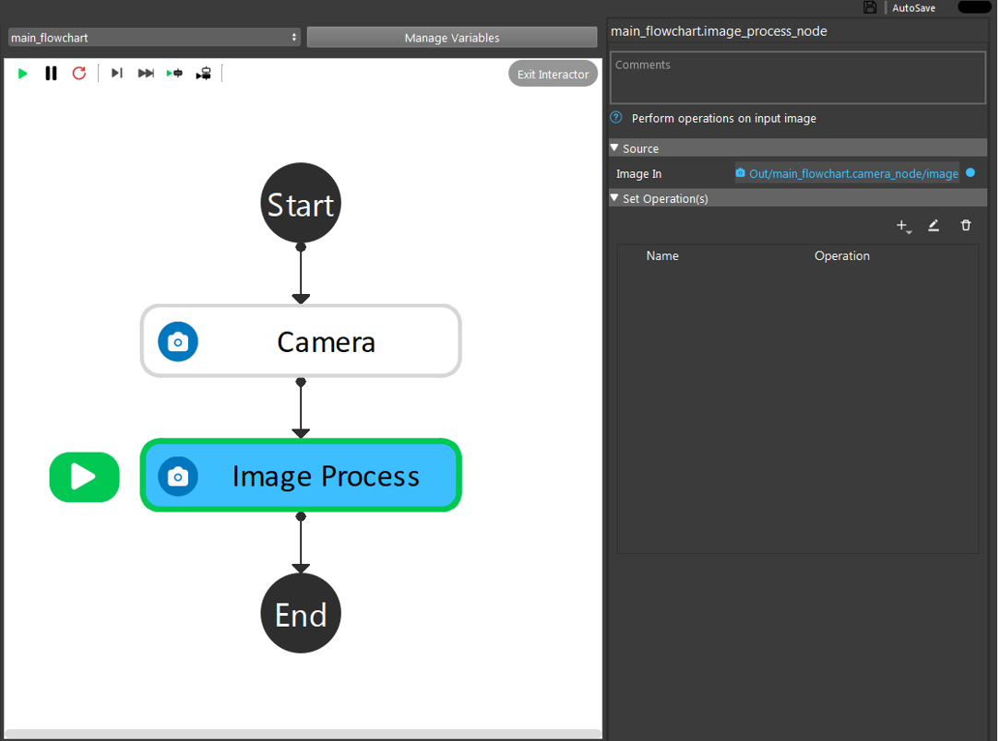
    
|

In order to choose an operation or a set of operations, you can choose the plus sign under the 'Set Operations' section. 

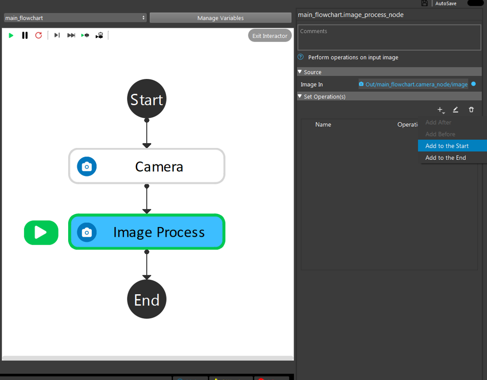
    
|

By clicking the add button, an operation will be added to the operation list. By default, this operation will be a "Resize" operation. In order to change the chosen operation, click on the added operation. Then, as shown below, you will 
be able to see a set of operations to choose from. 

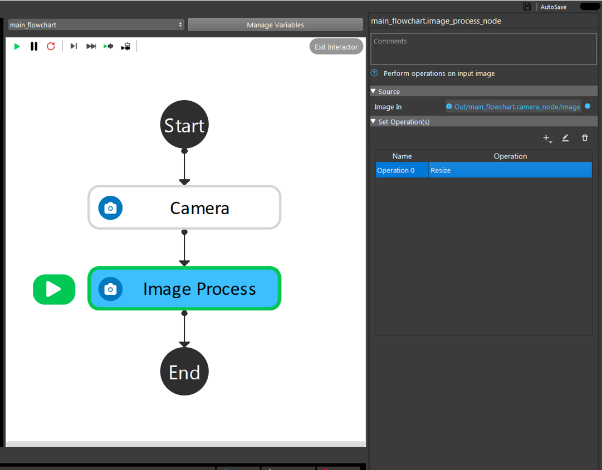
    
|

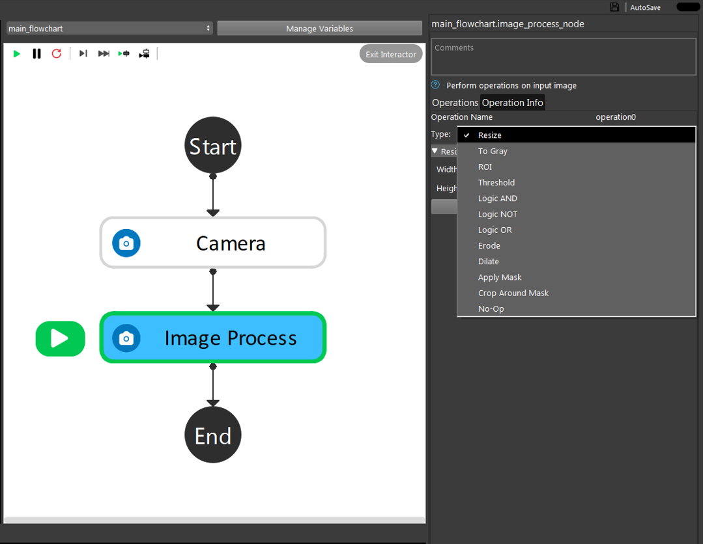
    
|

Note that base on your needs, you can choose as many as operations you want to be performed by order on the input image. In the next section, each of the available operations are explained. 

Resize
~~~~~~~~~~~~~~
This operation resizes the input into a user-specified size. An example of the settings of this operation is shown below. 

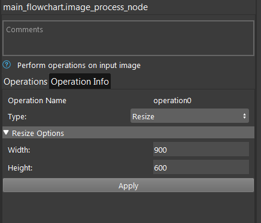
    
|

To Gray
~~~~~~~~~~~~~~
This operation converts the input image into a gray scale image with user-specified weights to control the gray level. An example of this settings is shown below. 

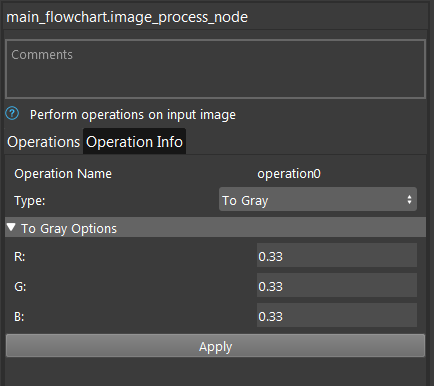
    
| 

The user-specified values R,G and B will determine each of the channels weights when converting to gray scale. The sum of wights should be equal to 1. The default value for each channel is 0.33. An example of an input image and output using the 
'To Gray' operation are shown below, respectively.

.. image:: Images/toGray/in.png
    :align: center
    
|

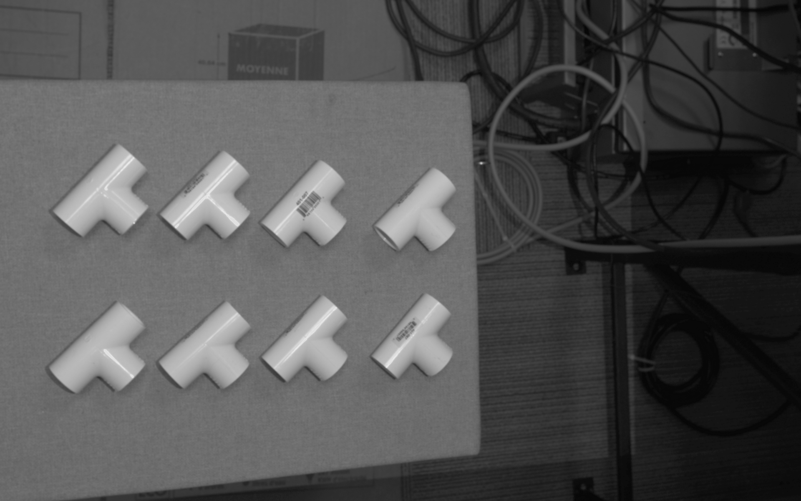
    
|

    
ROI
~~~~~~~~~~~~~~
Using this operation, you can define a rectangular Region Of Interest (ROI) in the input image and crop it out as the output. The image below shows the settings of this operation. 

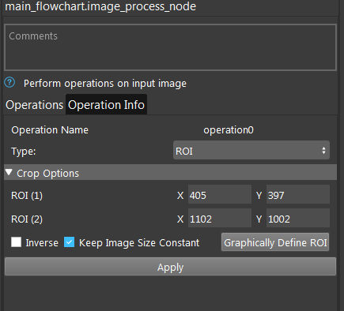
    
| 

As it can be seen, you need to define a region of interest graphically or manually by entering the pixel locations of the ROI1 (top left corner pixel location) and ROI2 (bottom right corner pixel location). By default, the output image 
will have the same size as the input image. However, you can resize the output image to the ROI size if needed by unchecking the "Keep Image Size Constant" checkbox. 

An example of the input image and the output image using the above settings is shown below, respectively.

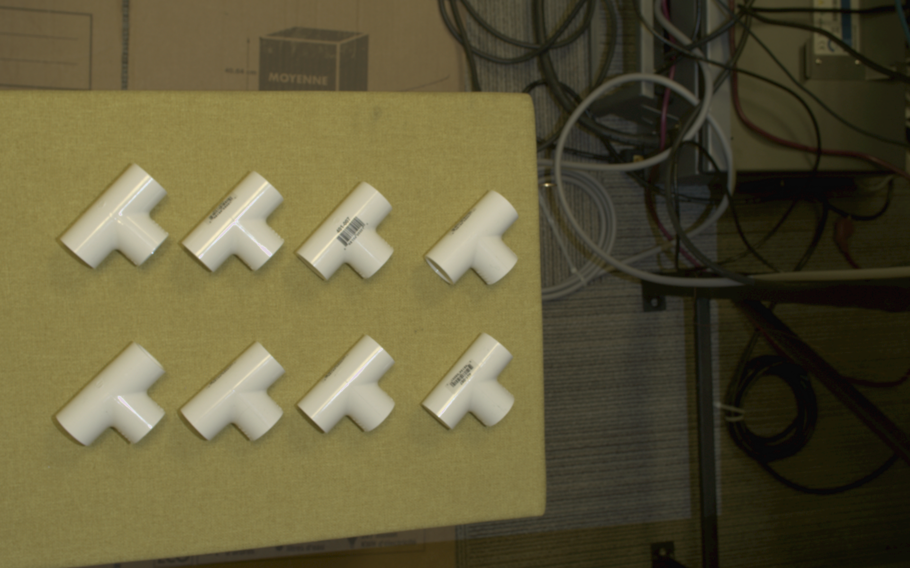
    
|

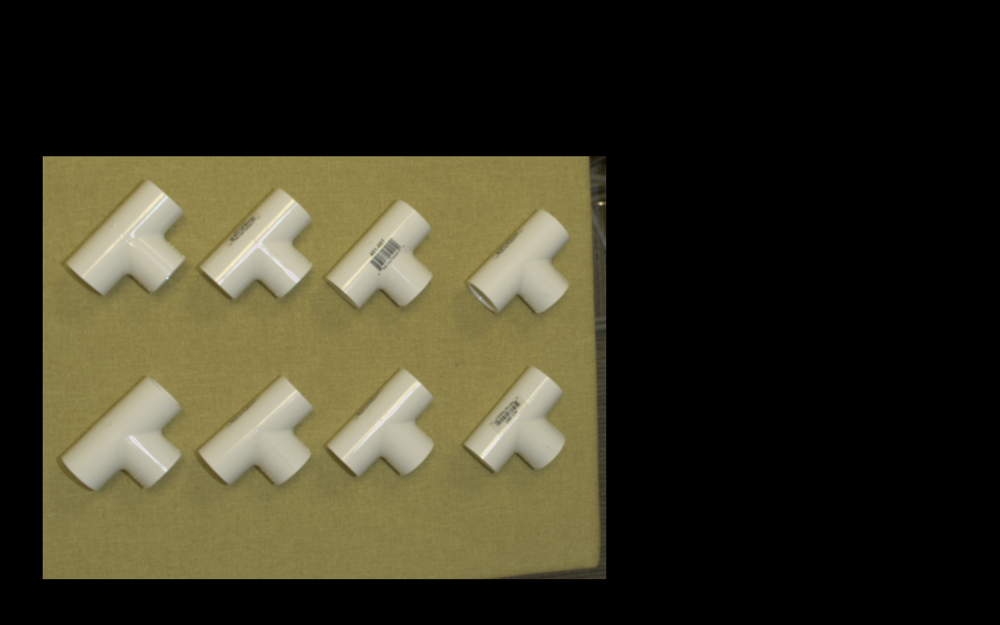
    
|

Note that you also has the choice of excluding the chosen ROI by checking the "Inverse" option.  

Threshold
~~~~~~~~~~~~~~
This operation performs a global thresholding (binarization) on the input image based on the user-specified threshold value. The image below shows the settings of this operation. 

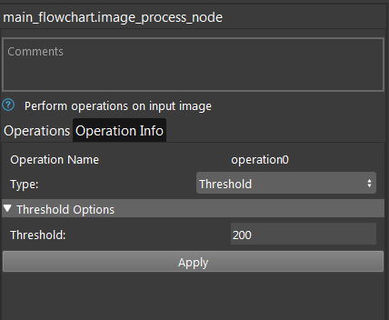
    
|

The user-specified threshold should have a value in range of 0 to 255 and determines the threshold used for binarization. 

.. image:: Images/threshold/in.png
    :align: center
    
|

.. image:: Images/threshold/out.png
    :align: center
    
|

Logic AND
~~~~~~~~~~~~~~
This operation performs logic AND operation between the input image and user-specified image. The image below shows the settings of this operation. 

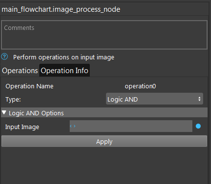
    
|

As shown in the image above, you have to define an additional image in the operation config page which is used for AND operation with the node input image. An example of the node image input, user-specified image for AND operation and the output image of this 
is below , respectively.

.. image:: Images/logic_and/in.png
    :align: center
    
|

.. image:: Images/logic_and/in1.png
    :align: center
    
|

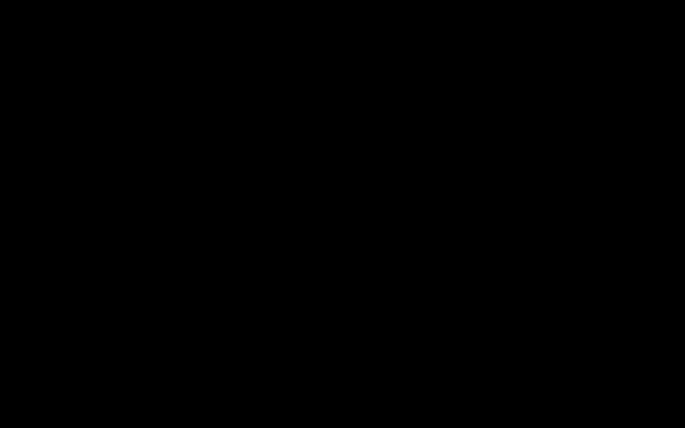
    
|

Logic NOT
~~~~~~~~~~~~~~
This operation performs logic NOT operation on the input image. Example of the input image and output using this operation is shown below.

.. image:: Images/logic_not/in.png
    :align: center
    
|

.. image:: Images/logic_not/out.png
    :align: center
    
|

Logic OR
~~~~~~~~~~~~~~
This operation performs logic OR operation between the input image and user-specified image. The image below shows the settings of this operation. 

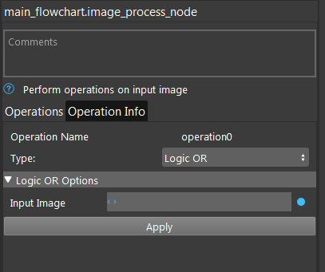
    
|

As shown in the image above, you have to define an additional image in the operation config page which is used for OR operation with the node input image. An example of the node image input, user-specified image for OR operation and the output image of this 
is shown below, respectively.

.. image:: Images/logic_or/in.png
    :align: center
    
|

.. image:: Images/logic_or/in1.png
    :align: center
    
|

    
|

Erode
~~~~~~~~~~~~~~
This operation performs erosion operation on the input image using the user-specified parameters (number of erosion iterations and used kernel size). The image below shows the settings of this operation. 

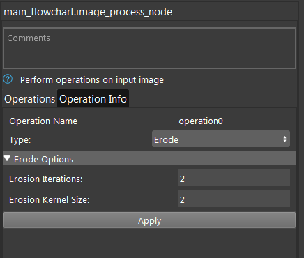
    
|

Using a bigger kernel size and number of iterations will result in more erosion of the input image. An example of the input image and output using this operation is shown below.

.. image:: Images/erode/in_erode.png
    :align: center
    
|

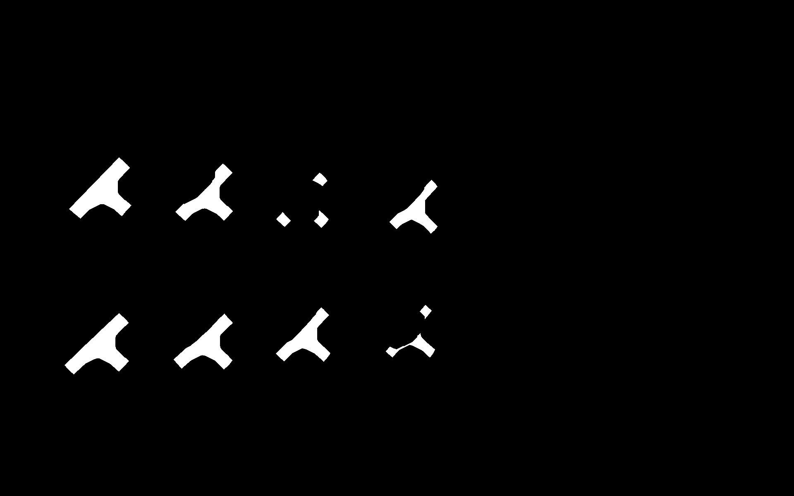
    
|

Dilate
~~~~~~~~~~~~~~
This operation performs dilation operation on the input image using the user-specified parameters (number of dilation iterations and used kernel size). The image below shows the settings of this operation.

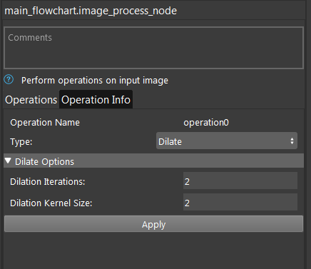
    
|

Using a bigger kernel size and number of iterations will result in more dilation of the input image. An example of the input image and output using this operation is shown below.

.. image:: Images/dilate/in.png
    :align: center
    
|

.. image:: Images/dilate/out.png
    :align: center
    
|

Apply mask
~~~~~~~~~~~~~~
This operation applies a mask to the input image. The mask input can be linked to a node which produces a mask, or by reading in a mask image using a Reader/Camera node. The image below shows the settings of this operation.

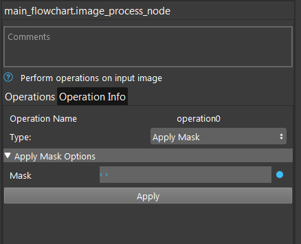
    
|

As shown in the image above, you have to define an additional image in the operation config page which is the mask used for this operation. An example of the node input input image, input mask and resulted output is shown below. 

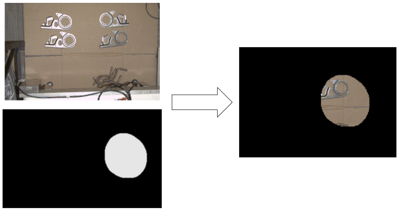
    
|

Crop Around Mask
~~~~~~~~~~~~~~
This operation crops the image around a mask with size of the user-specifications in pixels. This operation was added to produce cropped images which can then be fed into DL models. The image below shows the settings of this operation.

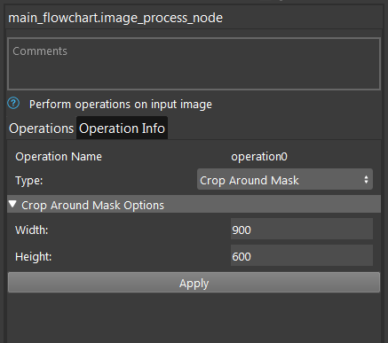
    
|

An example of the input image and resulting output image is shown below. 

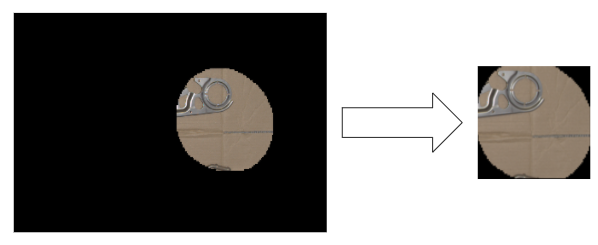
    
|

No-Op
~~~~~~~~~~~~~~
This option outputs the same image as the input image.

    