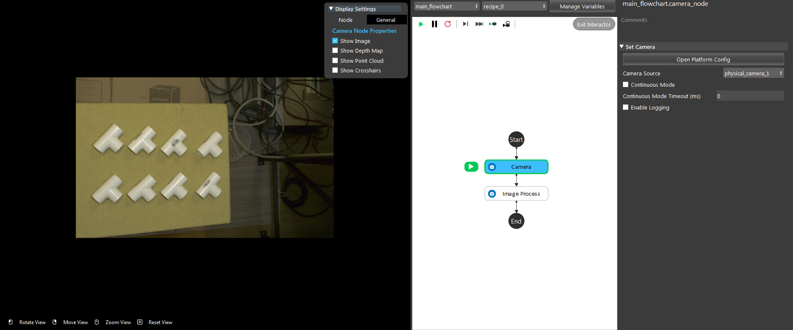
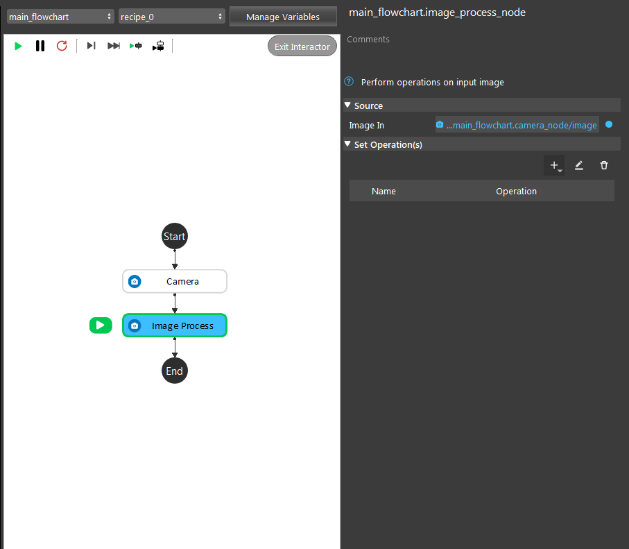
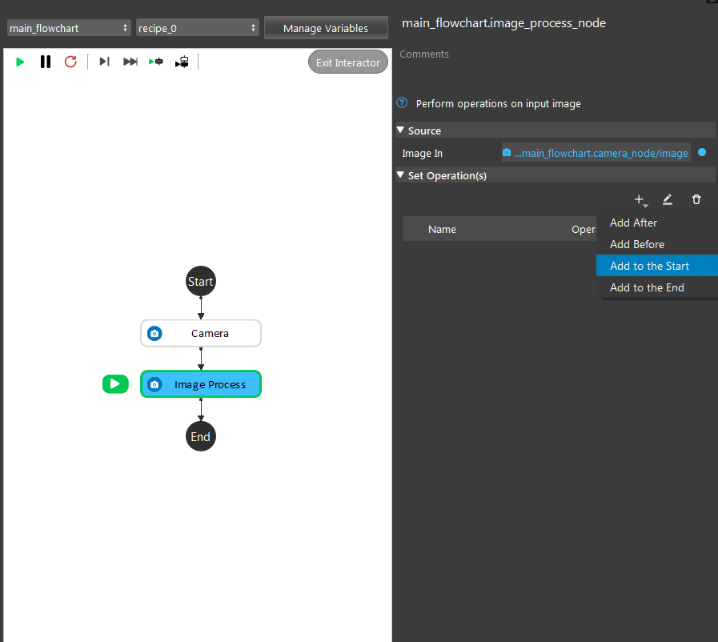
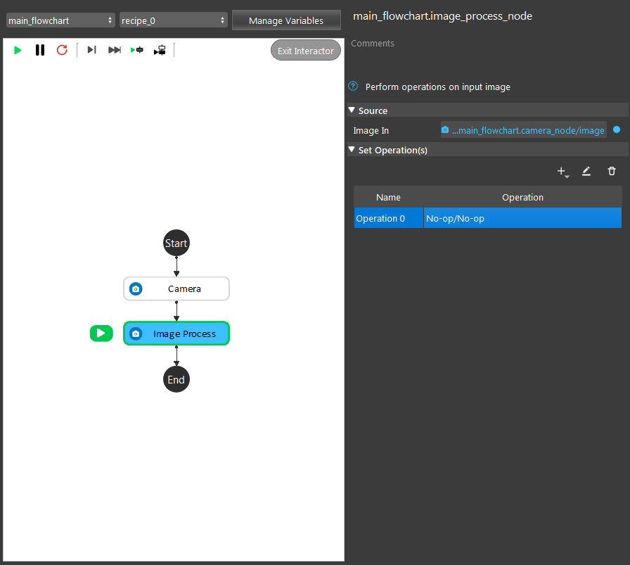
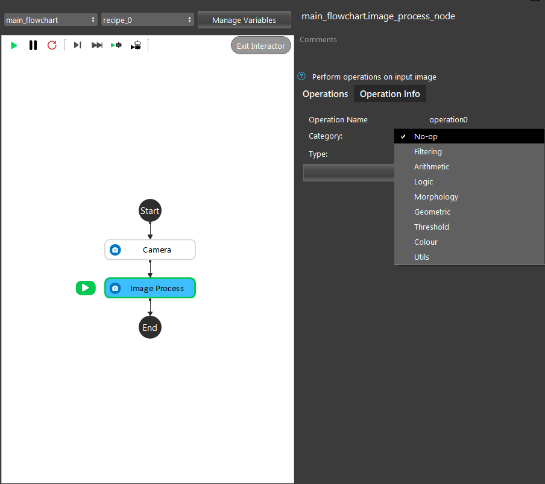

Image Process Node
====================

Overview
----------

This node is designed to handle operations to proc on images. It supports adding arbitrary operations 
in a list and applies each operation in the specified order and outputs the final rgb image. The functions used are primarily from OpenCV.

Input & Output
----------------

+------------+--------------+------------------------------------------------+
| Input      | Type         | Description                                    |
+============+==============+================================================+
| Image_In   | Image        | Input image for image process operations.      |
+------------+--------------+------------------------------------------------+

+-------------------------+-------------------+------------------------------------------------------------------------+
| Output                  | Type              | Description                                                            |
+=========================+===================+========================================================================+
| imageOutput             | Image             | Output image after performing different operations on the input image. |
+-------------------------+-------------------+------------------------------------------------------------------------+
| pose2DOutput            | Vec<Pose2D>       | Returned 2D Pose for Select Pixel opertaion.                           |
+-------------------------+-------------------+------------------------------------------------------------------------+


Operations
------------

No-op
~~~~~~

This option outputs the same image as the input image.

Filtering
~~~~~~~~~~~

    - **Bilateral Filter**:
        Applies the bilateral filter to the image. Bilateral filter is effective in removing noise while keeping edges sharp, but the operation is slower than other filters.
        
        - Size of Kernel: Size of the square kernel applied to the image matrix. 
        - Sigma Value: Value used for fiter sigma in color & coordinate space. Larger value means farther pixels will be mixed together.

        .. image:: Images/operations_demo/bilateral.png
            :align: center
            :scale: 70%

    - **Blur**:
        Apply a normalized box filter to the image which averages the pixels and blurs the image.
        
        - Size of Kernel: Size of the square kernel applied to the image matrix. 

        .. image:: Images/operations_demo/blur.png
            :align: center
            :scale: 70%
                    
    - **Box Filter**:
        Apply a box filter to the image which blurs the image.
        
        - Size of Kernel: Size of the square kernel applied to the image matrix. 

        .. image:: Images/operations_demo/box_filter.png
            :align: center
            :scale: 70%
            
    - **Guassian Blur**:
        Apply a guassian filter to the image which blurs the image.
        
        - Size of Kernel: Size of the square kernel applied to the image matrix. 
        - Sigma Value: The standard deviation value for Guassian kernel.

        .. image:: Images/operations_demo/guassian_blur.png
            :align: center
            :scale: 70%
            
    - **Median Blur**:
        Apply a Median filter to the image. 
       
        - Size of Kernel: Size of the square kernel applied to the image matrix. 

        .. image:: Images/operations_demo/median_blur.png
            :align: center
            :scale: 70%
            
    - **Smoothening**:
        Apply a 5x5 Mean Filter to the image.

        .. image:: Images/operations_demo/smoothening.png
            :align: center
            :scale: 70%
            
    - **Laplacian Edge**:
        Apply a Laplacian filter to the image which can be used to extract edges.
       
        - Size of Kernel: Size of the square kernel applied to the image matrix. 
        - Scale: Scale factor for the computed Laplacian values, need to be greater than zero.

        .. image:: Images/operations_demo/laplacian.png
            :align: center
            :scale: 70%
            
    - **Sharpening**:
        Apply a 3x3 filter to the image which can be used to sharpen the edges.

        .. image:: Images/operations_demo/sharpening.png
            :align: center
            :scale: 70%
            
    - **Sobel Highlighting**:
        Apply a Sobel filter to the image which can be used to extract edges.
       
        - Size of Kernel: Size of the square kernel applied to the image matrix. 
        - Sobel X-axis Threshold: 
        - Sobel Y-axis Threshold: 

        .. image:: Images/operations_demo/sobel.png
            :align: center
            :scale: 70%
            
    - **CLAHE Operation**:
        Apply a CLAHE (Contrast Limited Adaptive Histogram Equalization) to the image.
       
        - Contrast Limit Threshold: Scale for adjusting contrast.
        - Grid Size: The amount of rows and columns the image is split into for adjusting contrast.

        .. image:: Images/operations_demo/clahe.png
            :align: center
            :scale: 70%
            
    - **Edge Detect**:
        Apply a Canny filter to the image which can be used to extract edges.
       
        - Threshold 1: The first threshold for the hysteresis procedure. 
        - Threshold 2: The second threshold for the hysteresis procedure.
        - Aperture Size: The aperture size for the Sobel operator.

        .. image:: Images/operations_demo/edge_detect.png
            :align: center
            :scale: 70%
            
    - **Image Enhancement**:
        Applys CLAHE to the image and uses blur for preprocess and sharpening for post process. 
       
        - Blur Amount: The amount of blur applied before sharpening. 
        - Contrast Limit Threshold: Scale for adjusting contrast.
        - Grid Size: The amount of rows and columns the image is split into for adjusting contrast.

        .. image:: Images/operations_demo/image_enhance.png
            :align: center
            :scale: 70%
            
Arithmetic
~~~~~~~~~~

    - **Add**:
        Add the source image with the input image. The input image need to be the same size with the source image.

    - **Subtract**:
        Subtract the source image with the input image. The input image need to be the same size with the source image.

    - **Absolute**:
        Take the Absolute of each pixel wthin the source image.

    - **Negate**:
        Compute (255 - <pixel value>) for each channel of each pixel in the image.

    - **Multiply**:
        Multiply each pixel in the source image with each pixel in the input image. The input image need to be the same size with the source image.

    - **Divide**:
        Divide each pixel in the source image by each pixel in the input image. The input image need to be the same size with the source image.

Logic
~~~~~

    - **Not**:
        Compute bitwise 'Not' for each pixel in the image, works the same as Arithmetic Negate.

        .. image:: Images/operations_demo/not.png
            :align: center
            :scale: 60%
            
    - **Or**:
        Compute bitwise 'Or' for each pixel in the source image with input image.

        .. image:: Images/operations_demo/or.png
            :align: center
            :scale: 50%
            
    - **And**:
        Compute bitwise 'And' for each pixel in the source image with input image.

        .. image:: Images/operations_demo/and.png
            :scale: 50%
            :align: center
            
    - **Xor**:
        Compute bitwise 'Xor' for each pixel in the source image with input image.

        .. image:: Images/operations_demo/xor.png
            :scale: 50%
            :align: center

Morphology
~~~~~~~~~~

            
    - **Erode**:
        Perform Erode opertaion to the source image.
       
        - Iterations: Number of times to apply the operation
        - Size: The kernel size for the operation


    - **Dilate**:
        Perform Dilate opertaion to the source image.
       
        - Iterations: Number of times to apply the operation
        - Size: The kernel size for the operation

        .. image:: Images/operations_demo/erode_dilate.png
            :align: center
            :scale: 70%
            
    - **Open**:
        Perform Open opertaion (Erode then Dilate) to the source image.
       
        - Iterations: Number of times to apply the Erode and Dilate operation
        - Size: The kernel size for the Erode and Dilate operation

    - **Close**:
        Perform Close opertaion (Dialate then Erode) to the source image.
      
        - Iterations: Number of times to apply the Erode and Dilate operation
        - Size: The kernel size for the Erode and Dilate operation

        .. image:: Images/operations_demo/open_close.png
            :align: center
            :scale: 50%

            
    - **TopHat**:
        Perform an Open operation and subtract the source image by its result. 
       
        - Iterations: Number of times to apply the Erode and Dilate operation
        - Size: The kernel size for the Erode and Dilate operation

        .. image:: Images/operations_demo/tophat.png
            :align: center
            :scale: 70%


    - **BlackHat**:
        Perform an Close operation and subtract the source image by its result.
      
        - Iterations: Number of times to apply the Erode and Dilate operation
        - Size: The kernel size for the Erode and Dilate operation

        .. image:: Images/operations_demo/blackhat.png
            :align: center
            :scale: 70%
            
    - **Gradient**:
        Perform a dilate operation on the source image, and another erode operation on the source image then return thier difference. 
       
        - Iterations: Number of times to apply the Erode and Dilate operation
        - Size: The kernel size for the Erode and Dilate operation
       
        .. image:: Images/operations_demo/Gradient.png
            :align: center
            :scale: 70%

Geometric
~~~~~~~~~~

    - **Resize**:
        Resize the source image according to the input dimensions.
        
        - Width: The width of the output image in pixels. If "Use Percentage Size" is checked, the units will be in Percentage with respect to the source image's width.
        - Height: The height of the output image in pixels. If "Use Percentage Size" is checked, the units will be in Percentage with respect to the source image's width.
        - Use Percentage Size: Checkbox when checked, will use Percentage Size for Height and Width feild.
        - Keep Aspect Ratio: Checkbox when checked, will disable height input and will automatically compute height based on Width and the source image's width height ratio.

    - **Rotate**:
        Output the rotated the image for the input angle (degrees).
    
    - **Transpose**:
        Compute the transpose of the source image matrix and returns it as the output image.
    
    - **Flip**:
        Flip the image with respect to the input axis (X-axis, Y-axis, Both).

Threshold
~~~~~~~~~

    - **Simple**:
        Set pixels to black if their value is less than input threshold;
        and pixles to white if their value is greater or equal to threshold.

        .. image:: Images/operations_demo/threshold_simple.png
            :align: center
            :scale: 70%
                    
    - **Adaptive**:
        Set pixels to black if pixel value is less than adaptive threshold;
        and pixles to input threshold value if pixel value is greater or equal to adaptive threshold.

        .. image:: Images/operations_demo/threshold_adaptive.png
            :align: center
            :scale: 70%

Colour
~~~~~~

    - **To Gray**:
        Convert source image to grayscale image. 

        - [R, G, B]: The channel weight when converting to grayscale. The sum of the weights should be equal to 1.

    - **Color Filter**:
        Filter out pixels, change to black, if their color values are within the configured condition.

        - Mode: Choose between "RGB" mode and "HSV" mode.
        - Filter Type: Choose between "Include" or "Exclude".
        - [RGB, HSV]: RGB or HSV depending on the Mode, specifies the color value for filtering.
        - Threshold: The threshold for the filter. If the RGB value of a pixel in the scene falls inside the range of +/- Threshold * 10, this point will be excluded/included the scene.

Utils
~~~~~

    - **Select Pixel**:
        When running the node, will allow you to select a point on the image and output its coordinates.

    - **ROI**:
        Select a Region of Interest in the Image.

        - ROI(1): The top-left corner of the ROI.
        - ROI(2): The bottom-right corner of the ROI.
        - Inverse: Checkbox when checked will return the image outside of the region, and when not checked will return the image within the region.
        - Keep Image Size Constant: Checkbox when checked will keep the output image to have the same width and height of the source image, and when not checked will output image with the ROI's dimentsions.

    - **Apply Mask**:
        Applies a mask to the input image. The mask input can be linked to from a node which produces a mask, or by reading in a mask image using a Reader node.

        .. image:: Images/apply_mask/img.png
            :align: center
    
    - **Crop Around Mask**:
        Crops the image around an already applied mask with size of the user’s specifications in pixels. This operation was added to produce cropped images which can then be fed into DL models. 
        
        .. image:: Images/crop_around_mask/img.png
            :align: center

    - **16bit to 8bit**:
        Convert 16 depth map to 8 bit image.

        Color Map: Use the input color map code for the 8bit image0 (defualt: -1).


Procedure for Using Image Process Node
------------------------------------------

Image processing node gives you the ability to perform several image processing operations on input images. The input of
this node is an image which is usually linked to the reader or the camera node. An example of an input image and linking the input is shown below. 


    
|


    
|

In order to choose an operation or a set of operations, you can choose the plus sign under the 'Set Operations' section. 


    
|

By clicking the add button, an operation will be added to the operation list. By default, this operation will be a "No-op" operation. In order to change the chosen operation, double click on the added operation. Then, as shown below, you will 
be able to see a set of operations to choose from. 


    
|


    
|

Note that base on your needs, you can choose as many as operations you want to be performed by order on the input image. 


Exersice
----------

Try to come up with the setting on **Image Process** node according to the requirements below. You can work on these exercise with the help of this article. We also have answers attached at the end of this exercise.

This is some helpful resource when you are working on the exercise:

Scenario 1
~~~~~~~~~~

There is a project which requires the robot to pick all the occurrences of the T-tube in scene. 
Your colleague has setup the 3D camera and robot in the lab for experiment. 
Here's a `link to .dcf file <https://daoairoboticsinc-my.sharepoint.com/:u:/g/personal/tzhang_daoai_com/EUaL8LFp-JlJugrB-VYSCr8BODvs7cyJszjIywupMCNDDg?e=XCPFjb>`_ which are used as camera input.

You need to help him preprocess the image using the **Image Process** node in main_flowchart. Please choose the all correct answers from the options:

1. The image below is the original image, suppose we are only interested in the object area. How should you remove the background of the image?
	.. image:: images/exersice_1.png

	A. Use a Utils/Crop-Around-mask operation
	B. Use a Geometric/Resize operation
	C. Use a Utils/ROI operation
	D. Use a Arithmetic/Subtract operation

2. Proceed from (1), you want to do some proprocessing on the image to sharpen edges and remove noise. What operations can you choose?
	.. image:: images/exersice_2.png


	A. Use a Filtering/Guassian-Blur operation
	B. Use a Filtering/Sharpening operation
	C. Use a Filtering/Edge-Detect operation
	D. Both A & B

3. Proceed from (2), you want to extract the objects from the image. What operations can you choose?
	.. image:: images/exersice_3.png

	A. Use a Color/Color-Filter operation.
	B. Use a Threshold/Simple operation.
	C. Use a Threshold/Adaptive operation.
	D. Both A & B

|
|
|
|
|

Answers for Exercises
~~~~~~~~~~~~~~~~~~~~~~

Scenario 1
```````````````

1. **Answer: C**

**Explanation**: ROI operation as it's name crops out a region of interest.

2. **Answer: D**

**Explanation**: Guassian filter blurs the image and removing some noise in the process, Sharpening can sharpen the edge. But Edge-Detect highlights the edges and thats not what we want here.

3. **Answer: D**

**Explanation**: Since the object is brighter than the background, then we can set a threshold to filter out darker background. Or we can observe that the background's color is consistent, hence we can use color filter to filter out the background color.