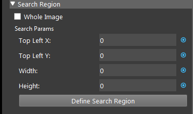

Mod Finder V2 Node 
==================

Overview 
--------

	Mod Finder Version 2 node achieves the same goal as 2d mod finder node, but with our own implementation. 
    This node supports defining models in a 2d image, editing model interactively and search for model occurrences in target images. 
    Each occurrence in the target image contains following information: x and y coordinates of the model’s reference point, 
    rotation angle of the model(clock-wise) and the scaling factor of the model. This node uses a modified generalized hough tranform 
    algorithm to extract edge-based model features and vote for the best occurrences.

Input and Output 
--------------------
	
+----------------------------------------+-------------------------------+-------------------------------------------------------------------------------+
| Input                                  | Type                          | Description                                                                   |
+========================================+===============================+===============================================================================+
| Image (2D Mod Finder)                  | Image                         | The source that is used to search for model.                                  |
+----------------------------------------+-------------------------------+-------------------------------------------------------------------------------+
| Labelled Mask sequence                 | Vec<Image>                    | The image masks from dl models (dl segment).                                  |
+----------------------------------------+-------------------------------+-------------------------------------------------------------------------------+
| Depth Image (3D Mod Finder)            | Depth Image                   | - The source that is used to search for model.                                |
|                                        |                               | - Can link to output from "Cloud to Detph Conversion" node.                   |
+----------------------------------------+-------------------------------+-------------------------------------------------------------------------------+


+-------------------------+-------------------+------------------------------------------------------------------------+
| Output                  | Type              | Description                                                            |
+=========================+===================+========================================================================+
| pose2dSequence          | Vec<Pose2D>       | Vector of pose 2d preserving order from labelled mask sequence.        |
+-------------------------+-------------------+------------------------------------------------------------------------+
| pose3dSequence          | Vec<Pose3D>       | Vector of pose 3d preserving order from labelled mask sequence.        |
+-------------------------+-------------------+------------------------------------------------------------------------+
| MaskSequence            | Vec<Image>        | Vector of pose 2d preserving order from labelled mask sequence.        |
+-------------------------+-------------------+------------------------------------------------------------------------+
| modelMasks              | Map<Image>        | A map of model masks.                                                  |
+-------------------------+-------------------+------------------------------------------------------------------------+
| modelPoses2D            | Map<Vec<Pose2D>>  | A map of vector of 2d poses.                                           |
+-------------------------+-------------------+------------------------------------------------------------------------+
| modelPoses3D            | Map<Vec<Pose3D>>  | A map of vector of 3d poses.                                           |
+-------------------------+-------------------+------------------------------------------------------------------------+
| numFound                | Int               | The total number of occurrences found.                                 |
+-------------------------+-------------------+------------------------------------------------------------------------+
| result                  | ModFinderResult   | A map, mapping “model_name” to “vector of occurrences of this model”.  |
+-------------------------+-------------------+------------------------------------------------------------------------+
| success                 | Bool              | Boolean value indicating the search is successful.                     |
+-------------------------+-------------------+------------------------------------------------------------------------+

Models
------

	The model is defined from the scene, or it can be imported from a DL_Segment node using a labelled mask sequence.
	For the details of the defining or import process, please check the "Procedure to use" section. 
	This section focuses on the properties of models.

	You can adjust the details of the model in the model config page. 
	Double click or select model and click edit button to open model config page.

	.. image:: Images/model_1.png
		:scale: 100%


- **Edit Mask Pixel Size** (Default value: 10):

    The square shaped brush size for when you draw masks on the model.

Model parameters
~~~~~~~~~~~~~~~~

- **Label**: (Default value: -1)

	To distinguish model from the DL segmentation node when labelled mask sequence is used.

- **Acceptance** Range [0,100] (Default value: MEDIUM):

	The minimum matching score where an occurrence is accpeted. 
	An occurrence will be returned only if the match score between the target and the model is greater than or equal to this level.

- **Overlap Threshold** (Default value: 20):

	The maximum overlap ratio of the object. 
	For objects overlapping with others, if the overlap ratio is higher than overlap threshold, it will be ignored. 

- **Num of Occurrences** Range [0, 99] (Default value: 1):

	The maximum occurrences of objects to be found before termination.

- **Model Detail Level** Range [0,100] (Default value: 60):

    The threshold used for canny edge extraction. Lower value will extract more detail.

Model Ref
~~~~~~~~~

- **Default Ref**:

    When checked, will use the default ref point, which is acquired by calculating the mean of all edge pixels. 

    - **X, Y**:

        Available when Default Ref is not checked. 
        The offsets to set the reference point. The X and Y are the X-offset (in pixels) and the Y-offset (in pixels) 
        of the origin of the model's reference axis, relative to the model origin. The top left corner is (0, 0). 

        You can also define reference points in the model image by clicking the “Define Ref Point” of the model. 
        This will enter interactor mode where you need to select a point as a reference point. 
        Normally the reference point is the center of all the edge pixels. 
        It is recommended to use the default reference point.


- **Search Region** (Default value: Whole Image):

    - **Whole image**:
        When checked, the search region is set to "Whole Image". and unchecking it allows you to define a specified region of the Image. 


        
	*Top Left X*:
		The top left starting X pixel value.

	*Top Left Y*:
		The top left starting Y pixel value.

	*Width*:
		The X dimension size of the search area in pixels.
	
	*Height*:
		The Y dimension size of the search area in pixels.

	For example, if the interested search region is in the top left corner of the image with a size of 1000*1000 pixels, the parameters should 
	be set as (0, 0, 1000, 1000).

	Alternatively, you can define the search region in the target image by clicking “Define Search Region” 
	and draw a rectangular ROI on target image.

- **Search Scale**:

    - **Enable Scale**:
        When checked, will search for models within a specified scale range. 
			.. image:: Images/model_3.png
				:scale: 100%
				
    Scaling Step (Default value: 0.1): 
        The step used in each scaled model.

    Scaling Min (Default value: 0.5):
        The min scale used in scale range calculations.

    Scaling Max (Default value: 1.5):
        The max scale used in scale range calculations.

- **Search Angle**:

	Min Angle: 
		Controls the lower limit of the angular range, relative to the reference angle (Model Ref Angle).

	Max Angle: 
		Controls the upper limit of the angular range, relative to the reference angle (Model Ref Angle).


Procedure to use
-----------------

2D Mod Finder Example
~~~~~~~~~~~~~~~~~~~~~~~

1. Open a workspace in DaoAI Vision Studio.
	.. image:: Images/2d_step_1.png
		:scale: 40%
|
2. Insert a Camera node to get the source image.
	.. image:: Images/2d_step_2.png
		:scale: 90%
|
3. A virtual image is used to demonstrate. Refer to System Overview, Tutorials on how to connect to camera.
	.. image:: Images/2d_step_3.png
		:scale: 50%
|
4. Insert a Mod Finder V2 node to find the T tube.
	.. image:: Images/2d_step_4.png
		:scale: 90%
|
5. Click on the blue dot on the right side of "Image" to link the image from the camera node above as input.
	.. image:: Images/2d_step_5.png
		:scale: 60%
|
6. Expand the "Out/main_flowchart.camera_node" on the left window of the LinkExpressionDialog. Click the "image" then Apply. 
	.. image:: Images/2d_step_6.png
		:scale: 60%
|
7. Create a model to let the node know what it should be looking for. Click on the "+" to create a model.
	.. image:: Images/2d_step_7.png
		:scale: 70%
|
8. Name the model then "Confirm".
	.. image:: Images/2d_step_8.png
		:scale: 100%
|
9. The display on the left window enters Interactor mode. Use mouse carefully 
select the region that contains the desired model.
	.. image:: Images/2d_step_9.png
		:scale: 50%
|
10. Run the Mod Finder V2 node. The edges of found objects are extracted by red line in the image display.
	.. image:: Images/2d_step_10.png
		:align: center
|
11. Double click the model to open the model settings. The default value of "Num of Occurences" is 1, change it to a larger number to detect more objects.
	.. image:: Images/2d_step_11.png
		:scale: 60%
|
12. Run the Mod Finder V2 node. Eight objects are detected.
	.. image:: Images/2d_step_12.png
		:scale: 65%
|
13. Adjust the parameter of the model to find all the objects with correct orientation. The model appears under the "Models" section. Double click it to open the model parameters configurator.
	.. image:: Images/2d_step_13.png
		:scale: 70%
|
14. Click on the "Draw Mask", then use mouse to cover all the area until only the edge of the model is extracted by red lines. Change the Acceptance to 40, and enable scale like in the image below.
	.. image:: Images/2d_step_14.png
		:scale: 70%
|
15. Run the Mod Finder V2 node. All of the objects are detected.
	.. image:: Images/2d_step_15.png
		:scale: 55%
|

3D Mod Finder Example
~~~~~~~~~~~~~~~~~~~~~~~

1. **Repeat the step 1 to 4 from the above example.**

2. **The 3D Mod Finder takes output from "Cloud to Depth Conversion Node" as input. Insert a "Cloud to Depth Conversion Node" node under Camera node.**

	.. image:: Images/3d_step_2.png
		:scale: 80%
|
3. Link the point cloud from the above camera node as the input of the "Cloud to Depth Conversion" node.
	.. image:: Images/3d_step_3.png
		:scale: 60%
|
4. Run the "Cloud to Depth Conversion" node. The display enters interaction mode. Adjust the adjust box to contain the region of interest.
	.. image:: Images/3d_step_4.png
		:scale: 55%
|
5. Exit the interactor, the depth map is displayed.
	.. image:: Images/3d_step_5.png
		:scale: 60%
|
6. Select the Mod Finder node. Check the "Use 3d Mod Finder" and link the result from the "Cloud to Depth Conversion" node as the input.
	.. image:: Images/3d_step_6.png
		:scale: 50%
|
	.. image:: Images/3d_step_6_b.png
		:scale: 50%
|
7. Click on the "+" to create a model and name the model then click "Confirm".
	.. image:: Images/2d_step_8.png
		:scale: 100%
|
8. The display on the left window enters Interactor mode. Use mouse to carefully select the region that contains the desired model.
	.. image:: Images/3d_step_8.png
		:scale: 40%
|
9. Run the Mod Finder node. One object is found.
	.. image:: Images/3d_step_9.png
		:scale: 70%
|
10. Double click the model to open the model settings. The default value of "Num of Occurences" is 1, change it to a larger number to detect more objects.
	.. image:: Images/3d_step_10.png
		:scale: 70%
|
11. Run the Mod Finder V2 node. 12 objects are found.
	.. image:: Images/3d_step_11.png
		:scale: 70%
|
12. Open the Model Parameter Configurator. Set the "Acceptance" to 45.
	.. image:: Images/3d_step_12.png
			:scale: 70%
|
13. Run the Mod Finder V2 node again. All of the objects are found.
	.. image:: Images/3d_step_13.png
			:scale: 60%
|


General process of Using Mod Finder V2 Node
----------------------------------------

	1. Link input model image. For 3d mode, the input must be the output of Cloud to Depth Conversion.
	2. Run node once so the input image shows on the display.
	3. Define model, click on "+" button to add a model, and draw a bounding box in the input image to define the model.
	4. (Optional) adjust model in the model config page.
	5. Run the node with other images. The found occurrences of the model will be displayed in the target image.
	6. Use the position vector  for further processing to get the picking pose of the objects in the scene.


Model Masking
-----------------

The model in this node is edgel model. Edge model use their edge-based geometric features (geometric features from extracted edges) to find the position of object.
		
The model is defined by drawing a rectangle box on display. 
	.. image:: Images/mod_finder_1.jpg
		:scale: 60%
|

You may draw mask on the model to erase unwanted edges. After draw mask, run this node to apply changes
	.. image:: Images/mod_finder_2.jpg
		:scale: 60%
	.. image:: Images/mod_finder_3.jpg
		:scale: 60%
|

The model can be searched on image. 
	.. image:: Images/mod_finder_4.jpg
		:scale: 100%
|

Search Model In Labelled Mask Sequence 
--------------------------------------

	This is a special use case of mod finder where the input is the result of segmentation (a vector of image, each contains an object) instead of a single image.

	1. Use DL segmentation node to obtain segments and their labels.
	2. In mod finder v2 node, define models. Assign correct labels to the models.
	3. Check "Use Labelled Mask Sequence", and link the labelled mask sequence to mask sequence output of of the DL segmentation node.
	4. Run the node. For each mask image in the sequence the node will search for the model based on the model of the mask image (label of the segment).
	5. The result pose (sorted in labelledPose2dSequence or labelledPose3dSequence) will have the same order of the segments vector of the DL segmentation node.


Excercise
---------

Try to come up with the setting on **Mod Finder V2** node according to the requirements below. You can work on these exercise with the help of this article. We also have answers attached at the end of this exercise.

This is some helpful resource when you are working on the exercise:

Scenario 1
~~~~~~~~~~

There is a project which requires the robot to pick all the occurrences of the T-tube in scene. 
Your colleague has setup the 3D camera and robot in the lab for experiment. 
Here's a `link to .dcf file <https://daoairoboticsinc-my.sharepoint.com/:u:/g/personal/tzhang_daoai_com/EUaL8LFp-JlJugrB-VYSCr8BODvs7cyJszjIywupMCNDDg?e=XCPFjb>`_ which are used as camera input.

You need to help him setup the **Mod Finder V2** node in main_flowchart. Please choose the all correct answers from the options:

1. Shown in the following image, the camera node is set up for you, suppose you were asked to use a mod finder V2 (3D mode) to detect the object in the image. How should you set up the node?
	.. image:: Images/mod_finder_excerise_1.png
		:scale: 40%
|

	A. Right click Camera node and insert Mod Finder node, then leave use 3d mod finder unchecked.
	B. Right click Camera node and insert Mod Finder node, then check use 3d mod finder.
	C. Right click Camera node and insert Cloud to Depth Conversion + Mod Finder V2 node, then check use 3d mod finder.
	D. Right click Camera node and insert Mono 3D node. 

2. Shown in the following image, you have created the mod finder V2 (3D) node, and you want to setup the input for the node. How do you do this?
	.. image:: Images/excerise_2.png
		:scale: 60%
|

	A. Click on the blue dot next to "Image" and link to Camera node.
	B. Click on the blue dot next to "Depth Image" and link to Camera node.
	C. Click on the blue dot next to "Image" and link to Cloud to Depth Conversion node.
	D. Click on the blue dot next to "Depth Image" and link to Cloud to Depth Conversion node.

3. Shown in the following image, you have captured a model, but you find that the features detected contains noise, and it failed to detect all T-tubes in the image. How do you remove the noise from model.
	.. image:: Images/excerise_3.png
		:scale: 40%
|

	A. Double click the model and draw mask on the model.
	B. Double click the model and change Model Detail Level from Default to 80.
	C. Double click the model and change Accuracy from 20 to 10.
	D. Double click the model and draw Depth mask on the model.


|
|
Answers for Excercises
~~~~~~~~~~~~~~~~~~~~~~

Scenario 1
```````````````

1. **Answer: C**

**Explanation**: 3d Mod finder must take inputs from DA CloudNDepth Conv node, therefore you need to insert a DA CloudNDepth Conv node and followed by Mod finder node and choose 3d.

2. **Answer: D**

**Explanation**: As mentioned in (ans 1), Mod Finder V2 (3D) must take input from Cloud to Depth Conversion node, hence the corresponding input should be Da Depth Map and Point Cloud. 
Which clicking the blue should link to DA CloudNDepth Conv node.

3. **Answer: A**

**Explanation**: While modifying smoothness and accuracy does effect the tolerance of detection, they do not directly effect on the model's feature. 
Drawing masks, on the other hand, directly removes the noise in the model.
