Basic Move Node
==================

Overview
----------

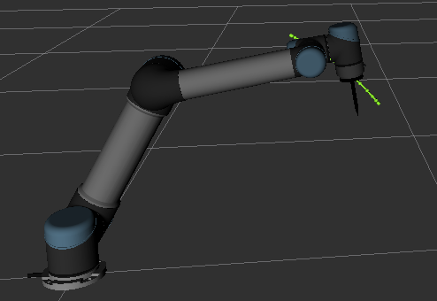

Basic Move node uses Waypoints to program robot movements.

Waypoint types include:
    - Fixed Position Waypoints 
    - Relative Position Waypoints
    - Variable Position Waypoints

Default Movement Parameters
-----------------------------

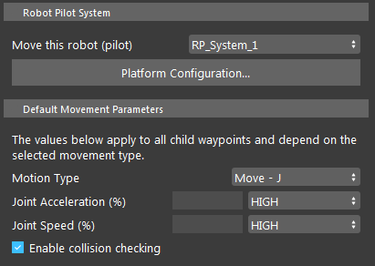

- Move this robot (pilot):
    Select a RP System (created in Platform Configuration page) to perform the move.

- Joint Acceleration (%): 
    Set the percentage joint acceleration for the robot during movement.

- Joint Speed (%):
    Set the percentage joint speed for the robot during movement.

- Enable collision checking:
    When checked, the movement will account for collision checking between the robot and the meshes in the scene.

Waypoints
-----------

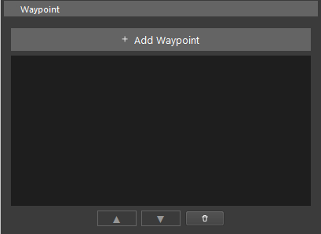

You can click the ``+ Add Waypoint`` button to add waypoints to the basic move node.

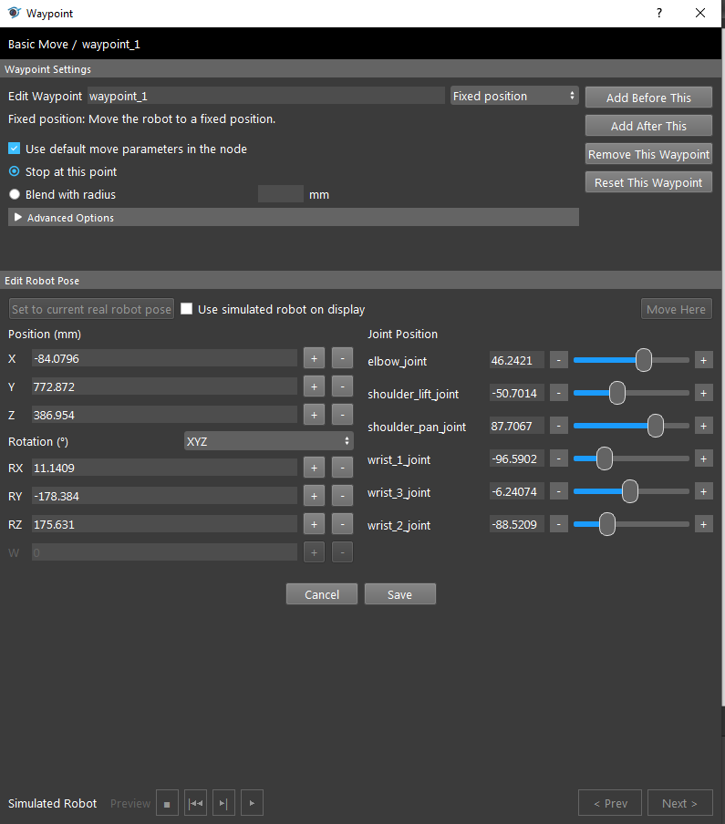

you can also manage waypoints with the waypoint editor, by clicking ``Add Before This``, ``Add After This``, ``Remove This Waypoint``, ``Reset This Waypoint``.

Waypoint Settings
~~~~~~~~~~~~~~~~~~~

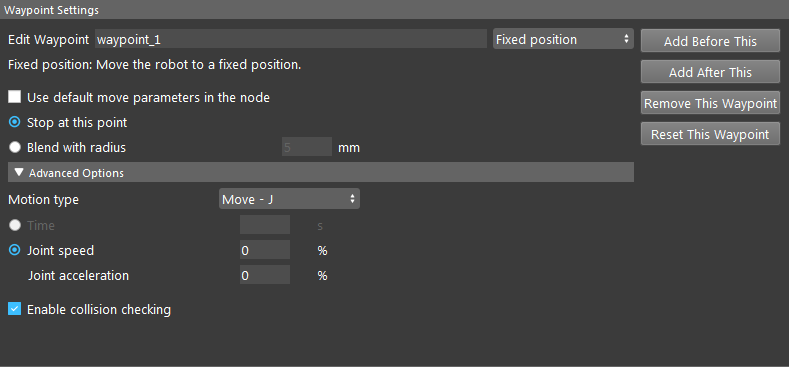

- Edit Waypoint:
    Text Field where you can change the waypoint name. Followed by the Waypoint Type.

- Waypoint Type:
    .. image:: Images/basic_move/wp_type.png
    
    Select the waypoint type: Fixed Position Waypoints, Relative Position Waypoints, Variable Position Waypoints. Details will cover in later sections.
    
- Use default move parmeters in the node:
    Checkbox, when checked will use defualt movement parameters to move this waypoint. 
    Uncheck will enable advanced settings where you can configure the movement parameters for this particular waypoint movement.

- Stop at this Point / Blend With radius:
    - **Stop at this Point**: Robot will stop at this waypoint, then proceed with the next.
    - **Blend With radius**: Robot will blend trajectory for this waypoint and the next waypoint to create a smooth transition.

- Advanced Options (available when *Use default move parameters in the node* is unchecked):

    Parameters are Same As **Default Movement Parameters**. Affecting only for this waypoint.

Fixed Position Waypoints
~~~~~~~~~~~~~~~~~~~~~~~~~~

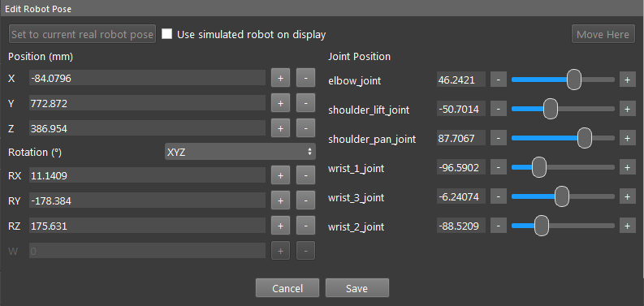

Define a fixed position as the waypoint. Can be defined through flange position with respect to the robot base (left), or through Joint Position in degrees (right).

- Set to current real robot pose:
    If using a real Robot, you can click this button to read the current robot position as the waypoint pose.

- Use simulated robot on display:
    .. image:: Images/basic_move/robot_display_interact.png

    Check this box to enable robot interaction through the display window.
    
    - drag the blue sphere to move the flange on display.
    - or use the axis cursor to move the flange on display.

- Move Here:
    Button, when clicked and after confirm, will move the robot to the current waypoint pose.

Relative Position Waypoints
~~~~~~~~~~~~~~~~~~~~~~~~~~~~~

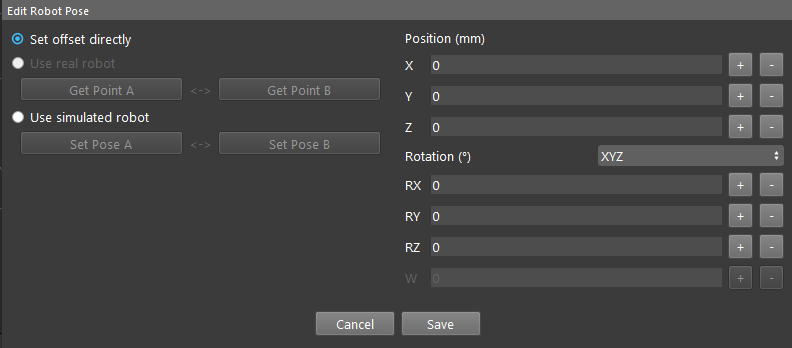

Define a relative position with respect to the **current flange position** as the waypoint. 
Can be defined by inputting the offset directly, 
or through setting a initial pose (Pose A), and set a destination pose (Pose B),  the offset of the poses will be calculated as the relative position.

.. Note::
    **current flange position** is the current position when the relative waypoint is executed.

Variable Position Waypoints
~~~~~~~~~~~~~~~~~~~~~~~~~~~~~

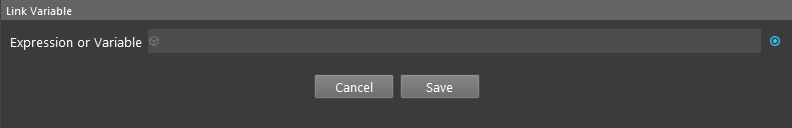

Link a pose output from another node (such as Assemble Pose Node, Transformation Tree Node, etc.) as the waypoint. The pose is the robot flange in base pose.

Procedure to Use
--------------------

1. Before using this node, you should have the Robot Pilot System created and started.

2. Insert a Basic Move node to the flowchart.

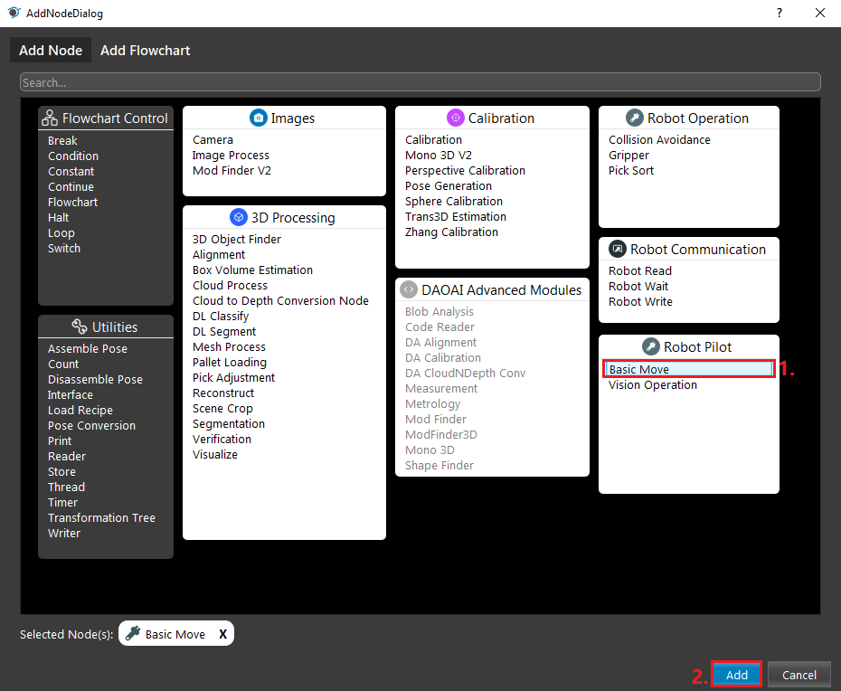

3. Select a RP System, you may optionally configure the defualt movement parameters, then add waypoints. Double-click the created waypoint to configure it.

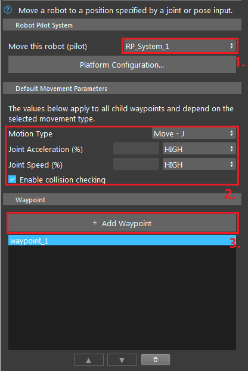

4. Configure the waypoint type and position, reference the above **waypoints** section.

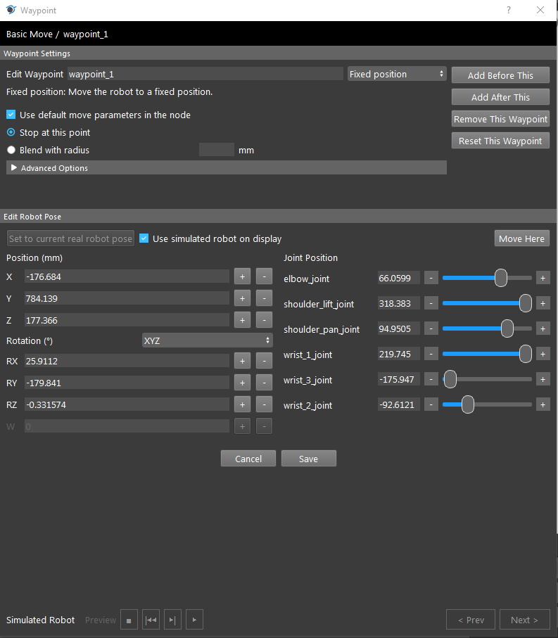

5. Click Save and close the dialog.

6. You may optionally add more waypoints after the first.

7. Switch to Robot Control View, run the node, and you can see the robot moving.

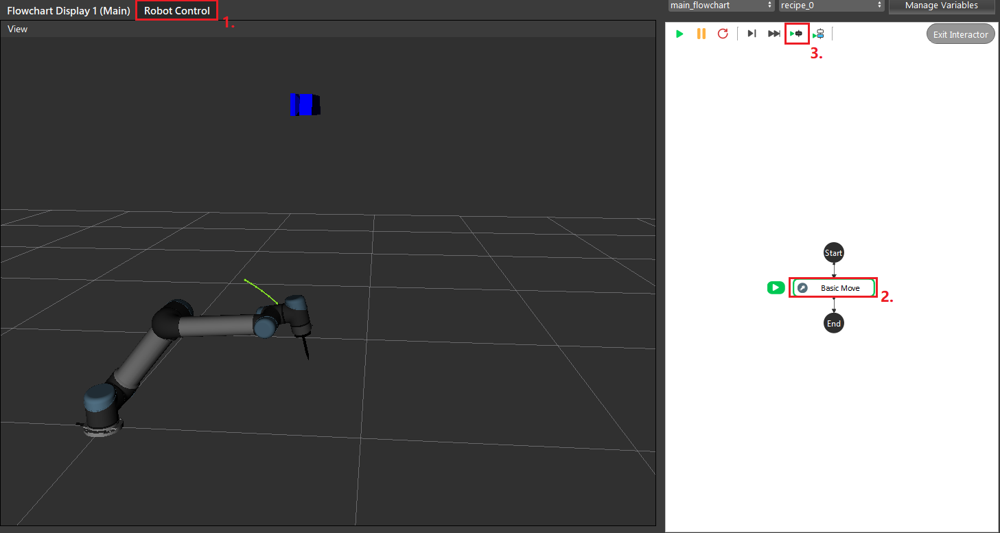

.. Warning::
    When using physical robots, be aware of the working environment and ensure there are no potential collisions. Be ready to stop the robot when test running.