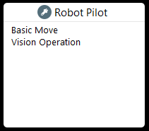

Robot Pilot Nodes
--------------------

Robot Pilot nodes are used to control the operations of the robot. 

Refer to :ref:`Robot Pilot` section for more information on Robot Pilot Systems

.. toctree::
    :maxdepth: 2
    :caption: Contents

    basic_move_node
    vision_operation