Vision Operation Node
=======================

Overview
------------

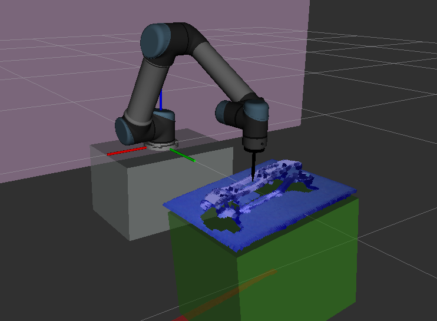

|

**Vision Operation Node** provides more advanced operations in robot control. It integrates with the detection pipeline to guide the robot to the designated picking position.

Supported opertaions include:
    - Waypoint:
        - Relative Position Waypoint
        - Picking Position Waypoint
    - Wait:
        - Wait by Time
        - Wait by Digial Input
    - Set:
        - Set Digial Output of UR Robot


Default Movement Parameters
-----------------------------

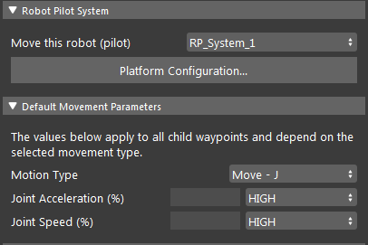

- Move this robot (pilot):
    Select a RP System (created in Platform Configuration page) to perform the move.

- Joint Acceleration (%): 
    Set the percetage joint acceleration for the robot during movement.

- Joint Speed (%):
    Set the percetage joint speed for the robot during movement.

Operations
--------------

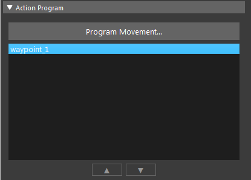

| You can click ``Program Movement`` button to open operation editor.
| or you can double-click the added operations to open the operation editor.

Waypoints
~~~~~~~~~~~~~

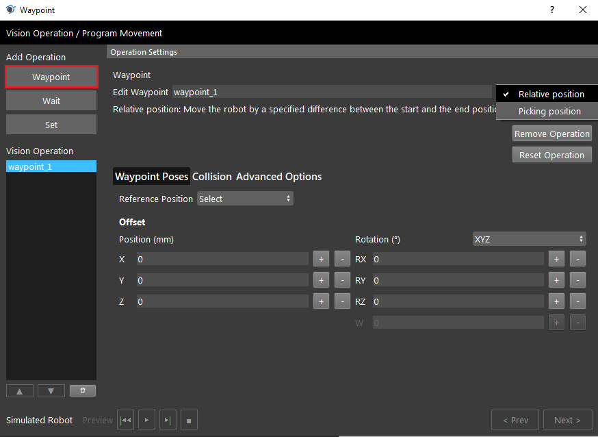

Waypoints operation has two types to choose from: Relative Position Waypoint and Picking Position Waypoint.

Relative Position
````````````````````

Relative Posistion waypoint needs a Picking Posistion Waypoint as a reference point in order to be used.

- Edit Waypoint:
    Text Field which you can edit the name of the waypoint.

- Reference Position:
    Choose the reference Picking Posistion Waypoint to use for the movement.

- Offset:
    The pose value as the offset transformation with respect to the reference pose. 

Picking Position
````````````````````````

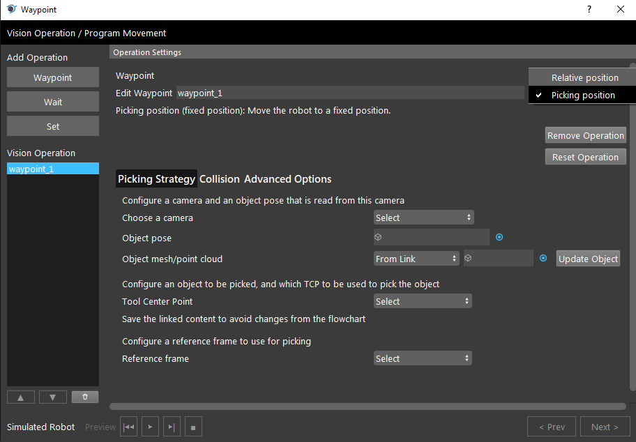

Picking Position waypoint is used to guide the robot to the designated picking position with respect to the detected object.

- Choose a Camera:
    Choose from a dropdown menu for the camera (added in Platform Configuration page) that the object is captured from.

- Object Pose:
    Link the Vec<Pose3D> output from other nodes such as (alignment node, transformation tree node, etc.) which represents the objects 3D positions.

- Object Mesh/Point Cloud:
    Link from node or Browse from file, for the object Mesh/Point-cloud used in the visual display of the pick pose. Click Update Object after change to save.

- Tool Center Point:
    Choose from a dropdown menu of the created TCPs (created in Robot Control View, after the gripper is added) as the TCP that is using for the picking.

    Once the TCP is selected, the ``Define Pick Poses`` button will be available, click it to open the following dialog to define pick pose (TCP-in-Object pose).
        .. image:: Images/vision_move/pick_pose.png

            - Click the + Pose button to Create a pick pose.
            - You may set the priority of the pick pose, that the vision move will attempt by order if  using the previous pick pose fails to find a collision free pick pose.
            - the right TCP-in-Object configuration is the same as the :ref:`Gripper Node`.

- Reference Frame:
    Select a reference frame created from Robot Control View. Which is used to determine the orientation of the picking plane.


Collision
```````````

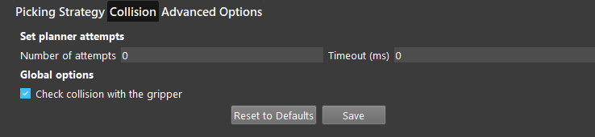

Collision Tab contains the settings for collision checking. 

- Number of attempts:
    Specifies the number of attempts for finding a collision free movement trajectory before giving up and return error.

- Timeout (ms):
    Specifies the maximum time that each attempt can take to find a collision free movement trajectory before giving up.

- Check collision with the gripper:
    Checkbox when checked, will take account of the gripper when performing collision check.

.. Note:: 
    Click ``Save`` after you set this page.

Advanced
`````````````

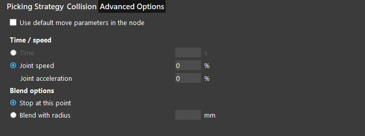

- Advanced Options (available when *Use default move parameters in the node* is unchecked):

    Parameters are Same As **Default Movement Parameters**. Affecting only for this waypoint.

    - Stop at this Point / Blend With radius:
        - **Stop at this Point**: Robot will stop at this waypoint, then proceed with the next.
        - **Blend With radius**: Robot will blend trajectory for this waypoint and the next waypoint to create a smooth transition.

Wait
~~~~~~

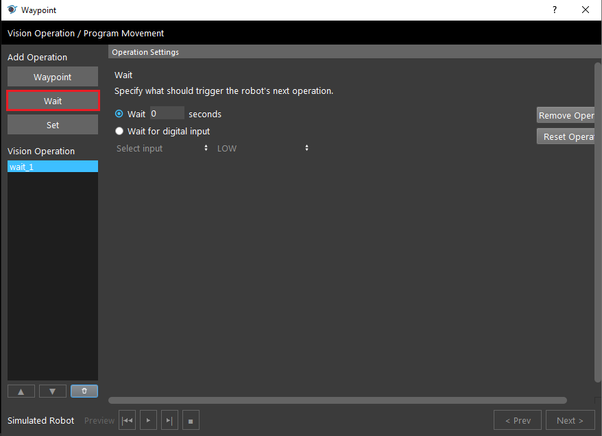

- Wait _ seconds:
    When this is checked, this operation will wait for specified time before continuing with the next operation.

- Wait for digial input:
    When this is checked, this operation will wait for specified digial input received in UR Robot before continuing with the next operation.
    
    When checked, can choose the input port and voltage status: High meaning there is voltage, Low meaning when there is no voltage.
 


Set
~~~~~~~

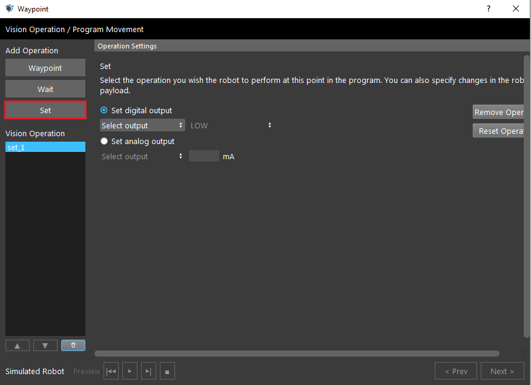

- Set digial output:
    Can set digial output of the UR Robot, can choose the input port and voltage status: High meaning there is voltage, Low meaning when there is no voltage.
    

.. - Set analog output (currently Not Supported)


Procedure to Use
--------------------

1. Before using this node, you should have the Robot Pilot System created and started. Also have a detection pipeline that outputs a 3D Pose vector.

2. Insert a Vision Operation node.

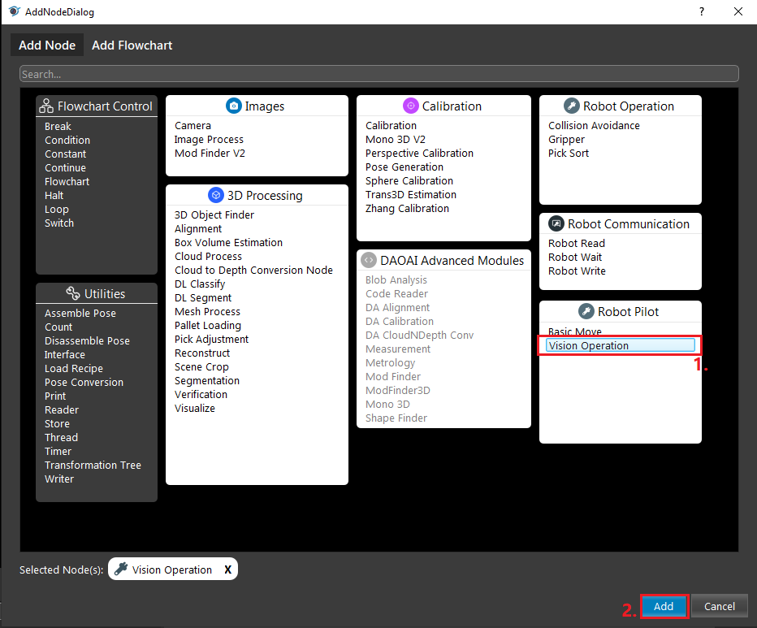

|

3. Select a RP system, you may optionally set the movement parameters, then click ``Program Movement`` and add the **Operations** (see above section for **Operations**).

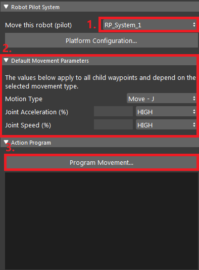

|

4. Switch to Robot Control view, then Run the node, you should see the robot moving.

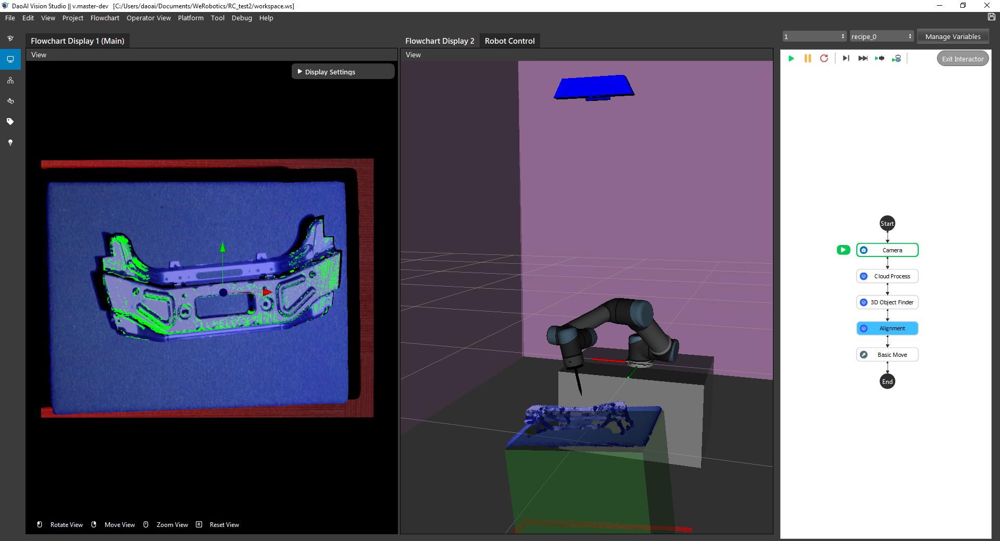

|

.. Warning::
    When using physical robots, be aware of the working environment and ensure there are no potential collisions. Be ready to stop the robot when test running.