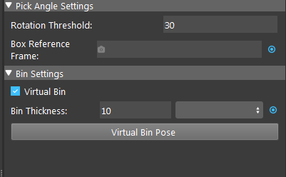

Collision Avoidance Node
========================

Overview
--------

Do you recall that we mentioned **Vision** does not able to detect box/basket like boundary? It is simply because the camera is capturing from 
one side and the wall/edges of the box is merely a line in the scene. Computer is not human, they don't know that edges is obstacle for them. 
    .. image:: Images/collision_avoidance.png
        :align: center
        :scale: 70%
    
.. image:: Images/box_detector.png
    :align: center
    :scale: 50%

Therefore, you will need to tell the robot where this obstacle and warn it to avoid the collision. 

**Collision Avoidance** node is born to deal with this problem. 

Input and Output
----------------

+----------------------------------------+-------------------------------+---------------------------------------------------------------------------------------+
| Input                                  | Type                          | Description                                                                           |
+========================================+===============================+=======================================================================================+
| Object Pose                            | VectorPose                    | The Pose of the picked object in the world (point cloud) coordinate system.           |
+----------------------------------------+-------------------------------+---------------------------------------------------------------------------------------+
| Scene Cloud                            | PointCloud                    | World cloud scene containing the object being picked.                                 |
+----------------------------------------+-------------------------------+---------------------------------------------------------------------------------------+
| Gripper Node                           | Node Link                     | Select from a list of Gripper nodes to be used in Collision Avoidance                 |
+----------------------------------------+-------------------------------+---------------------------------------------------------------------------------------+
| Box Reference Frame                    | Pose                          | Link to a reference frame (from cloud process node) which is used to determine z-axis.|
+----------------------------------------+-------------------------------+---------------------------------------------------------------------------------------+

+----------------------------------------+-------------------------------+---------------------------------------------------------------------------------+
| Output                                 | Type                          | Description                                                                     |
+========================================+===============================+=================================================================================+
| isCollisionFree                        | Boolean                       | Whether the node found at least one collision free picking pose.                |
+----------------------------------------+-------------------------------+---------------------------------------------------------------------------------+
| gripperCollisionFreePose               | VectorPose                    | A vector of collision free picking pose of gripper found by the node.           |
+----------------------------------------+-------------------------------+---------------------------------------------------------------------------------+
| ObjectCollisionFreePose                | VectorPose                    | The corresponding object poses of the collision-free picking pose               |
+----------------------------------------+-------------------------------+---------------------------------------------------------------------------------+


Node Settings
----------------


|

Pick Angle Settings
-------------------

- **Rotation Threshold** (Default: 30, Range: [0,180]): 
   Maximum rotation offset to pick the object with respect to its z-axis in degrees.

- **Box Reference Frame** : 
   Link to a reference frame(set by cloud process node). Positive of Z axis of this pose will be the box opening and which the z-axis is used in rotation threshold.
   The postive z-axis is also the top direction where gripper pick from.

Bin Settings
------------

- **Virtual Bin** (Default: checked):
    CheckBox, if checked will use a virtual bin (rectangular box with four side). And uncheck Virtual Bin will change to a link that takes a mesh for the box.

- **Bin Mesh**:
    Enabled when Virtual bin is not checked. Link to a mesh (from reader node) of the bin.
        .. image:: Images/collision_avoidance/settings_3.png
            :scale: 100%

- **Bin Thickness** (Default: 10):
    Enabled when Virtual bin is checked. Sets the thickness of the virtual box.

- **Virtual Bin Pose**:
    .. image:: Images/collision_avoidance/settings.png
        :scale: 100%

    A button which click will pop up a position dialog allowing you to specify the position/size of the virtual box. Click the Adjust Bin Pose button in the dialog
    allow you to edit the pose visually in the display window.
        .. image:: Images/collision_avoidance/settings_2.png
            :scale: 100%

        .. image:: Images/virtual_box.png
            :scale: 40%
        |

Procedure to use
----------------

1. Make sure you have all the requried input in the previous nodes in the flowchart. 
    - Object Pose: from reconstruct node, alignment node, etc.
    - Scene Cloud: from camera node, reader node, cloud process, etc.
    - Gripper Node
    - Box Reference Frame: from cloud process node.

2. Insert the collision avoidance node.
    .. image:: Images/collision_avoidance/step_1.png
        :scale: 50%

3. Click the blue dot next to "Object Pose" input and link to a node (the example used reconstruct node).
    .. image:: Images/collision_avoidance/step_2.png
        :scale: 60%

4. Click the blue dot next to "Scene Cloud" input and link to a node (the example used camera node).
    .. image:: Images/collision_avoidance/step_3.png
        :scale: 60%

5. Click and open the list next to "Gripper Node" input, and select a gripper node.
    .. image:: Images/collision_avoidance/step_4.png
        :scale: 70%

6. Click the blue dot next to "Box Reference Frame" input and link to cloud process node.
    .. image:: Images/collision_avoidance/step_5.png
        :scale: 60%

7. You may limit the maximum threshold in Rotation Threshold field to prevent picking pose with large rotations.

8. Choose wether to use virtual bin or bin mesh and click "Virtual Bin Pose", and click "Adjust Bin Pose" and set the bin position in the display window. (the example used virtual bin).
    .. image:: Images/collision_avoidance/step_6_1.png
        :scale: 60%
    .. image:: Images/collision_avoidance/step_6_2.png
        :scale: 60%

9. Run the node and check 'Show Gripper' and "Show Bin" in the display settings, then the result should be visible in the display window.
    .. image:: Images/collision_avoidance/step_7.png
        :scale: 60%

Exercise
--------

Try to come up with the setting on **Collision Avoidance** node according to the requirements below. 
You can work on these exercise with the help of this article. 
We also have answers attached at the end of this exercise.

Here's a `link to .dcf file <https://daoairoboticsinc-my.sharepoint.com/:u:/g/personal/tzhang_daoai_com/EUaL8LFp-JlJugrB-VYSCr8BODvs7cyJszjIywupMCNDDg?e=XCPFjb>`_ which are used as camera input.
and also a `link to mesh file <https://daoairoboticsinc-my.sharepoint.com/:u:/g/personal/tzhang_daoai_com/EakzJYaABuZEmyaGjXJIPvMBiTpbQ4LZpKOZwnreduGiTQ?e=ynzs1c>`_ which can be used as gripper model.

**Scenario 1**
~~~~~~~~~~~~~~

We have a project on picking the tee tube, your partner has set up the detection for you, and need you to help set up the collision avoidance node.
    .. image:: Images/collision_avoidance/exercise_1.png
        :scale: 70%

1. Suppose the virtual bin is the picking area you desire, how should you prevent the gripper from picking out side of the bin?
    .. image:: Images/collision_avoidance/exercise_2.png
        :scale: 70%

    A. Use a adjusted scene cloud from cloud process node(adjust bounding box) as the Collision Avoidance node input.
    B. Increase Rotation threshold.
    C. Use a adjusted scene cloud from cloud process node(adjust bounding box) as the mod finder input.
    D. Decrease the Bin thickness.

2. Now suppose the box is really close to the object, then the result contains picking pose of large rotations and performing such picks can be dangerous. 
How should you prevent picking with large rotations angles?
    .. image:: Images/collision_avoidance/exercise_3.png
        :scale: 70%

    A. Reduce Rotation Threshold.
    B. Decrease Bin Thickness.
    C. Use a bin Mesh instead of virtual bin.
    D. Increase the virtual bin size.

Answers for Excercises
~~~~~~~~~~~~~~~~~~~~~~

Scenario 1
```````````

1. **Answer: C**

**Explanation**: The Collision Avoidance node only concerns about preventing the gripper from hitting the bin, 
hence if you want to restrict the picking area then you should restrict the detection area.


2. **Answer: A**

**Explanation**: Rotation Threshold restricts the picking rotation angles, by decreasing it, you eliminates any picking pose with rotaion angle larger than specified.


