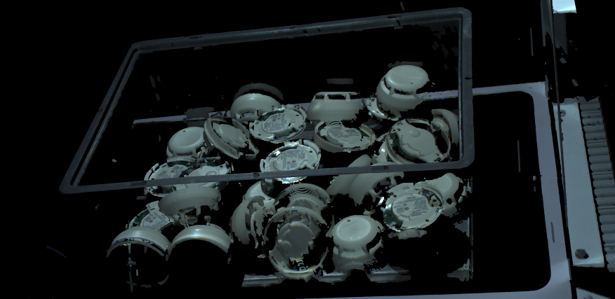
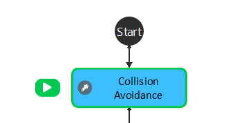
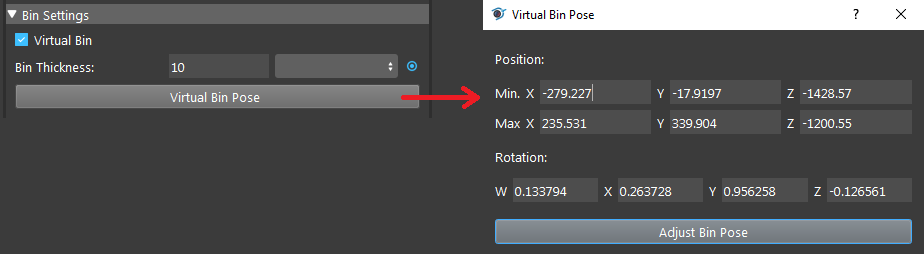
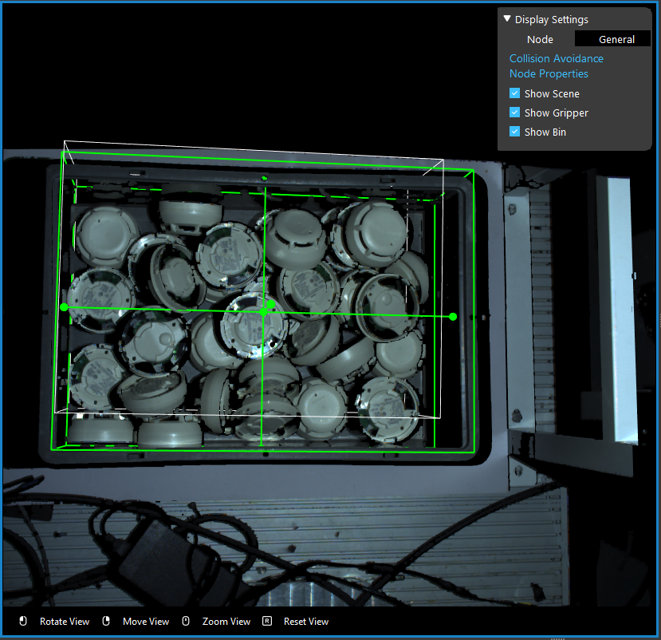
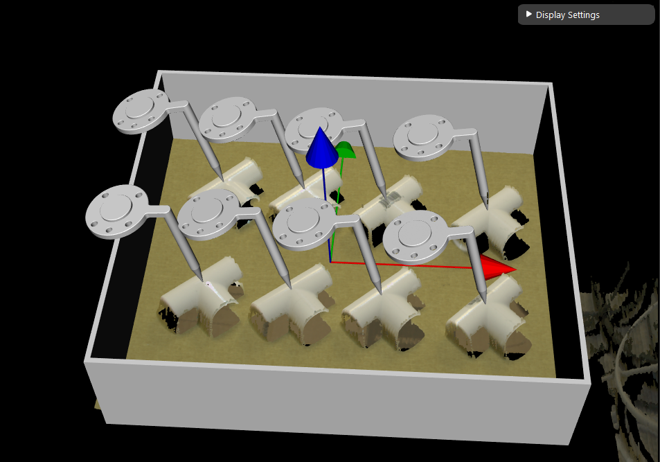

Collision Avoidance
========================

Do you recall that we mentioned **Vision** does not able to detect box/basket like boundary? It is simply because the camera is capturing from 
one side and the wall/edges of the box is merely a line in the scene. Computer is not human, they don't know that edges is obstacle for them. 

Therefore, you will need to tell the robot where this obstacle and warn it to avoid the collision. 

**Collision Avoidance** node is born to deal with this problem. 

It takes the **Object in Cloud** (from detection) relation and **Object in Tool** relation(Pose Define **Gripper** node) as inputs. 
You can see there is a **Bin Setting** in this node, which is the obstacle you set for the robot. 

|

In this Virtual bin setting, you can define the box-obstacle for the robot arm. Any pick poses collide with this obstacle, **Collision Avoidance** node will filter out these poses, 
Only keep the ones which are collision-free. You can use the coordinate values to setup the box or even simpler, drag the box in scene. 

|

You will see the visualization effect of these collision-free pick poses like below:

|