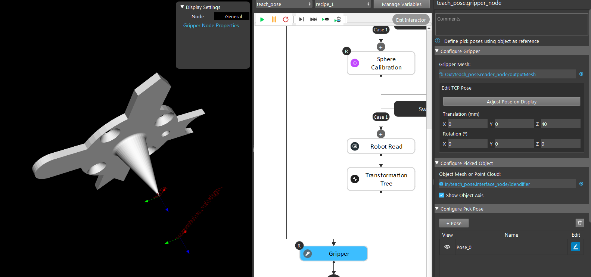
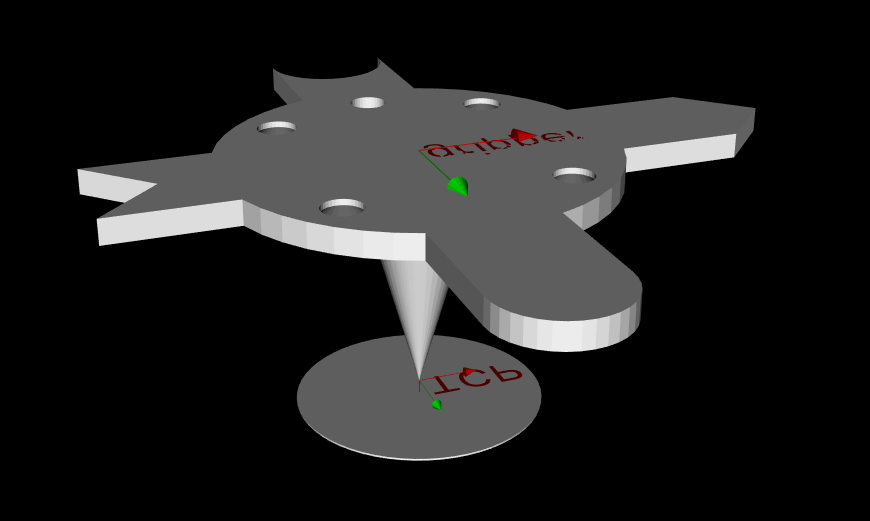
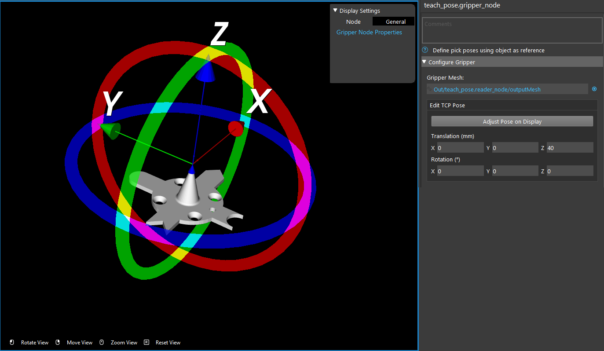
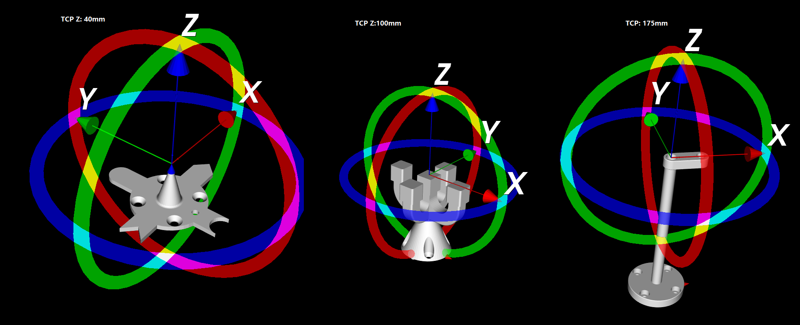
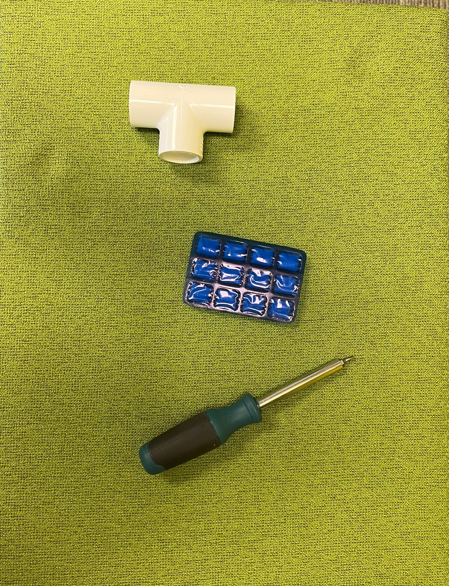
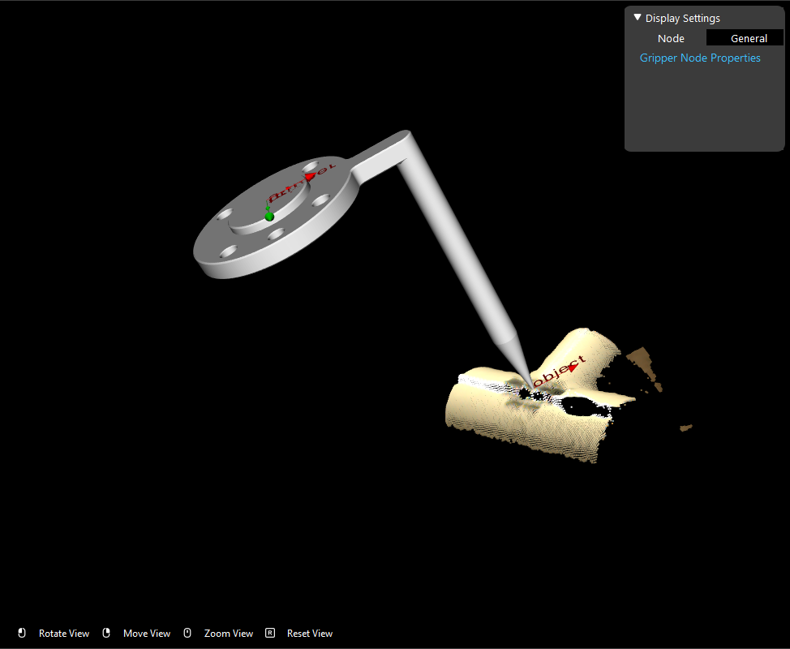
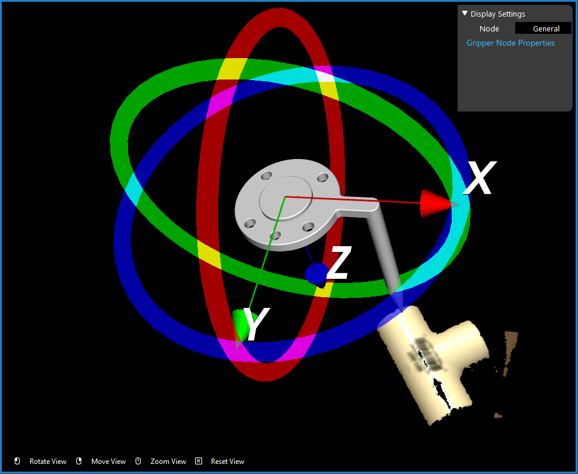

Gripper Node
============

Overview
--------

Robot arm has compatibility to many different tool to achieve different purposes. 
Since there are thousands of tools can be installed on the robot arm, you will need to specify what tool you installed. 

    
Here is where the **Gripper** node comes in play. **Gripper** node requires the gripper model and object model in order to work properly. 

The Gripper Node is used for defining and visualizing gripper pick pose on Object. 
Gripper Node supports reading a mesh data for visualizing gripper and reading mesh or point-cloud data for visualizing object.

Input and Output
----------------

+--------------------------------+-----------------+--------------------------------------------------------------------------------+
| Input                          | Type            | Description                                                                    |
+================================+=================+================================================================================+
| Gripper Model                  | Mesh            | The Mesh used to display Gripper model.                                        |
+--------------------------------+-----------------+--------------------------------------------------------------------------------+
| Object Model                   | Mesh or Point   | The Mesh or Point Cloud used to display the Object model.                      |
+--------------------------------+-----------------+--------------------------------------------------------------------------------+
| Pick Pose                      | Pose            | The pose of Gripper in Object pose used to define gripper and object relation. |
+--------------------------------+-----------------+--------------------------------------------------------------------------------+

+-------------------------+-------------------+-------------------------------------------------------------------------------------------------------------+
| Output                  | Type              | Description                                                                                                 |
+=========================+===================+=============================================================================================================+
| GripperInObjectVec      | Vec<Pose>         | The request command for the robot to determine its next operation.                                          |
+-------------------------+-------------------+-------------------------------------------------------------------------------------------------------------+
| TcpInFlange             | Pose              | The message received from the robot.                                                                        |
+-------------------------+-------------------+-------------------------------------------------------------------------------------------------------------+
| gripperData             | GripperData       | The gripper data of the node, can be used in collision avoidance node to generate collision free pick pose. |                                     |
+-------------------------+-------------------+-------------------------------------------------------------------------------------------------------------+

Node Settings
-------------

- **Edit Tcp Pose**:
    Adjust Tool Center Point (TCP) posistion on the gripper model. Default Pose will be all zero. 
    After setting all inputs and run the node, you can click "Adjsut Pose on Display" to define
    TCP Pose on display window.
        .. image:: Images/gripper/setting_1.png
        .. image:: Images/gripper/setting_1_b.png
            :scale: 50%

- **Edit Pick Pose**:
    Adjust Tool Center Point (TCP) posistion relative to the object. Default Pose will be all zero.
    After setting all inputs and run the node, you can click "Adjsut Pose on Display" to define
    TCP in Object Pose on the display window.
        .. image:: Images/gripper/setting_2.png
        .. image:: Images/gripper/setting_2_b.png
            :scale: 50%

Flexible Pick Orientation
~~~~~~~~~~~~~~~~~~~~~~~~~

Toggle on the Flexible Pick Orientation Will enable the following settings.
    .. image:: Images/gripper/setting_3.png

- **Set Symmetric Origin in TCP Pose**:
    Adjust Symmetric Origin in TCP position, used as the center point of tilt, rotation of the x/y axis, of gripper on the object. Default Pose will be all zero.
    After setting all inputs and run the node, you can click "Adjsut Pose on Display" to define
    Symmetric Origin Pose on the display window.

- **Allow tilting with respect to the Z-axis of Symmetric Orientation**:
    Checked will enable the following settings.
    
    - **Tilt Axis**:
        Select from a list to enable tilt of Gripper along the specified axis.
    - **Tilt Angle**:
        Set the Maximun tilt angle of the gripper.
    - **Pick Stategy**:
        If "Pick from Top" is chosen, the algorithm will prioritize pick pose whose Z-axis is closer to the Z-axis of the world.
        If "Pick with less tilt" is chosen, the algorithm will prioritize pick pose whose Z-axis is closer to the Z-axis of the object.
    
- **Z-Rotation**:
    If "180° Z-flip" is chosen, will enable the Gripper to pick from the top and bottom (180° flip) of the object.
    If "Full Circle /360° z-rotation" is chosen, will enable the Gripper to pick within the "Tilt Angle" specified above.
    And you can Check the "View Flexibility" checkbox and drag the track bar below to visualize the tilt/rotation of the Gripper poses.
        .. image:: Images/gripper/setting_4.png

Robot tool model
----------------

|
You can adjust the Tool Center Point(TCP) on the display like image shown above. You will also see the corresponding values on your adjusted TCP. 
Of course, you can do it on the other way around: by maunally input the coordinate to adjust TCP. 

This setting is important because **Vision** is meant to control the robot arm and flange. 
Even if you give **Vision** the tool model(**.ply** file), **Vision** does not know the potential collision and relations. 

This TCP pose setting will produce the **TCP in flange** relation for **Vision** to manage the robot arm. In another word, 
after setting up the TCP pose, **Vision** will now treat the TCP as robot flange(with relation process underneath) in order to avoid collision as well as 
generate the correct picking pose for different tools. 

|

.. tip::
    When defining the TCP pose on a tool, set it at around **1 mm** away from the actual TCP tip. 
    Since the **Vision** and the robot possibly having 0.1-0.2 mm of error tolerance. 
    It is better to set the TCP slightly larger to keep everything safe. 
    Most of the tools are able to manage the 1mm Z-axis direction tolerance. Therefore, **DO NOT** use every mm of the TCP!

Pick points
-----------

A **pick point** is the picking central point of the object. 
Different tools have different mesh and picking mechanism. Objects need different picking mechanism too. 
The central pick points of objects are also different. Therefore, you need to be aware what tool you are using and what objects you will be picking. 

|

In the image above we have 3 different objects. Since the Tee tube and gum is light and weight distribution is fairly even. 
You can grab on the central of the object. But for the screwdriver, most of the weight is concentrated on the bottom part of the screwdriver. 
Therefore, the pick point should ideally at the black area of the screwdriver. 

Hence, you need to find out where is the pick point for your objects, then define the pick point on **Vision Studio** for these objects.

There are a few ways to setup the pick point(reference point):
    #. **Mod Finder** models define reference point;
    #. Key-point model with key-point annotated;
    #. **Gripper** node adjust the pick point on the model cloud;

If you are using RGB/Depth Mod Finder, you can define the reference point on models. You can checkout this article `How to define reference point <https://daoai-robotics-inc-daoai-vision-user-manual.readthedocs-hosted.com/en/latest/complete-vision-guidance/detection/mod-finder/good_model.html#how-to-set-good-model-matching-parameters>`_.

If you planned to use key-point models to detect your objects, you can define the reference point(the key-point) on the pick point. 
First you need to `collect your dataset <https://daoai-robotics-inc-daoai-vision-user-manual.readthedocs-hosted.com/en/latest/deep-learning/dataset.html>`_ and `annotate your dataset <https://daoai-robotics-inc-daoai-vision-user-manual.readthedocs-hosted.com/en/latest/deep-learning/annotation/index.html>`_. 
The pick point will be your key-point on the object by default. 

If you are not using the detection engines above, you can use the **Gripper** node to adjust your pick point. 

.. image:: Images/gripper_pick_point.png
    :align: center
|

**Gripper** node requires tool mesh and model mesh/point cloud in order to work. 

|

In here, we can see the original pick point is at the middle of the Tee tube(we used the long point tool in order check the pick point easier). 
In this example, we will need to change the pick point at the edge of the Tee tube. So we can change the x, y, z offsets or adjust the pose in display to change the pick point. 

.. image:: Images/gripper_pose_values.png
    :align: center
|

Another way to change this pick point on object is like we mentioned above: adjust the pose on display.

|

You can drag the tool model in display to adjust the pick point. 

Procedure to Use
----------------

1. Read the Gripper model from a mesh file or link it to the output of a reader node which reads a mesh file. And Click "Define Gripper".
    .. image:: Images/gripper/step_1.png
|

    .. image:: Images/gripper/step_1_b.png
        :align: center

2. Read the Object model from a mesh or point-cloud file or link it to the output of a reader node which reads a mesh or point-cloud file, or you can link to any node that outputs point-cloud. And Click "Define Object".
    .. image:: Images/gripper/step_2.png
|

    .. image:: Images/gripper/step_2_b.png
        :align: center

|

3. Click "+ Pose" to add a pick pose, and run the node, and you should be able to see the meshes on the display window.
    .. image:: Images/gripper/step_3.png
|

4. Then you may adjust the TCP pose and the Pick pose by input values or click "Adjust Pose on Display" to define visually.
    .. image:: Images/gripper/step_4.png
    .. image:: Images/gripper/step_4_b.png
|

5. You may optionally enable and set Flexible Pick Orientation.
    .. image:: Images/gripper/step_5.png
    .. image:: Images/gripper/step_5_c.png
        :scale: 70%
    .. image:: Images/gripper/step_5_b.png
|

Excercise
---------

Try to come up with the setting on **Gripper** node according to the requirements below. You can work on these exercise with the help of this article. We also have answers attached at the end of this exercise.

This is some helpful resource when you are working on the exercise:

1. Suppose that the gripper that you are using is 40cm long, like the one on the image below. For a long gripper, how can you improve the accuracy of the picking.
    .. image:: Images/gripper/exercise_1.png
        :scale: 70%
    
    A. Set TCP Pose to the tool-tip of the mesh and set pick pose to have the tool tip pointing at the object.
    B. Leave TCP as defualt but set pick pose to have the tool tip pointing at the object.
    C. Enable Flexible Picking Orientation and set Symmetric Origin and set pick pose to have the tool tip pointing at the object.
    D. None of the above.

2. **You've set the tcp in object pose. Now suppose that the picking enviroment involves picking in deep boxes, how can you set the gripper node to help generate more box collision-free picking poses.**

    A. create more picking Pose with picking angle variations.
    B. Enable Flexible Pick Orientation and allow Tilt angle.
    C. Both A and B.
    D. None of the above.

|
|
Answers for Excercises
~~~~~~~~~~~~~~~~~~~~~~

1. **Answer: A**
    
**Explanation**: For long grippers, if we only consider the robot flange in picking, then any precision error in the robot flange and the TCP will be enlarged and result in major precision errors.
Therefore it is always better to consider TCP pose when using long grippers.

2. **Answer: C**
    
**Explanation**: In deep box picking, single pick pose picking might have the gripper collide with the box, and hence eliminates the picking option for the particular object.
By Giving the Gripper more picking Stategies, we provide more flexibility and hence a greater chance that it will produce a collision-free picking pose. 
