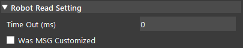

Robot Read Node
========================
Overview
~~~~~~~~~~~~~~~~~~~~~
Robot Read node reads the information from the robot system.

Input and Output
~~~~~~~~~~~~~~~~~~~~~
+----------------------------------------+-------------------------------+---------------------------------------------------------------------------------+
| Input                                  | Type                          | Description                                                                     |
+========================================+===============================+=================================================================================+
| Robot Source                           | String                        | The name of the robot system to perform the read.                               |
+----------------------------------------+-------------------------------+---------------------------------------------------------------------------------+
| Time Out                               | Int32                         | The time limit (in millisecond) for the robot to wait to read a message.        |
+----------------------------------------+-------------------------------+---------------------------------------------------------------------------------+
| Was MSG Customized                     | Bool                          | Indicate whether the message was customized.                                    |
+----------------------------------------+-------------------------------+---------------------------------------------------------------------------------+

+-------------------------+-------------------+------------------------------------------------------------------------+
| Output                  | Type              | Description                                                            |
+=========================+===================+========================================================================+
| command                 | int               | The request command for the robot to determine its next operation.     |
+-------------------------+-------------------+------------------------------------------------------------------------+
| message                 | String            | The message received from the robot.                                   |
+-------------------------+-------------------+------------------------------------------------------------------------+
| payload1                | int               | Extra message for communication.                                       |
+-------------------------+-------------------+------------------------------------------------------------------------+
| payload2                | int               | Extra message for communication.                                       |
+-------------------------+-------------------+------------------------------------------------------------------------+
| poseObject              | Pose              | The robot's current pose.                                              |
+-------------------------+-------------------+------------------------------------------------------------------------+
| status                  | int               | The status value of the robot.                                         |
+-------------------------+-------------------+------------------------------------------------------------------------+
| timeout                 | Bool              | Indicate whether the last robot read was timed out.                    |
+-------------------------+-------------------+------------------------------------------------------------------------+

Node Settings
~~~~~~~~~~~~~~~~~~~~~
--------------------
Data Source
--------------------

- **Robot Source**: 

    Follow the following steps to add a robot:

    1. Click on Robot Read, and click 'Open Platform Config'. Alternatively, you can click 'Platform' and click 'Platform Configuration' on the top menu bar.
        .. image:: Images/robot_data_source_add_robot_1.png
            :align: center
        
    2. Select the Robots tab. Choose 'Other' as the Robot Type, then click '+' add a robot. 
        .. image:: Images/robot_data_source_add_robot_2.png
            :align: center

    3. Keep everything as default, check 'Use String', and 'Connect'.
        .. image:: Images/robot_data_source_add_robot_3.png
            :align: center

    4. You should see the console message "Server started on port: 6969" from the robot system you created.
        .. image:: Images/robot_data_source_add_robot_4.png
            :align: center

    -   **Port Number** (Default: 6969):
            The port number used for connection. Please make sure it is the same as it is in Hercules. 

    -   **Pose Order** (Default: XYZ):
            The type of rotation to be performed by the robot. 

    -   **MULT Value** (Default: 10000):
            The multiplication factor used for multiplying pose values.

    -   **Splitter** (Default: ','):
            The character that separates the message into different fields.

    -   **Ending Character** (Default ';')：
            The character that marks the end of the message.
--------------------
Robot Read Setting
--------------------

- **Time out**: (Default: 0 ms)

    The time limit (in ms) for the program to wait to receive a robot response.
    An error will be printed onto the console if the waiting time exceeds the timeout value.
    The program waits indefinitely if the field is set to 0 ms.

- **Was MSG Customized**: (Default: false)

    When the message is not customized (default), the program reads message that includes 12 numbers, separated by splitter and ends with the ending character. 
    Otherwise, an error will be thrown.
    When the message is customized, the program reads message in other format.

Procedure to Use
~~~~~~~~~~~~~~~~~~~~~
1. Right click on the flowchart and click insert node, find the Robot Operation section, and select the Robot Read node.
    .. image:: Images/robot_read_procedure_1.png
        :align: center

2. Click the Robot Read node, and select a Robot System. If you have not added a robot already, follow the steps in :ref:`Data Source` section. 
    .. image:: Images/robot_read_procedure_2.png
        :align: center

3. In this case, we use the Hercules program for demonstration. Open the Hercules program. Click the third tab 'TCP Client', input Module IP 127.0.0.1, input port number 6969, and click connect. You should see the message "Connected to 127.0.0.1" in Hercules.
    .. image:: Images/robot_read_procedure_3.png
        :align: center

4. Run the Robot Read Node in Vision.
    .. image:: Images/robot_read_procedure_4.png
        :align: center

5. In Hercules, send the message "1,2,3,4,5,6,7,20,2,1,99,1;".
    .. image:: Images/robot_read_procedure_5.png
        :align: center

6. The robot successfully receives the message.
    .. image:: Images/robot_read_procedure_6.png
        :align: center

Exercise
~~~~~~~~~~~~~~~~~~~~~
1. Vision prints an Input Error message on the console when it receives this message with the following Robot Read node settings. Assuming the connection is set up correctly, please explain what is causing the error.
    .. image:: Images/robot_read_exercise_1.png
        :align: center
        :scale: 160%

    .. image:: Images/robot_read_exercise_1_2.png
        :align: center

2. Please identify the position of the command field and its value in the following message sent to the robot.
    .. image:: Images/robot_read_exercise_2.png
        :align: center
        :scale: 150%

|
|
|
|
|
|
|
|
|
|
|
|
|
|
|

Answers for Exercise
~~~~~~~~~~~~~~~~~~~~~
1. Since the 'Was MSG Customized' option is not checked, the robot only reads message with 12 numbers, otherwise it will throw an error. If you count the numbers in the message, you will notice there is only 10 numbers, which causes the error.

2. Please refer to the :ref:`Request Message` section for all the fields. The eigth number in the message corresponds to the command field. Thus, the command value is 21.
