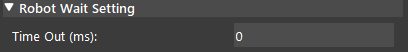

Robot Wait Node
========================
Overview
~~~~~~~~~~~~~~~~~~~~~
Robot Wait node waits for a response from the Robot System for a certain amount of time until a robot response is received.

Intput and Output
~~~~~~~~~~~~~~~~~~~~~
+-------------------------+-------------------+---------------------------------------------------------------------------------+
| Input                   | Type              | Description                                                                     |
+=========================+===================+=================================================================================+
| Robot Source            | String            | The name of the robot system to perform the wait.                               |
+-------------------------+-------------------+---------------------------------------------------------------------------------+
| Time Out                | Int32             | The amount of time (in millisecond) for the program to wait.                    |
+-------------------------+-------------------+---------------------------------------------------------------------------------+

+-------------------------+-------------------+---------------------------------------------------------------------------------+
| Output                  | Type              | Description                                                                     |
+=========================+===================+=================================================================================+
| status                  | int               | The status value of the robot.                                                  |
+-------------------------+-------------------+---------------------------------------------------------------------------------+

Node Settings
~~~~~~~~~~~~~~~~~~~~~
--------------------
Data Source
--------------------
- **Robot Source**: 

    Follow the following steps to add a robot:

    1. Click on Robot Wait, and click 'Open Platform Config'. Or you can click 'Platform' and click 'Platform Configuration' on the top menu bar.
        .. image:: Images/robot_data_source_add_robot_1.png
            :align: center
        
    2. Select the Robots tab. Choose 'Other' as the Robot Type, then click '+' add a robot. 
        .. image:: Images/robot_data_source_add_robot_2.png
            :align: center

    3. Keep everything as default, check 'Use String', and 'Connect'.
        .. image:: Images/robot_data_source_add_robot_3.png
            :align: center

    4. You should see the console message "Server started on port: 6969" from the robot system you created.
        .. image:: Images/robot_data_source_add_robot_4.png
            :align: center

    -   **Port Number** (Default: 6969)：
            The port number used for connection. Please make sure it is the same as it is in Hercules. 

    -   **Pose Order** (Default: XYZ)：
            The type of rotation to be performed by the robot. 

    -   **MULT Value** (Default: 10000)：
            The multiplication factor used for multiplying pose values.

    -   **Splitter** (Default: ',')：
            The character that separates the message into different fields.

    -   **Ending Character** (Default ';')：
            The character that marks the end of the message.

--------------------
Robot Wait Setting
--------------------

- **Time out**: (Default: 0 ms)

    The amount of time (in ms) for the program to wait.
    The program waits indefinitely if the field is set to 0 ms.

Procedures to Use
~~~~~~~~~~~~~~~~~~~~~
1. Right click on the flowchart and click insert node, under the Robot Operation section, and select the Robot Wait node.
    .. image:: Images/robot_wait_procedure_1.png
        :align: center

2. Click the Robot Wait node, and select a Robot System. If you have not added a robot already, follow the steps in :ref:`Data Source` section. 
    .. image:: Images/robot_wait_procedure_2.png
        :align: center

3. Right click on the flowchart and click insert node, under the Utilities section, select the Print node. 
    .. image:: Images/robot_wait_procedure_3.png
        :align: center

4. Click on the Print node, type '1' in the Print Message.
    .. image:: Images/robot_wait_procedure_4.png
        :align: center

5. Right click on the flowchart and click insert node, under the Flowchart Control section, select the Halt node. 
    .. image:: Images/robot_wait_procedure_5.png
        :align: center

6. Click on the Halt node, and select True.
    .. image:: Images/robot_wait_procedure_6.png
        :align: center

7. Click the Robot Wait node and run the flowchart. The program should now wait indefinitely (if the Time Out value is set to 0 ms) until a robot response is received.
    .. image:: Images/robot_wait_procedure_7.png
        :align: center

8. In this case, we use the Hercules program for demonstration. Open the Hercules program. Click the third tab 'TCP Client', input Module IP 127.0.0.1, input port number 6969, and click connect. You should see the message "Connected to 127.0.0.1" in Hercules.
    .. image:: Images/robot_wait_procedure_8.png
        :align: center

9. Since a robot response is received, the program resumes running, and you can see the number 1 is printed onto the console.
    .. image:: Images/robot_wait_procedure_9.png
        :align: center

Exercise
~~~~~~~~~~~~~~~~~~~~~
In steps, explain the appropriate settings for the Robot Wait node to make the program print "123" every 8 seconds?

|
|
|
|
|
|
|
|
|
|
|
|
|
|
|

Answers for Exercise
~~~~~~~~~~~~~~~~~~~~~
1. First we have to add a Print node, and one Robot Wait Node.
    .. image:: Images/robot_wait_exercise_1.png
        :align: center

2. Type "123" into the Print node settings.
    .. image:: Images/robot_wait_exercise_2.png
        :align: center

3. You will need select a robot system, and start the server from the platform configuration page. However, there is no need to connect from Hercules, as this will let the program waits for a robot respnose for the timeout time.
    .. image:: Images/robot_wait_exercise_3.png
        :align: center

4. Note that the timeout value is in millisecond, so we need to input 8*1000 = 8000 into the timeout field.
    .. image:: Images/robot_wait_exercise_4.png
        :align: center

5. You should see the console prints 123 after every Robot Wait node timeout.
    .. image:: Images/robot_wait_exercise_5.png
        :align: center
