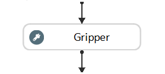

Gripper
-----------

Overview
==================

**Gripper** node is mainly for **Teach Pose** procedure of many major pipelines. This node is able to produce a pose/poses that represents the **Object in Tool** relation. 
**Gripper** node will almost appear in every workspace which has robot-Vision interaction. 

Input and Output
==================

+----------------------------------------+-------------------------------+---------------------------------------------------------------------------------+
| Input                                  | Type                          | Description                                                                     |
+========================================+===============================+=================================================================================+
| Gripper Mesh                           | Mesh                          | The gripper mesh from Resource system or Reader.                                |
+----------------------------------------+-------------------------------+---------------------------------------------------------------------------------+
| Model Mesh/Cloud                       | Mesh/Cloud                    | The object mesh/cloud model from Resource system, Reader, crop from scene etc.  |
+----------------------------------------+-------------------------------+---------------------------------------------------------------------------------+
| Initial Pose(Optional)                 | Pose                          | The initial pose from Robot Read node.                                          |
+----------------------------------------+-------------------------------+---------------------------------------------------------------------------------+

+----------------------------------------+-------------------+------------------------------------------------------------------------+
| Output                                 | Type              | Description                                                            |
+========================================+===================+========================================================================+
| Gripper in Object Locations            | Vec<Pose3D>       | Vector of 3D poses for Tool in Object locations.                       |
+----------------------------------------+-------------------+------------------------------------------------------------------------+
| Gripper Data                           | Gripper Data      | Object for Collision Avoidance tilting restriction.                    |
+----------------------------------------+-------------------+------------------------------------------------------------------------+
|TCP in Flange Pose                      | Pose              | Pose of TCP in flange relation.                                        |
+----------------------------------------+-------------------+------------------------------------------------------------------------+

Node Settings
==================

Configure Gripper
~~~~~~~~~~~~~~~~~~~~~~~~

* Gripper Mesh

   The gipper mesh from Reader or Resource System.

* TCP Pose

   The pose of TCP in flange relation.

Configure Picked Object
~~~~~~~~~~~~~~~~~~~~~~~~

* Object Mesh or Point Cloud

   The object mesh or point cloud from scene, Reader, Resource System etc.

Configure Pick Pose
~~~~~~~~~~~~~~~~~~~~~~~~

* Pose

   The poses that store the **Tool in Object** relation, each pose can be customized with different restrictions and flexibilities. 

* Use Initial Pose

   Apply initial pose from robot read or any other pose output to the **this** pose.

* Flexible Pick Orientation

   Enable more options for gripper flexibility, rotation and tilting etc.

Procedure of Using Gripper Node
====================================

Gripper node is usually appear in **Teach Pose**, hence we will show the procedure of using Gripper node in **Teach Pose** flowchart. 

1. Open a workspace in DaoAI Vision Studio. 
	.. image:: Images/open_project.png
		:align: center

2. Add a flowchart named with **Teach Pose**, **Pose Define** or any other names you can remember. 
	.. image:: Images/add_flowchart.png
		:align: center

3. Insert a Calibration node to load the **Camera in Base** relation of our current robot base and camera.
	.. image:: Images/calibration.png
		:align: center

4. The following steps are procedures for robot-involved teach pose. If you only wants to check the virtual teach pose procedures, or only the setup for **Gripper** node, you can jump to step XX. 

|

5. Add a flowchart node and connect to detection flowchart.
	.. image:: Images/detection_flowchart.png
		:align: center

6. A virtual image is used to demonstrate. Refer to System Overview, Tutorials on how to connect to camera.
	.. image:: Images/tee.png
		:align: center

6. A virtual image is used to demonstrate. Refer to System Overview, Tutorials on how to connect to camera.
	.. image:: Images/tee.png
		:align: center

6. A virtual image is used to demonstrate. Refer to System Overview, Tutorials on how to connect to camera.
	.. image:: Images/tee.png
		:align: center

Robot tool model
==================

Robot arm has compatibility to many different tool to achieve different purposes. 
Since there are thousands of tools can be installed on the robot arm, you will need to specify what tool you installed. 

.. image:: Images/gripper.png
    :align: center 

Here is where the **Gripper** node comes in play. **Gripper** node requires the gripper model and object model in order to work properly. 

Tool Model is usually **.ply** format(CAD model). This tool mesh will be used in **GRipper** node for visualization and calculation. 

.. image:: Images/tcp.png
    :align: center 

You can adjust the Tool Center Point(TCP) on the display like image shown above. You will also see the corresponding values on your adjusted TCP. 
Of course, you can do it on the other way around: by changing the coordinate to adjust TCP. 

This setting is important because **Vision** is meant to control the robot arm and flange. 
Even if you give **Vision** the tool model(**.ply** file), **Vision** does not know the potential collision and relations. 
This TCP pose setting will produce the **TCP in flange** relation for **Vision** to manage the robot arm. In another word, 
after setting up the TCP pose, **Vision** will now treat the TCP as robot flange(with relation process underneath) in order to avoid collision as well as 
generate the correct picking pose for different tools. 

.. image:: Images/grippers_comp.png
    :align: center

|

.. tip::
    When defining the TCP pose on a tool, set it at around **1 mm** away from the actual TCP tip. Since the **Vision** and the robot possibly having 0.1-0.2 mm of error tolerance. It is better to set the TCP slightly larger to keep everything safe. Most of the tools are able to manage the 1mm Z-axis direction tolerance. Therefore, **DO NOT** use every mm of the TCP!

Pick points
====================

A **pick point** is the picking central point of the object. 
Different tools have different mesh and picking mechanism. Objects need different picking mechanism too. 
The central pick points of objects are also different. Therefore, you need to be aware what tool you are using and what objects you will be picking. 

.. image:: Images/objects.png
    :align: center

In the image above we have 3 different objects. Since the Tee tube and gum is light and weight distribution is fairly even. 
You can grab on the central of the object. But for the screwdriver, most of the weight is concentrated on the bottom part of the screwdriver. 
Therefore, the pick point should ideally at the black area of the screwdriver. 

Hence, you need to find out where is the pick point for your objects, then define the pick point on **Vision Studio** for these objects.

There are a few ways to setup the pick point(reference point):
    #. **Mod Finder** models define reference point;
    #. Key-point model with key-point annotated;
    #. **Gripper** node adjust the pick point on the model cloud;

If you are using RGB/Depth Mod Finder, you can define the reference point on models. You can checkout this article `How to define reference point <https://daoai-robotics-inc-daoai-vision-user-manual.readthedocs-hosted.com/en/latest/complete-vision-guidance/detection/mod-finder/good_model.html#how-to-set-good-model-matching-parameters>`_.

If you planned to use key-point models to detect your objects, you can define the reference point(the key-point) on the pick point. 
First you need to `collect your dataset <https://daoai-robotics-inc-daoai-vision-user-manual.readthedocs-hosted.com/en/latest/deep-learning/dataset.html>`_ and `annotate your dataset <https://daoai-robotics-inc-daoai-vision-user-manual.readthedocs-hosted.com/en/latest/deep-learning/annotation/index.html>`_. 
The pick point will be your key-point on the object by default. 

If you are not using the detection engines above, you can use the **Gripper** node to adjust your pick point. 

.. image:: Images/gripper_pick_point.png
    :align: center

**Gripper** node requires tool mesh and model mesh/point cloud in order to work. 

.. image:: Images/default_point.png
    :align: center

In here, we can see the original pick point is at the middle of the Tee tube(we used the long point tool in order check the pick point easier). 
In this example, we will need to change the pick point at the edge of the Tee tube. So we can change the x, y, z offsets or adjust the pose in display to change the pick point. 

.. image:: Images/gripper_pose_values.png
    :align: center

Another way to change this pick point on object is like we mentioned above: adjust the pose on display.

.. image:: Images/gripper_adjust_pose.png
    :align: center

You can drag the tool model in display to adjust the pick point. 