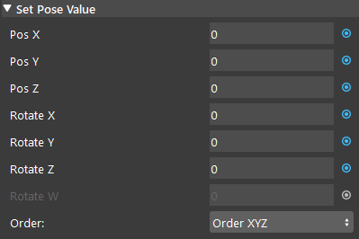

Assemble Pose Node
=====================

Overview
-----------

The **Assemble Pose node** creates a 4x4 homogeneous transformation matrix from 3 translation numbers (in millimeters) and 3-4 rotation numbers (in degrees).

Three main conventions are available for the rotation numbers:

- **Euler Angles**: 3-number representation in the orders: XYZ, XZY, YXZ, YZX, ZXY, ZYX, and ZYZ.

- **Axis Angle**: 3-number representation of axis with angle magnitude.

- **Quaternion**: 4-number representation of a quaternion rotation.

Input and Output
-------------------

+----------------------------------------+-------------------------------+-------------------------------------------------------------------------------+
| Input (optional)                       | Type                          | Description                                                                   |
+========================================+===============================+===============================================================================+
| Pos X                                  | Double                        | Generated pose's translation on X-axis.                                       |
+----------------------------------------+-------------------------------+-------------------------------------------------------------------------------+
| Pos X                                  | Double                        | Generated pose's translation on Y-axis.                                       |
+----------------------------------------+-------------------------------+-------------------------------------------------------------------------------+
| Pos Y                                  | Double                        | Generated pose's translation on Z-axis.                                       |
+----------------------------------------+-------------------------------+-------------------------------------------------------------------------------+
| Rotate X                               | Double                        | Generated pose's rotation on X-axis.                                          |
+----------------------------------------+-------------------------------+-------------------------------------------------------------------------------+
| Rotate Y                               | Double                        | Generated pose's rotation on Y-axis.                                          |
+----------------------------------------+-------------------------------+-------------------------------------------------------------------------------+
| Rotate Z                               | Double                        | Generated pose's rotation on Z-axis.                                          |
+----------------------------------------+-------------------------------+-------------------------------------------------------------------------------+
| Rotate W                               | Double                        | the rotation around the vector (only used for quaternion rotation).           |
+----------------------------------------+-------------------------------+-------------------------------------------------------------------------------+
| Order                                  | Int                           | | Select from a dropdown list to choose the order of the generated pose.      |
|                                        |                               | | Orders are: XYZ, XZY, YXZ, YZX, ZXY, ZYX, ZYZ, Axis Angle and Quaternion.   |
+----------------------------------------+-------------------------------+-------------------------------------------------------------------------------+

+-------------------------+-------------------+-----------------------------------------------------------------------+
| Output                  | Type              | Description                                                           |
+=========================+===================+=======================================================================+
| Pose                    | Pose              | A Homogeneous transformation corresponding to the inputs pose         |
+-------------------------+-------------------+-----------------------------------------------------------------------+

Procedure to Use
------------------

1. Right click the node where you want to insert and insert an Assemble Pose node.
    .. image:: Images/assemble_pose/step_1.png
|

2. Input the pose value and select the pose order.
    .. image:: Images/assemble_pose/step_2.png
|

3. Run the node, and you can access this pose as 3D pose for other nodes' input (eg. transformation Tree Node, Robot Write Node).

