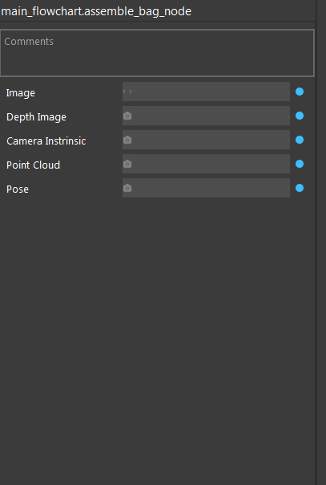
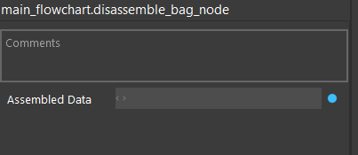

Assemble Bag Node, Disassemble Bag Node
========================================

Bag is our special data type that combines point cloud, image, pose and camera intrinsic together.

Assemble Bag Node
---------------------

This node allows us to put together different data and create a bag data as an output.

Input
~~~~~~~~~~~~~~~~~~~~~

* Image: rgb image to be put into the bag
* Depth Image: depth image to be put into the bag
* Point Cloud: point cloud to be put into the bag
* Camera intrinsic: camera intrinsic to be put into the bag, usually from camera node, or output from disassemble bag node 
* Pose: pose data to be put into the bag, can be any pose

Note that all fields above are optional, you can combine arbitrary number of fields(at lease one) to create a bag

output
~~~~~~~~~~~~~~~~~~~~~

A bag data

Disassemble Bag Node
----------------------

This node does the reverse process of assemble bag node

Input
~~~~~~~~~~~~~~~~~~~~~

A bag data, usually from the output of reader node or assemble bag node

output
~~~~~~~~~~~~~~~~~~~~~

Same as the input feilds of assemble bag node, a out field contains value if only there is such data in the input bag

