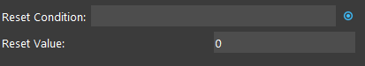

Count Node
========================

Overview
------------

A counter node that increases its counter every time the node has been run, usually used in flowchart and loop control

Input and Output
------------------

+-------------------------+-------------------+-----------------------------------------------------------------------+
| Output                  | Type              | Description                                                           |
+=========================+===================+=======================================================================+
| count                   | Int               | Stores the number of times count node has been run                    |
+-------------------------+-------------------+-----------------------------------------------------------------------+

Settings
----------

**Reset Condition**:
    Boolean value, evaluated from link or advanced expression, when evaluated to True, then the value of the counter will be reset.

**Reset Value** :
    The value for the counter node to reset to when reset flowchart, or Reset Condition is evaluated to True. 

Procedure to Use
------------------

1. Right click the node where you want to insert and insert an count pose node.
    .. image:: Images/count/step_1.png

2. You may optionally set Reset Condition and Reset Value.

3. You can access the Counter in other node like the folling image. (using Break node as an example)
    .. image:: Images/count/step_3.png

