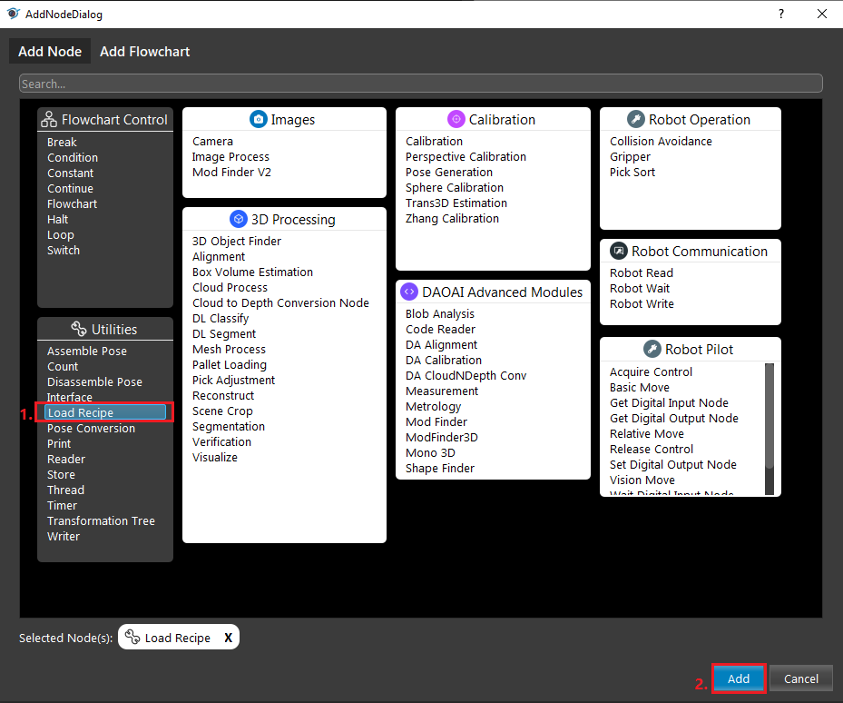
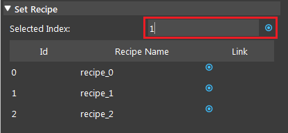

Load Recipe Node
=================

Overview
----------

This node allows you to load recipe automatically. For more information about the recipe, refer to :ref:`Recipes` section.
This node contains a table of recipe names. Users can add/remove recipe names in the table, when the node is run,
it loads the recipe with the input index.

Input and Output
------------------

+-------------------------+-------------------+-----------------------------------------------------------------------+
| Input                   | Type              | Description                                                           |
+=========================+===================+=======================================================================+
| Index                   | Int               | The index in node's recipe table, corresponding recipe will be loaded |
+-------------------------+-------------------+-----------------------------------------------------------------------+

Index Table
-------------

.. image:: Images/load_recipe/index.png

Click '+' to add an index and its corresponding recipe name. Load Recipe Node will load the recipe according to the table.

Procedure to Use
-------------------

1. Create recipe and add your nodes to recipe, refer to :ref:`Recipes` section.

2. Insert a Load Recipe node.

3. Click '+' to add all of your recipes, and enter a value for Selected Index input or link to another node.

4. Run the node, and the corresponding recipe is loaded for your nodes.