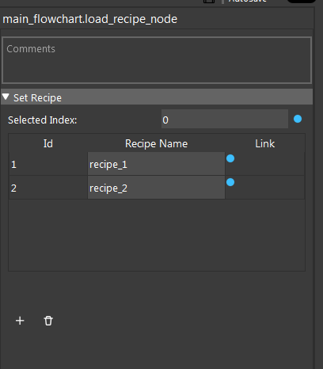

Load Recipe Node
=======================
 
This node allows you to load recipe automatically. For more information about the recipe, refer to recipe section.
This node contains a table of recipe names. Users can add/remove recipe names in the table, when the node is run,
it loads the recipe with the input index.

Input
________________________

* Index : the index in node's recipe table, corresponding recipe will be loaded

