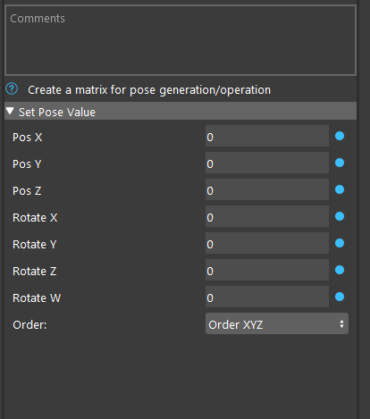
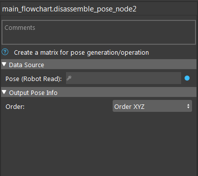
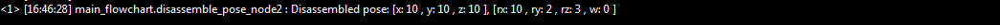

Assemble Pose Node, Disassemble Pose Node
===========================================

These two nodes provide functionalities to create a pose (3d transformation matrix) or analyze a pose.

Assemble Pose Node
---------------------

Assemble pose node allows users to create a 3d transformation matrix with specified parameter.

Input
~~~~~~~~~~~~~~~~~
* Pos X, Pos Y, Pos Z : translation in X,Y,Z axis in the pose
* Rotate X, Rotate Y, Rotate Z : rotation angles around X,Y,Z axis, in degrees. In Quaternion mode, these corresponds to first 3 numbers in quaternion. In angle-axis mode this represents an axis
* W : 4th number in quaternion, or rotation angles in degrees in axis-angle mode
* Order : type of rotation

output
~~~~~~~~~~~~~~~~~~~~~
A pose that contains assembeld transformation matrix

Disassemble Pose Node
---------------------

Disassemble pose node decomposes the input pose and print the result on console 

Input
~~~~~~~~~~~~~~~~~
* Pose : input pose to analyze
* Order : type of rotation

output
~~~~~~~~~~~~~~~~~~~~~
No output, the result is printed in the console

