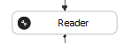
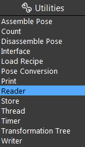
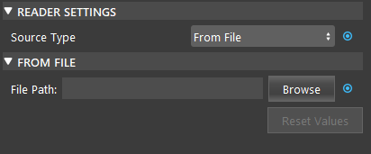
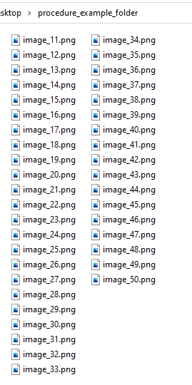
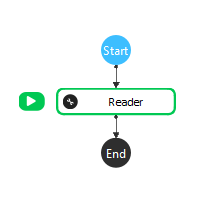
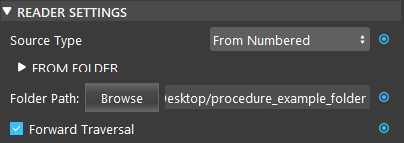
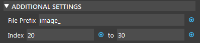

Reader Node
============

Overview
------------

The **Reader node** read files from the designated path. 
There are three modes of reading files are available.

|

Output
----------

+-------------------------+-------------------+------------------------------------------------------------------------+
| Output                  | Type              | Description                                                            |
+=========================+===================+========================================================================+
| index                   | int               | The index of the file if loading from a folder or from numbered files. |
+-------------------------+-------------------+------------------------------------------------------------------------+
| numOfFiles              | int               | The number of files.                                                   |
+-------------------------+-------------------+------------------------------------------------------------------------+
| outputBag               | AssembledBagData  | Data read as a bag data object.                                        |
+-------------------------+-------------------+------------------------------------------------------------------------+
| outputCloud             | Cloud             | Data read as a point cloud.                                            |
+-------------------------+-------------------+------------------------------------------------------------------------+
| outputImage             | Image             | Data read as an image.                                                 |
+-------------------------+-------------------+------------------------------------------------------------------------+
| outputMesh              | Mesh              | Data read as a mesh.                                                   |
+-------------------------+-------------------+------------------------------------------------------------------------+
| status                  | int               | Status code, 0 if successful.                                          |
+-------------------------+-------------------+------------------------------------------------------------------------+

|

Node Settings
----------------

**Source Type**

    - From File:
        Read the same file from the path. 

    - From Folder:
        Read from files inside a folder.        

    - From Numbered:
        Reads from files with the same naming scheme ending with a number.

- File Path / Folder Path: 
    The path the read files from.

- Forward Traversal (Default: True): 
    Files are read in non-decreasing index if true. Available in From Folder and From Numbered mode.

- File Prefix (Default: "daoai\_"): 
    Appended to the start of the file name. Available in From Numbered mode.

- Index (Default: 0 to 10000): 
    The start index and the end index to consider. Available in From Numbered mode.

|

Procedure to Use
-------------------

You only want to read image_20 to image_30 from this folder.

1. Insert a Reader node.

2. Select "From Numbered" mode for Source Type. Click Browse to select the folder path.

3. Change File Prefix to "image\_", and change start index to 20 and end index to 30.

4. Run the node. You can see that only the files with index 20 to 30 will be read. 

.. image:: Images/reader/reader_procedure_4.png
   :scale: 80%

