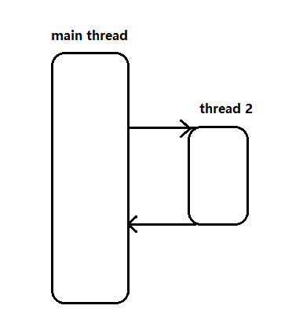
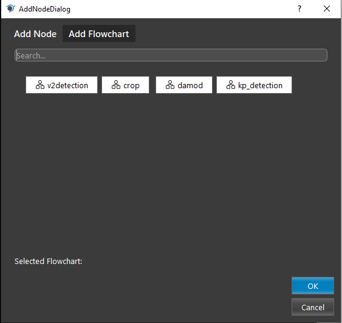
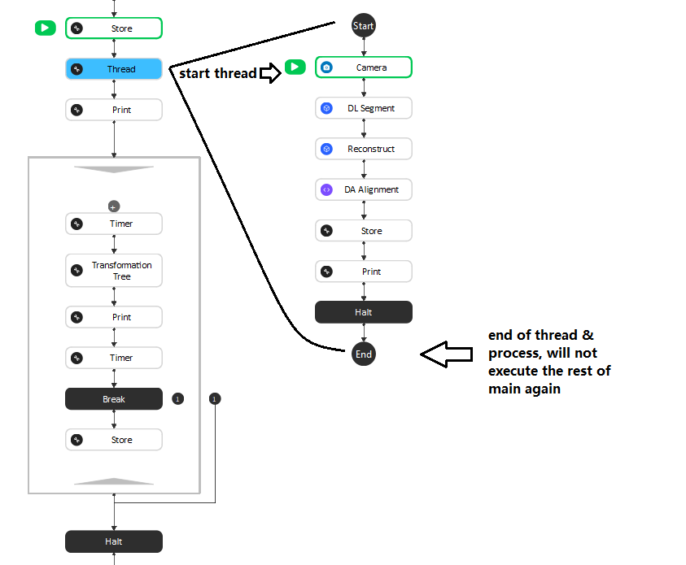
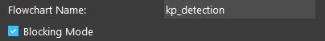
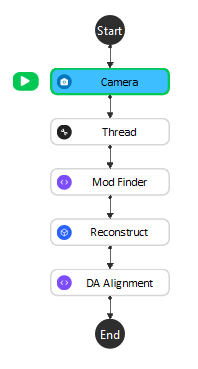
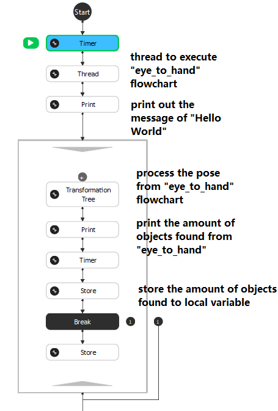

Thread
============

Overview
---------

Thread node is able to provide multi-threading-like execution flow for the workspace. Which allows you to execute more than 1 pipeline at the same time to increase the time complexity for your pipeline.

Input and Output
------------------

+----------------------------------------+-------------------------------+---------------------------------------------------------------------------------+
| Input                                  | Type                          | Description                                                                     |
+========================================+===============================+=================================================================================+
| flowchart                              | flowchart                     | The flowchart which user want to execute on another newly started thread.       |
+----------------------------------------+-------------------------------+---------------------------------------------------------------------------------+

+-------------------------+-------------------+------------------------------------------------------------------------+
| Output                  | Type              | Description                                                            |
+=========================+===================+========================================================================+
| threadFinished          | bool              | Boolean value for whether the thread has finished or not.              |
+-------------------------+-------------------+------------------------------------------------------------------------+
| threadRunTime           | double            | The executed total time for thread.                                    |
+-------------------------+-------------------+------------------------------------------------------------------------+

Node Settings
-------------

After added the thread node, you can immediately see it asks you to select a flowchart like image shown below.

|

The selected flowchart will be executed on the new initialized thread. For example, I want the system to execute the main_flowchart and kp_detection flowchart simultaneously. 
You should add thread node in either of these flowchart, and then add the other flowchart into thread node. In our example, we have thread node added into main_flowchart, and 
kp_detection flowchart is connected on this thread node. 

Also, these 2 threads will both execute to the end. After thread kp_detection is done, process will terminate at the end of this thread. Which means main_flowchart will only executed once. 

And this is one of the mode for thread node. Thread node has 2 modes, this is regular mode, which will start a new thread and will not interfere with the main thread. Second mode is **Blocking mode**, this mode will require another thread node to 
pause the process in main thread. This mode is more usually used since it will ensure the data integrity. 

Blocking mode
-------------

As mentioned above, this mode requires 2 thread nodes: first thread node starts the separate thread; second thread node will block the main process until the indicated thread has finished. 
This mode is useful when your main thread requires dependant data from the separate threads, which needs the separate thread to be finished then work on the data from this finished thread. 

.. image:: Images/thread/blocking.png
   :align: center

When you added the blocking thread, you should choose the same flowchart; this means blocking the process until the thread of "flowchart" is done for the system. 

Exercise
-------------

|

Image above is the detection pipeline. You want to use DL Segment node to detect objects on scene. However, you realize that the DL Segment node will need a lot of time to produce the results. 

Question 1. Would it be a good choice if executing DL Segment node on a separate thread? Why?

	A. It is a good idea since we can multi-threading and have the time consuming nodes executing a separate thread will speed up the process;

	B. It is not a good idea because you will need another thread node to wait for the thread finished, otherwise Mod Finder will report errors and stop the process;

	C. It is not a good idea because Mod Finder requires DL Segment's results as its input; 

	D. It is not a good idea because this multi-threading will spend more time;

|

Image above is your current pipeline. You want to make sure all the data is correct before the next node executes. 

Question 2. Where would you place the second thread node? Why?

	A. between Thread node and Print node;

	B. between Print node and the loop;

	C. between Transformation Tree node and the Print node within the loop; 

	D. between Store node and Break node;

Answers for Exercises
~~~~~~~~~~~~~~~~~~~~~~

Q1. B, C, D

B, C and D they are all correct. Also, DL Segment node within detection pipeline is not good for multi-threading since all the nodes after it will need its output to continue. 
Multi-threading works better for separate calculation but not for linear pipelines. 

Q2. B

Since Transformation Tree node requires the output from the thread, the only place for blocking thread node is before Transformation Tree node. By the way, this multi-threading 
practice is not good as well. Because the nodes/process between thread started and the blocking thread is short, it doesn't take up much time. Therefore, the thread nodes on this example 
is not necessary. My recommendation would be using **Flowchart node** instead of thread node in this case.  