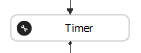
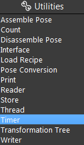
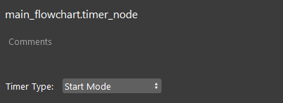
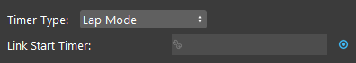
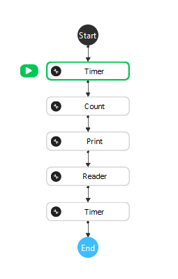
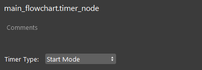
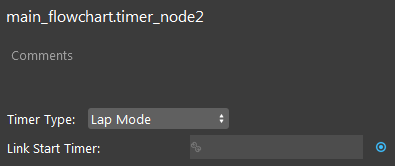
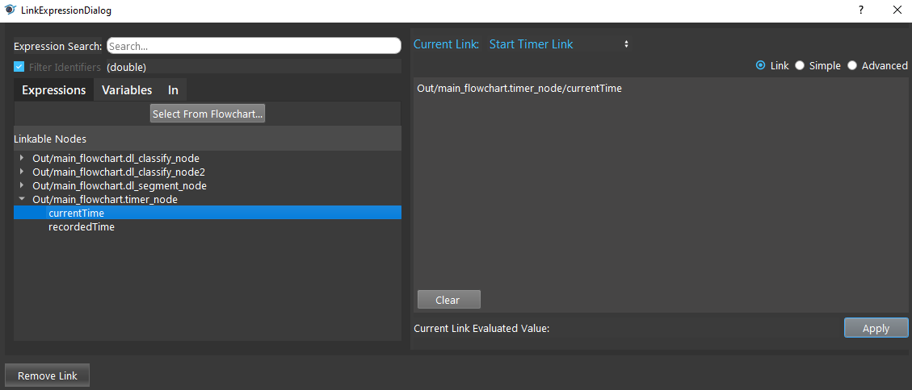
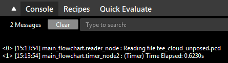

Timer Node
============

Overview
----------

The **Timer node** calculates the runtime from the first start timer to the second timer.

|

Output
------------------

+-------------------------+-------------------+------------------------------------------------------------------------+
| Output                  | Type              | Description                                                            |
+=========================+===================+========================================================================+
| currentTime             | double            | Time value for when the node was last run.                             |
+-------------------------+-------------------+------------------------------------------------------------------------+
| recordedTime            | double            | Recorded elapsed time.                                                 |
+-------------------------+-------------------+------------------------------------------------------------------------+

RecordedTime = current time - current time at the last time it ran

|

Node Settings
--------------

- Timer Type (Default: Start Mode):
    Select from Start Mode or Lap Mode.

- Link Start Timer:
    The other Timer node used in calculating the time.

|

Procedure to Use
-------------------

1. Insert two Timer nodes, and some other nodes between the two Timer nodes.

2. Click the first Timer node. Set the Timer Type to Start Mode.

3. Click the second Timer node. Set the Timer Type to Lap Mode. Click the blue dot and link the first Timer node's currentTime output.

4. Run the flowchart. You can see the Time Elapsed is printed in the console.

