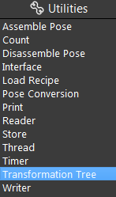

Transformation Tree Node
=============================

Input and Output 
--------------------

The **Transformation Tree node** creates a relationship graph of relative positions of objects.
There are two steps involved in using this node. The first step is to define a set of relationships between objects positions and their relative transformations, 
then we can query the internal graph to produce a list of transformations as the output.
You can refer to :ref:`3D Transformation Concept` for more information on the transformation concept.

.. image:: Images/transformation_tree/transformation_tree_overview_1.png
   :align: center



|

Input and Output 
--------------------

The input can be any number of pose items, each item represents a transformation from one coordinate system to another.

+----------------------------------------+-------------------------------+----------------------------------------------------------------------------------+
| Input                                  | Type                          | Description                                                                      |
+========================================+===============================+==================================================================================+
| Object A name                          | String                        | | The name of first object, same object much have same name across all pose      |
|                                        |                               | | items otherwise the node will not work properly.                               |
+----------------------------------------+-------------------------------+----------------------------------------------------------------------------------+
| Object B name                          | String                        | The name of second object.                                                       |
+----------------------------------------+-------------------------------+----------------------------------------------------------------------------------+ 
| * A in B transformation                | Pose                          | | A pose data representing, A's relative position in B's coordinate system,      |
|                                        |                               | | this input field can be linked with other nodes' output, or you can manually   |
|                                        |                               | | set the pose. All thse pose item will result in a transformation graph that    |
|                                        |                               | | contains a path between any two objects in the pose items (if such path exist).|
+----------------------------------------+-------------------------------+----------------------------------------------------------------------------------+
 
This node can have any number of output poses.

+-------------------------+-------------------+---------------------------------------------------------------------------------------+
| Output                  | Type              | Description                                                                           |
+=========================+===================+=======================================================================================+
| * X in Y transformation | Pose              | | Represents a path (combined transformation) from one object X to Y. The final output|
|                         |                   | | will be a vector of the poses (each generated by one query). The order of output is |
|                         |                   | | the same as what appears in the user-interface.                                     |
+-------------------------+-------------------+---------------------------------------------------------------------------------------+
| size                    | int               | The number of poses.                                                                  |
+-------------------------+-------------------+---------------------------------------------------------------------------------------+

|

Procedure to Use
----------------

Please refer to :ref:`3D Transformation Concept` for more information on the transformation concept.

1. Right click and click insert node to add a transformation tree node.

   .. image:: Images/transformation_tree/step_1.png
      :scale: 60%

|

2. Click Set Inputs on the node config window on the right.

   .. image:: Images/transformation_tree/step_2.png
      :scale: 100%

|

3. In the opened dialog, click the "+" sign to add input transformations. 

   .. image:: Images/transformation_tree/step_3.png
      :scale: 100%

|

4. Define their name and Transformation A in B using link expression from node, or through Set Pose where you can define your own transformation, and click Apply.

   .. image:: Images/transformation_tree/step_4_1.png
      :scale: 100%

   .. image:: Images/transformation_tree/step_4_2.png
      :scale: 100%

|

5. Repeat step 3-4 for number of inputs that you need. 

|

6. Click Set outputs on the node config window on the right.

   .. image:: Images/transformation_tree/step_2.png
      :scale: 100%

|

7. In the opened dialog, click the "+" sign to add output transformations, select the objects from the list and click apply. Repeat for number of outputs you need.

   .. image:: Images/transformation_tree/step_7.png
      :scale: 100%

|

8. run the node and the transform relation is displayed on the display window.

   .. image:: Images/transformation_tree/step_8.png
      :scale: 60%

|

Exercise
---------

Try to come up with the setting on **Mod Finder node** according to the requirements below. You can work on these exercise with the help of this article. We also have answers attached at the end of this exercise.

Scenario 1
~~~~~~~~~~

There is a project which requires the robot to pick all the occurrences of the T-tube in scene. 
Your colleague has setup the 3D camera and robot in the lab for experiment. 
Here's a `link to .dcf file <https://daoairoboticsinc-my.sharepoint.com/:u:/g/personal/xchen_daoai_com/EVCy06cC-FFBqsSVWdZ9T3UBhjdX6cYGdSKwhi4IIemvPw?e=HxO6d8>`_ which are used as camera input.

You need to help him setup the **Transformation node** in main_flowchart. Please choose the all correct answers from the options:

1. Shown in the following image, The picking pose is too low. You believe that the height is too low by over a distance of object-in-cloud. 
What output from the transformation tree can help you correct this error?
	.. image:: Images/transformation_tree/exercise_1.png
		:scale: 60%
	A. obj in cloud
	B. cloud in obj

2. Suppose we have the following relations as the input, what can we derive as an output?

   - object in cloud
   - base in cloud
   - tool in object

   A. object in base
   B. base in object
   C. tool in base
   D. All of the above

3. In order to pick the object, we have to send the tool-in-base pose to the robot, what should you set as input in order to compute the position to send to the robot.

   A. object in cloud
   B. base in cloud
   C. tool in object
   D. All of the above
   E. A and C

|
|
|
|
|
|
|
|
|
|
|
|
|
|
|

Answers for Exercise
----------------------

Scenario 1
```````````````

1. **Answer: B**

**Explanation**: Since the height is over by one obj-in-cloud, we have to subtract the distance in order to correct it, and applying cloud-in-obj, its inverse, will correct the error. 

|

2. **Answer: D**

**Explanation**: All relations can be derived given the premise. 

|

3. **Answer: D**

**Explanation**:  All premise is needed to compute tool-in-base, and it can not be reached without base in cloud.

|

