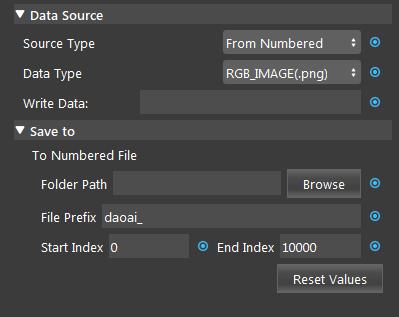
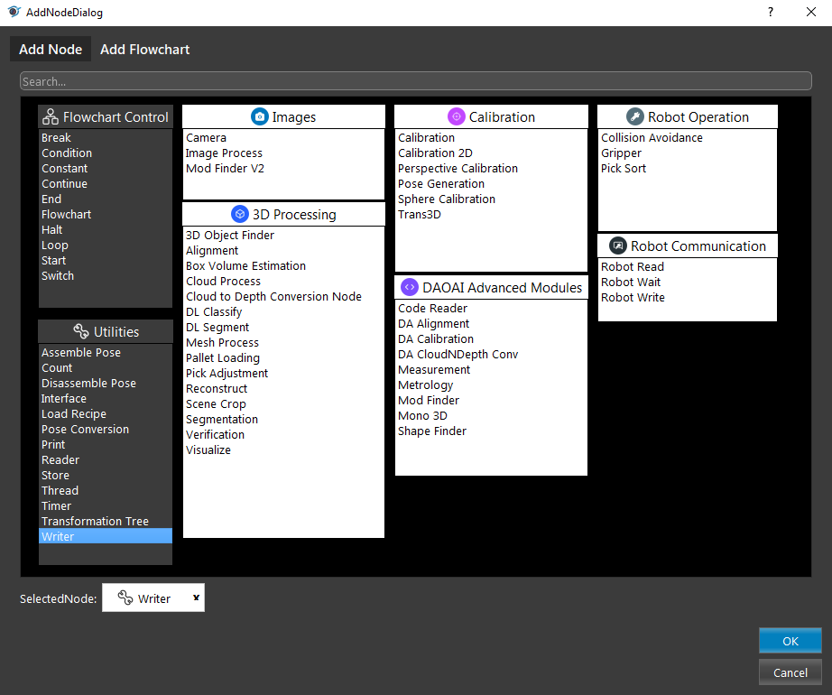

Writer Node
===============

Overview
-----------

**Writer node** writes various types of data to files in disk.
There are two modes available for writing data: From File, and From Numbered.
If there are existing files with the same name when writing new files, the old files will be overwritten.

.. image:: Images/writer/writer_overview_1.png
   :align: center

.. image:: Images/writer/writer_overview_2.png
   :align: center

|

Input
------------------

+----------------------------------------+-------------------------------+---------------------------------------------------------------------------------+
| Input                                  | Type                          | Description                                                                     |
+========================================+===============================+=================================================================================+
| Data Type                              | Int32                         | The file type to write to. (one of .png, .tif, .pcd, .ply, .bag)                |
+----------------------------------------+-------------------------------+---------------------------------------------------------------------------------+
| Image                                  | Image                         | The image to be written to the bag file.                                        |
+----------------------------------------+-------------------------------+---------------------------------------------------------------------------------+
| Point Cloud                            | Cloud                         | The point cloud to be written to the bag file.                                  |
+----------------------------------------+-------------------------------+---------------------------------------------------------------------------------+
| Depth Image                            | Image                         | The depth image to be written to the bag file.                                  |
+----------------------------------------+-------------------------------+---------------------------------------------------------------------------------+
| Pose                                   | Pose                          | The pose to be written to the bag file.                                         |
+----------------------------------------+-------------------------------+---------------------------------------------------------------------------------+
| Intrinsic                              | CameraIntrinsics              | The camera intrinsics to be written to the bag file.                            | 
+----------------------------------------+-------------------------------+---------------------------------------------------------------------------------+

|

Node Settings
--------------

.. image:: Images/writer/writer_node_settings.png
    :scale: 100%

**Data Source**

    - Source Type (Default: From File):
        - From File: write data to one single file.
        - From Numbered: write data to multiple files. 

    - Data Type (Default: RGB_IMAGE (.png)):
        Select from one of the four output file types:
            - RGB_IMAGE (.png)
            - DEPTH_IMAGE (.tif)
            - POINT_CLOUD (.pcd)
            - POLYGON_MESH (.ply)
            - BAG (.bag)

    - Write Data:
        The data to be written to files.

**Save to**

    - File Path: 
        Available in From File mode.

    - File Prefix (Default: "daoai\_"):
        The string as the file name prefix.

    - Start Index (Default: 0):
        Index is the suffix number to be added to File Prefix.
        The starting index of the file to be saved.

    - End Index (Default: 10000):
        The ending index of the file to be saved. Index will reset to Start Index after exceeding the End Index.

    - Reset Values:
        Clicking this button will reset the file suffix index value

    .. warning::        
        Writer node will overwrite exsiting file with same name.
|

Procedure to Use
-----------------

1. Set up the Camera node, you can refer to :ref:`Camera Node`. 

2. Insert a Writer node.

.. image:: Images/writer/writer_overview_1.png

3. Select Source Type and Data Type (will use "from file" and "save as .bag" as an example)
    .. image:: Images/writer/writer_procedure_3.png

4. link data to save (Image, Point Cloud, Depth Image, Intrinsic can all be linked to camera node, and Pose can be linked to robot read node).
    .. image:: Images/writer/writer_procedure_4.png

5. Select a path to save, click browse folder and default path is "[workspace]/Data", click "Select Folder"
    .. image:: Images/writer/writer_procedure_5.png

6. run the node and the file will be save to the specified directory.
    .. image:: Images/writer/writer_procedure_6.png
