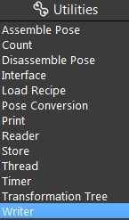
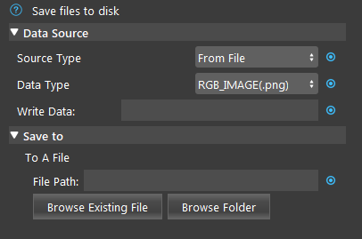
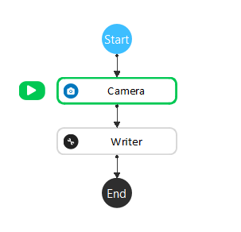
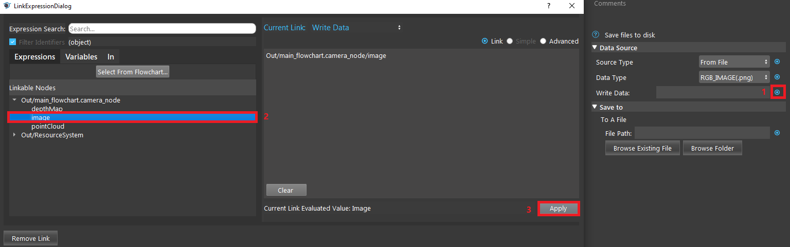
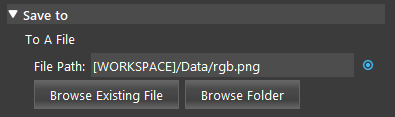
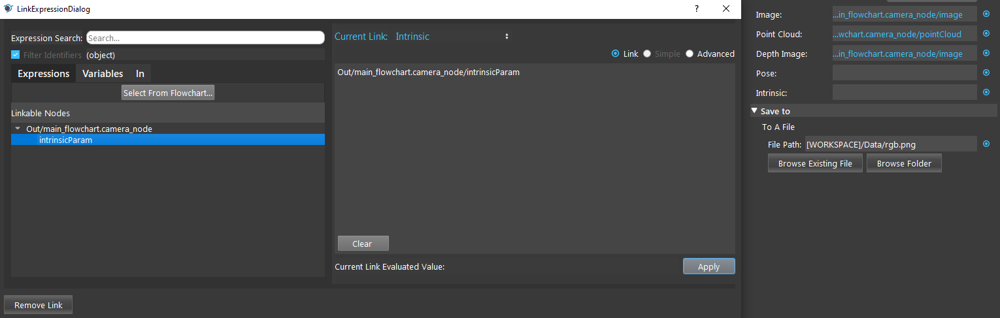

Writer Node
===============

Overview
-----------

**Writer node** writes various types of data to files in disk.
There are two modes available for writing data: From File, and From Numbered.
If there are existing files with the same name when writing new files, the old files will be overwritten.

|

Input
------------------

+----------------------------------------+-------------------------------+---------------------------------------------------------------------------------+
| Input                                  | Type                          | Description                                                                     |
+========================================+===============================+=================================================================================+
| Data Type                              | Int32                         | The file type to write to. (one of .png, .tif, .pcd, .ply, .bag)                |
+----------------------------------------+-------------------------------+---------------------------------------------------------------------------------+
| Image                                  | Image                         | The image to be written to the bag file.                                        |
+----------------------------------------+-------------------------------+---------------------------------------------------------------------------------+
| Point Cloud                            | Cloud                         | The point cloud to be written to the bag file.                                  |
+----------------------------------------+-------------------------------+---------------------------------------------------------------------------------+
| Depth Image                            | Image                         | The depth image to be written to the bag file.                                  |
+----------------------------------------+-------------------------------+---------------------------------------------------------------------------------+
| Pose                                   | Pose                          | The pose to be written to the bag file.                                         |
+----------------------------------------+-------------------------------+---------------------------------------------------------------------------------+
| Intrinsic                              | CameraIntrinsics              | The camera intrinsics to be written to the bag file.                            | 
+----------------------------------------+-------------------------------+---------------------------------------------------------------------------------+

|

Node Settings
--------------

**Data Source**

- Source Type (Default: From File):
    - From File: write data to one single file.
    - From Numbered: write data to multiple files. 

- Data Type (Default: RGB_IMAGE (.png)):
    Select from one of the four output file types:
        - RGB_IMAGE (.png)
        - DEPTH_IMAGE (.tif)
        - POINT_CLOUD (.pcd)
        - POLYGON_MESH (.ply)
        - BAG (.bag)

- Write Data:
    The data to be written to files.

**Save to**

- File Path: 
    Available in From File mode.

- File Prefix (Default: "daoai\_"):
    The string to be appended to the start of the file name.

- Start Index (Default: 0):
    The starting index of the file to be saved.

- End Index (Default: 10000):
    The ending index of the file to be saved.

|

Procedure to Use
-----------------

1. Insert Camera node and a Writer node.

2. Set up the Camera node, you can refer to :ref:`Camera Node`. Then, link a Write Data, and select a path. 

3. Run the node.

4. You can find the file in the file path.

