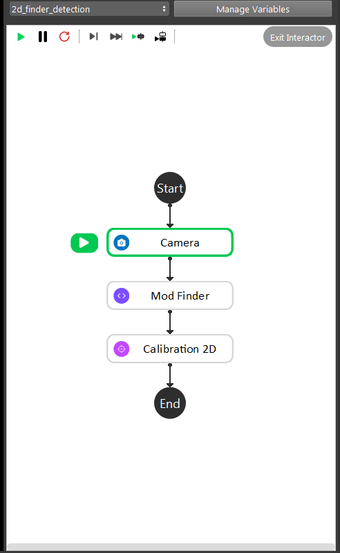
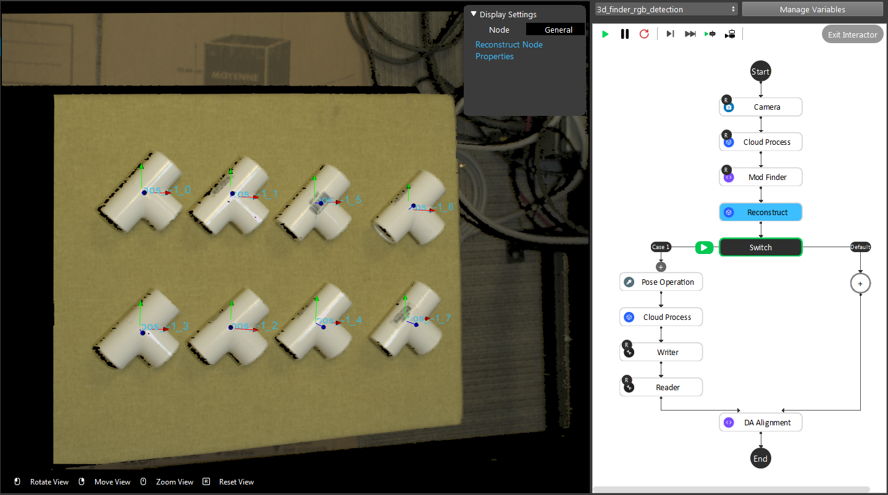
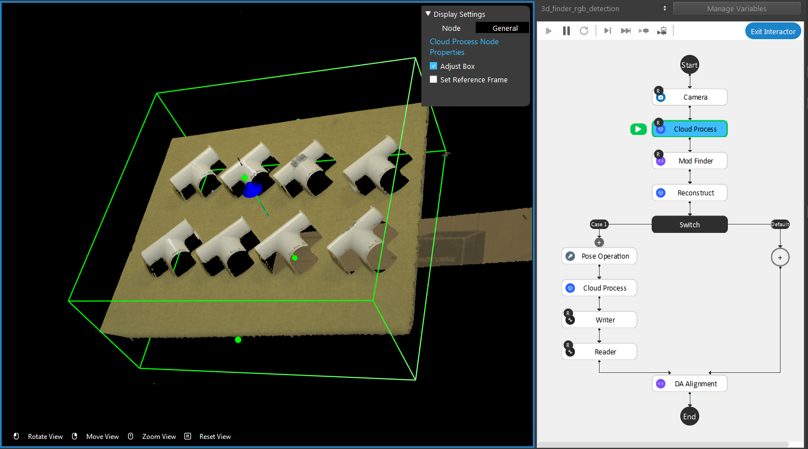
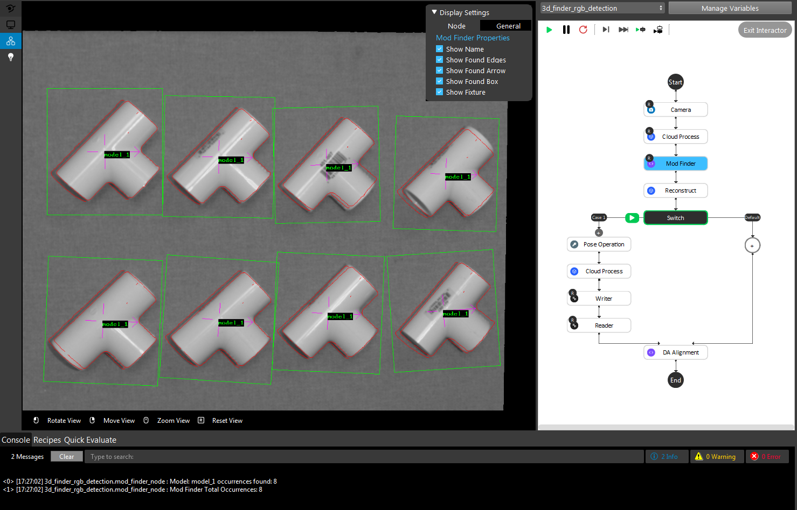
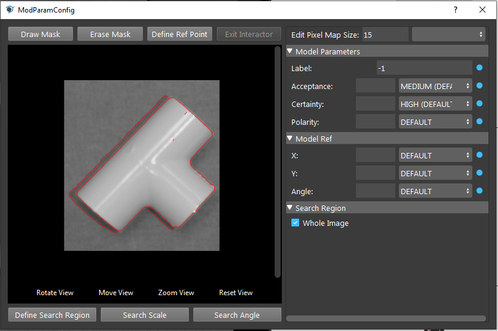
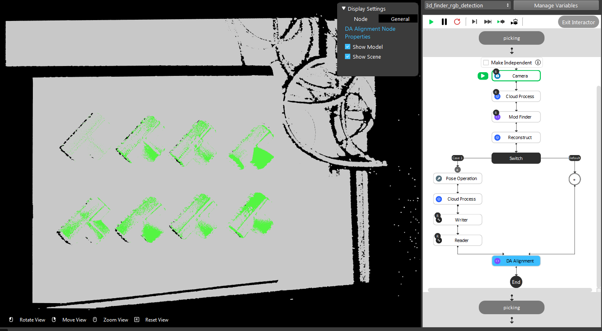

3D Finder RGB Detection
=====================

Teach From Camera
----------------

3D Finder RGB Detection uses image RGB to detect object location. Cloud Process Node highlights the designated area(bounding box) for the scene, system will try to detect from this specific area to increase accuracy. Mod Finder Node takes the Cloud ouput and user is able to define the object model. Reconstruct Node will generate the Z coornidate for objects which were detected. The left branch of the Switch Node is used when first define the object cloud/mesh to the system. It saves the object cloud/mesh to local folder in order for future use. Last but not least, DA Alignment Node refines the poses for Picking process, generating the object locations to robot.

Teach Good Model
----------------

Defining a good model is essential for Detection, a good model can help the system to identify the objects in many different situation. But note that, machine is still machine, some object might be different from front and back, system only able to identify the model which user defined. As example, template is a sample project which is looking for the T-tubes. The T-tubes are identical front and back. Hence, the system is able to detect both sides. 

Cloud Process Node will generate a box of area; this area is desingated for the system to search for the model.

    
|

Connect Mod Finder Node with Cloud Process, taking Cloud Process Node result as input, searching for the model within this box area. Mod Finder Node is detecting object from image RGB and depth. When adding Mod Finder Node, system will ask which source to use. 2D is taking image RGB as input, and 3D is depth image. In this case, system takes RGB image as input, so that choose 2D. Console with print the message with how many objects found, also displaying the object in the image.

    
|

Image link is the input user defined for Mod Finder Node. Checking the ``Use labelled mask sequence`` enables the node to use designated mask for the models; commonly taking Deep Learning ouput(DL Segment Node). Total occurence option can be detect all the objects in the image or only one object in the image at a time: if user wants to picking all occurence of objects with single image captured, this option should set to ``All``; on the other hand, picking one object at a time shuold set to ``One`` (default).

    
|

Double click on the model name brings up the Model Param Configuration dialog. There are more parameter settings for the model in this dialog. Mod Finder Node uses the model details to detext the objects in the image. 
``Draw Mask`` is able to set a excluding area for the model, the mask area would be ignored when it comes to detect the object. 
``Erase Mask`` can erase the drawn area. Reference point is generated at the middle of the object by default. Reference point would be used by Reconstruct Node, generating Z coordinate from this point. 
``Define Red Point`` allows user to define a new reference point on the object. It is useful when the object is skewed or heavy on one side: robot might be failed to grab or the object will fall when using this reference point. 
``Acceptance`` is the acceptance level for the system: if the acceptance level is too high, system might not be able to detect all the objects since system sees the objects in the image is not 100% identical to the model. On the other hand, low acceptance level might lead to finding too many objects, system might detect all the similar points, pixels in the image as the object. User should adjust the acceptance level to detect all the occurence AND as high as possible. 

Testing the detection of the model
----------------

Run the rest of the detection flowchart, and see if ``DA Alignment`` Node is able to detect all the objects and only the objects are detected. Also, capture a different image(Or use different picture for virtual camera), and see if all the obejects are detected.

    
|

As shown above, this is a detection of the model. Only 8 objects are found and all the green points are aligned with the objects.