3D Depth Picking
=============

3D Depth Picking Teach Pose
-------------

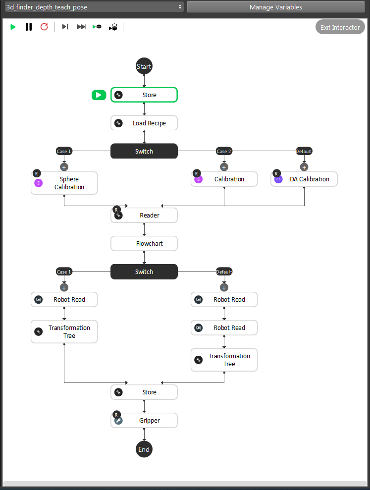
    
|

``3d_finder_depth_teach_pose`` flowchart is used before ``Picking`` since we need to teach the system what pose to pick the object. 

1. ``Store`` Node at the beginning will set the variable ``Teaching_Pose`` as ``True`` . 
This step runs the Detection flowchart as Teach_Pose mode(running the right branch of the first ``Switch`` in Detection flowchart).

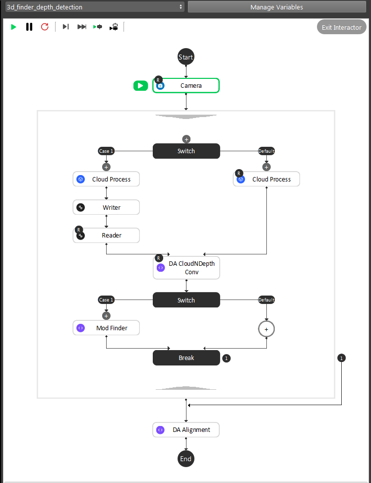
    
|

2. The system loads a recipe depending on which kind of object user wants to pick. In this template, both recipe_1 and recipe_2 are looking for the same object.

3. Depending on the Calibration type in variable, ``Switch`` between 3 kinds of calibration files. We use ``Sphere Calibration`` in our example.

4. ``Reader`` Node loads the gripper mesh from local directory. Then run through the Detection flowchart to define model.

5. Depending on the project requirements, ``Eye to Hand`` picking would be on the left branch; ``Eye io Hand`` picking would be on the right branch.

6. Re-store the variable ``Teaching_Pose`` as ``False`` , so that system will not redefine the model during the Picking process.

7. Lastly, ``Gripper`` Node defines the picking pose and can be visualized here. 

Note: When ``Gripper`` Node needs to redefine a new pose, please delete the existing poses in ``Gripper`` Node, then add a new pose. Otherwise the ``Gripper`` Node might not be able to visualize the new pose.

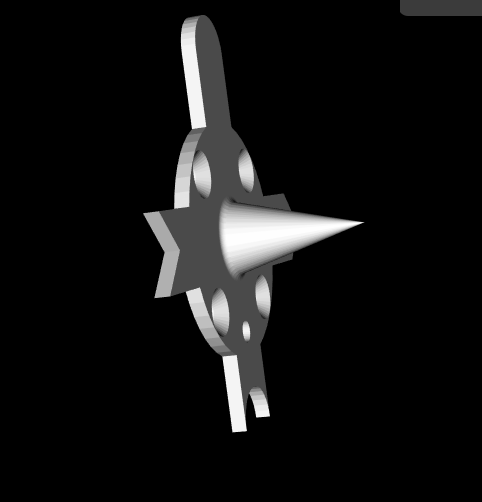
    
|

The example shown above is transformed with virtual robot therefore the ``Robot Read`` input is not accurate. User then should adjust the pose for ``Gripper`` Node output, adjusting it as they should align. 

Note: ONLY adjust this pose when using virtual robot! If using real robot and gripper not aligned with object, should check the real robot pose. 

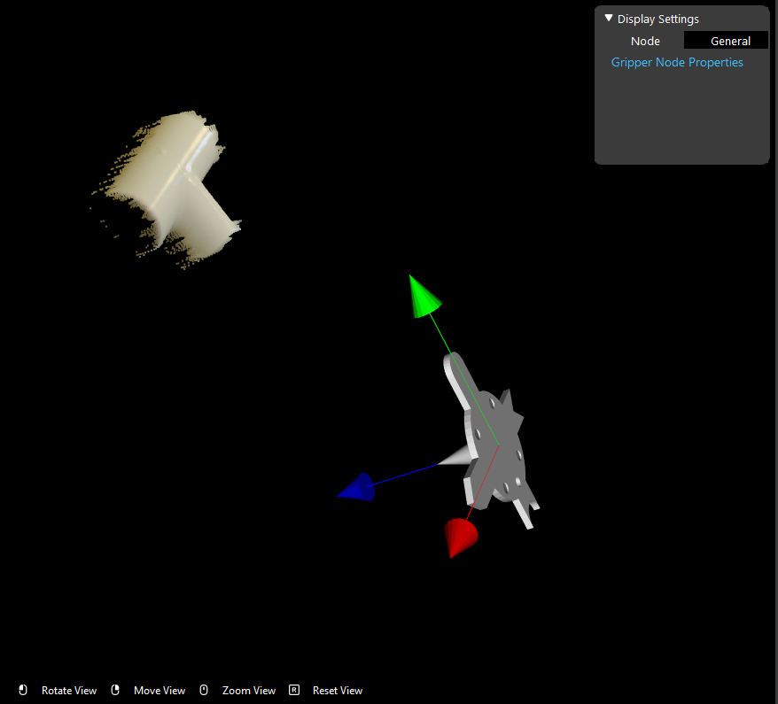
    
|

This is how it looks like the image below.

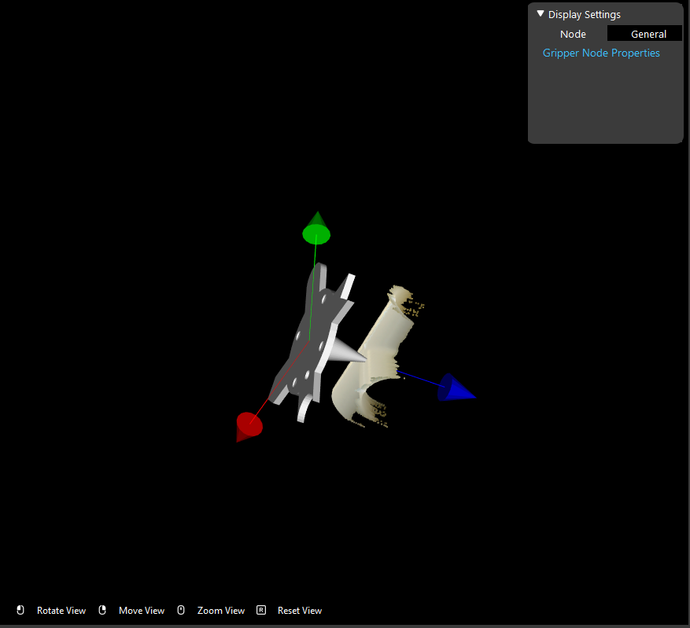
    
|

Order Picking Setting
-------------

If user wants to pick using 3D Depth Picking, the Picking flowchart needs to take in specific payloads from the robot. 
``Payload_1`` is the variable which control what type of detections to choose. In this case, 3D Depth Picking is ``2`` .
``Payload_2`` is the variable which control what kind of objects to pick in the recipe(swithcing recipes). ``Load Recipe`` Node takes ``Payload_2`` as input to determine which recipe to load. 
In our example, there are only 2 recipes in this project. Hence carefully set this ``Payload_2`` , if this payload does not match corresponding recipe number, the system would ouput ``ERROR`` .

For virtual robot, we use ``Hercules`` . 

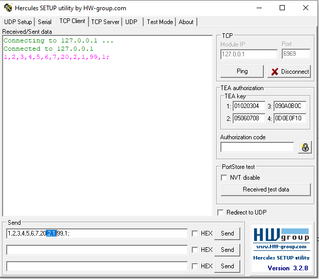
    
|

In Hercules, the ``Payload_1`` and ``Payload_2`` is the highlight indexes in the image. In this case, we choose ``2`` in ``Pyload_1`` to use 3D Depth Picking; ``1`` in ``Payload_2`` to load recipe_1.

Collision prevention
-------------

Both 3D RGB Picking and 3D Depth Picking would need ``pose_generation`` flowchart. This flowchart would ensure the robot would not collide anything when it performs picking. 

``Collision Avoidance`` Node collects all the poses, and simulate a box boundary for the scene. Output of ``Collision Avoidance`` Node is used as inputs for ``Pick Sort`` Node to generate the transformations for ``Transformation Tree`` Node.

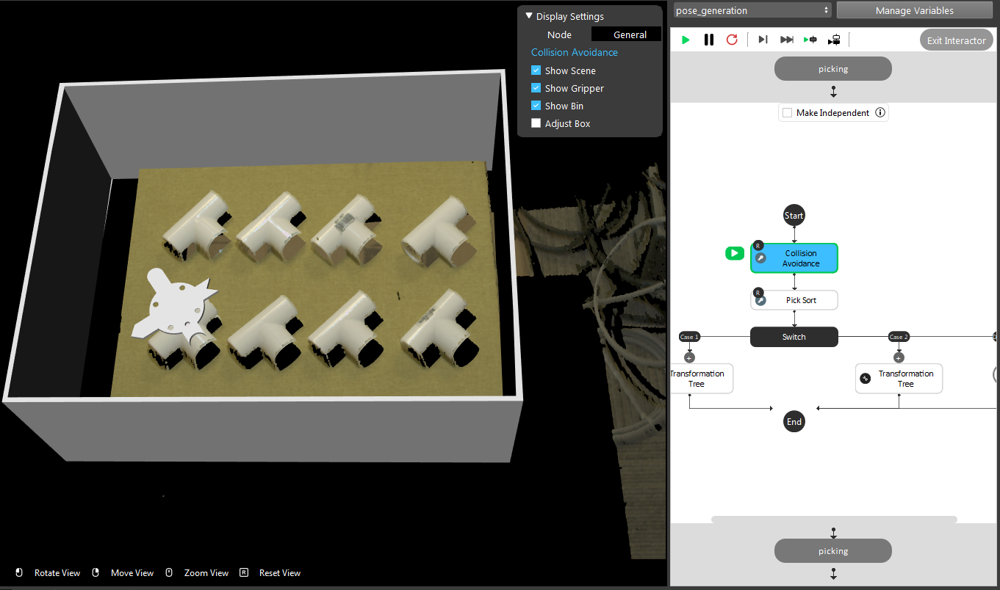
    
|

``Pick Sort`` Node would sort the order for picking up objects. This Node labels all the occurence of objects and the result is used as inputs for ``Transformation Tree`` Node to generate the pose to robot.

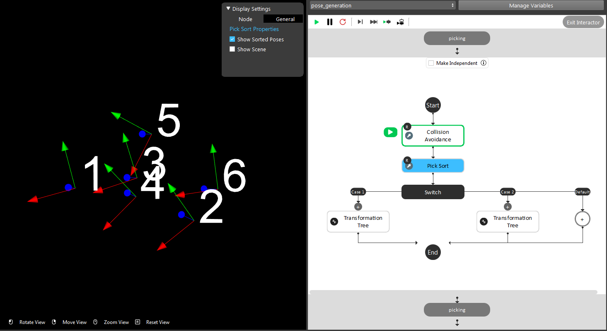
    
|

Run Picking
-------------

For virtual robot, we use ``Hercules`` . 

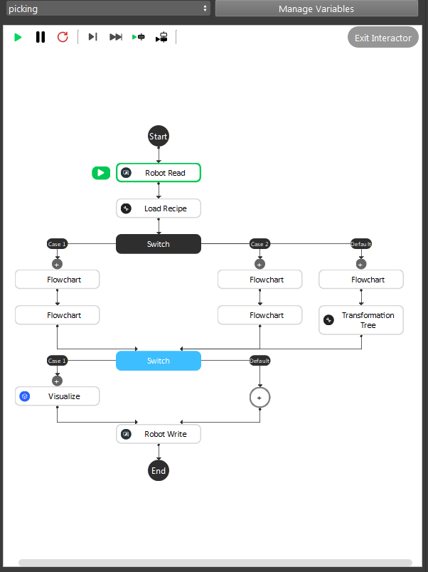
    
|

Before running the Picking flowchart:

1. Should run through the ``3d_finder_depth_teach_pose`` flowchart, otherwise some of the inputs might be ``NULL`` .

2. User should double check the ``Platform Configuration`` , make sure the camera and robot is connected. 

In this case, camera_1 is for Recipe_1 object detection; camera_2 is for Recipe_2 object detection.

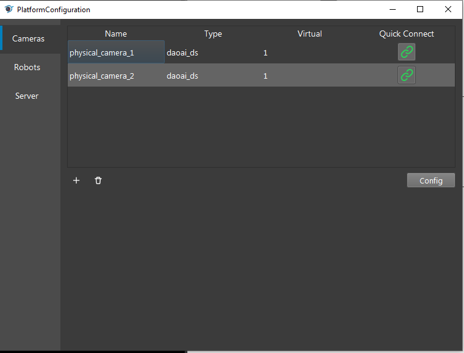
    
|

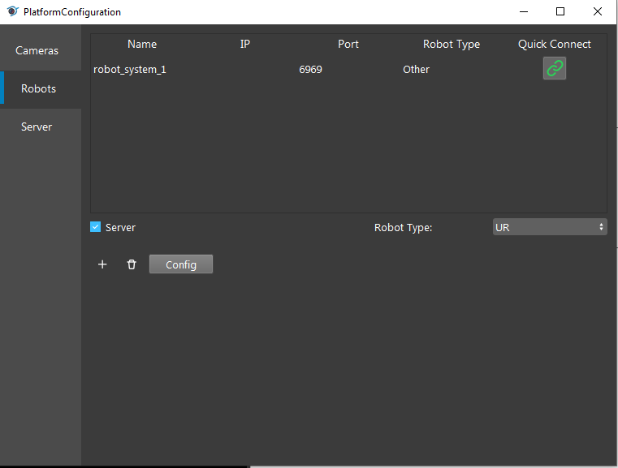
    
|

Loading the recipe from ``Robot Read`` Node ``Payload_2`` to determine which object we want to pick. Then the first ``Switch`` Node checks the ``Robot Read`` Node ``Payload_2`` to ensure which detection is used for this picking. 
``Transformation Tree`` Node processes the result from ``3d_finder_depth_detection`` and ``3d_finder_depth_teach_pose`` flowcharts. 

After Detection and Pose Generation flowcharts, ``Visualize`` Node will visualize the corresponding gripper and object in the scene.

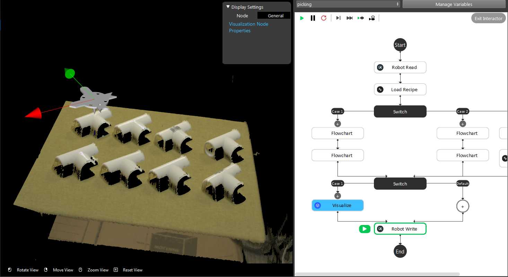
    
|

``Robot Write`` will send the pose to robot and robot can perform picking.