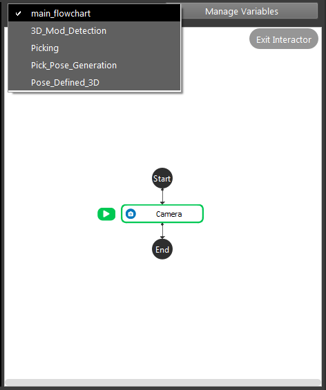
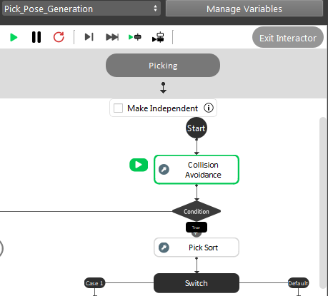
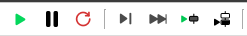

Config flowchart 
**********

A flowchart is a sequence of well-defined operation that achieves a functionality (e.g. detecting an object in a scene, picking an object).
A workspace usually consists of several flowcharts, each managing one procedure in the picking application.

In our example, they are 5 flowchars defined. You can switch between nodes from the drop-down menu on top. You can also manage flowchart in the "Flowchart" menu.

Some flowcharts are define as sub-flowchart of other flowcharts, which means they can only be run when running their parent flowchart. You can check
"Make Independent" checkbox to make a sub-flowchart a independent flowchart

Flowcharts consist of nodes, all flowcharts have start and end indicates the start and end of the flowcharts. Flowchart is the core for the program, modifying the nodes can generate different kinds of flowcharts for different usage. The execution order is indicated by the arrows, and usually the flowchart is executed from top to the bottom. 

Right click any node, choose Insert Node from the drop-down menu. Add Node Dialog is shown as below. Nodes are in categories. Click on the nodes which want to add to the flowchart then OK. These nodes will be inserted.

.. image:: image/add_node.PNG
   :width: 650

They are differnt buttons to run the flowchart: (from left to right)

   
* Run: Run current flowchart non-stop, the order of nodes being run depends on the flowchart. It stops until it gets an error, or it reaches a halt node. After the end node, it goes back to the start node.
* Pause: Pause current running flowchart.
* Reset: Reset all flowchart status (node outputs, node's internal counter for sequential file read/write, current node marker).
* Next Step: Run current node and go to next node in the flowchart.
* Skip Step: Skip current node and go to next node in the flowchart.
* Run Selected Step: Run a selected node, this node can be arbitrarily selected.
* Run to Selected Step: From the current node, run the flowchart until it reaches selected node. the current node is not Run.