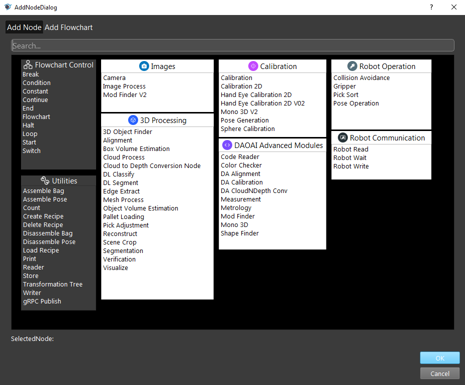

Config flowchart 
**********

Flowcharts consist of nodes, all flowcharts have start and end indicates the start and end of the flowcharts. Flowchart is the core for the program, modifying the nodes can generate different kinds of flowcharts for different usage. The execution order is indicated by the arrows, and usually the flowchart is executed from top to the bottom. 

Right click any node, choose Insert Node from the drop-down menu. Add Node Dialog is shown as below. Nodes are in categories. Click on the nodes which want to add to the flowchart then OK. These nodes will be inserted.

