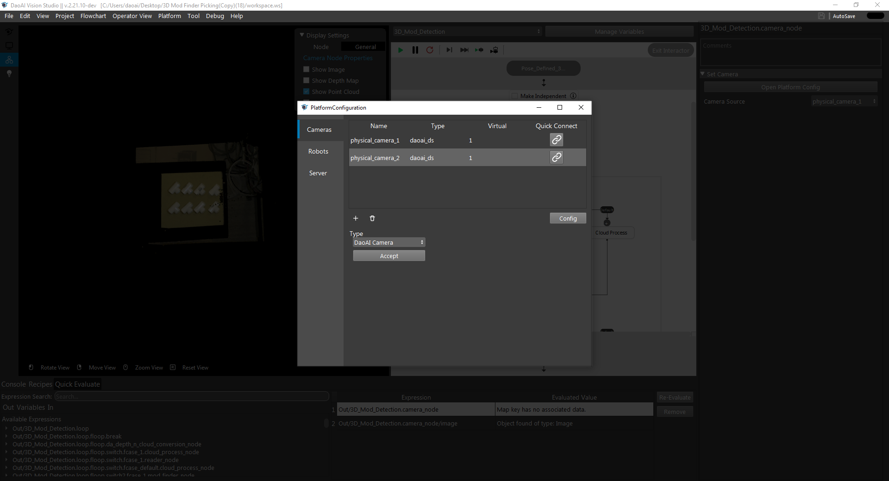

Platform 
===========

Platform is one of the title tabs. Platform is the configuration menu for connecting camera and robot. 

.. image:: image/platform.png
   :width: 650

Camera 
-----------

Cameras can be added with + button then accept. 

Camera name(alias) and type of this camera is shown at top of the dialog. Uncheck the option Virtual Camera for actual cameras. Users can choose the camera in the list of Serial number and IP. If could not find the camera in the list, click on the Update Camera List to refresh the camera list. Camera setting can be loaded from file(.cfg) which can be generated from DaoAI Studio. Then clicking connect, camera would be connected to the program now. 

Save camera data enables the camera node to store the image data into local file folders. Selecting Write to File will write to a specific file, if camera node is executed multiple times, the file will be overwritten.  

.. image:: image/cam_writetofile.png
   :width: 350

Selecting Write to Numbered Files will write images data to a folder. File Prefix is the files name, starting with your file prefix. Indexes are the number index for the image files, users can set the range for this index; also, the index is able to reset, resetting to the start index. 

.. image:: image/cam_writeNumbersfile.png
   :width: 350

Selecting Enable Remote Camera will connect the remote camera using its IP address. 

.. image:: image/cam_remote.png
   :width: 350

Virtual Camera 
-----------

Virtual camera uses images as input. Loading from a single file is default setting. 

.. image:: image/cam_virtual.png
   :width: 350

Virtual camera can also load from a folder, users can define the expected files’ suffix and extension. By default, loading from folder would load the lowest file suffix to the highest; if the folder has no more applicable files, it will load from the first file again. 

.. image:: image/cam_loadfolder.png
   :width: 350

Loading from numbered files is similar to load from folder, but this option can setup the range for the files and limited to the user defined file prefix. 

.. image:: image/cam_loadnumbered.png
   :width: 350
