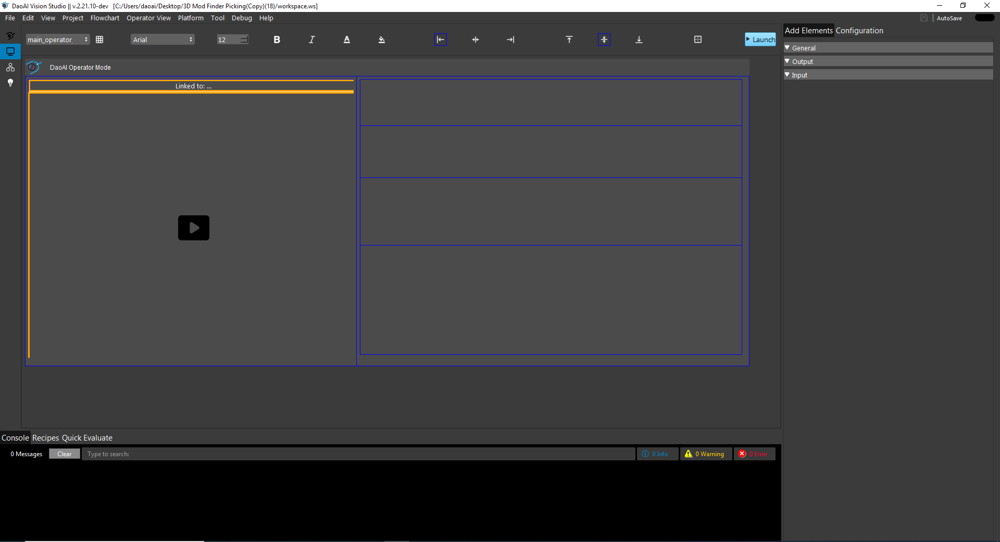
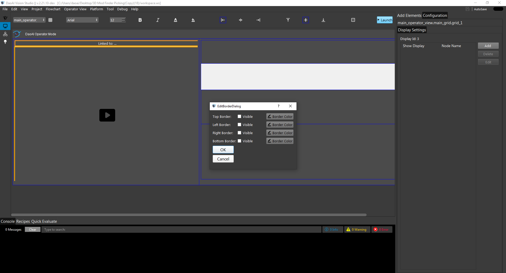
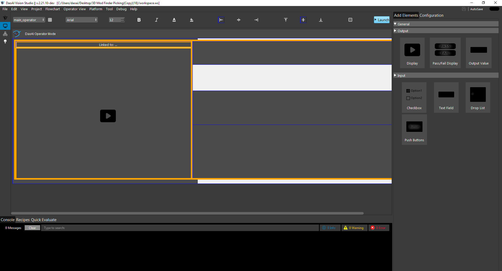

Create operator view   
**********



The Operator View can design user preference facing application. Based on a cell and grid system. Different operator views can be selected from the drop-down menu on the top left. 

Style Editing: 
===========

Each Item can be edited to set the style for their text, borders, and colors 

Some of the settings to edit:

Font  

Font Decoration  

Font Color  

Background Color  

Alignment  

Border Visibility  

Border Color 



Resizing Grids/Cells:
===========

Both Grids and Cells can be resized 

Differing cell contents will have different minimum sizes 

Cell Actions 
===========

When Mouse Right Click on a cell you will have many different options 

Inserting Grid 
===========

You can insert a sub grid inside a cell to manage deeper columns. 

These grids behave like the main grid 

Row and Column Operation: 
===========

You can add columns and rows before and after the current cell 

Columns and Rows will be made to start at their default size 

You can also delete the current row/column 

All other cells and cell contentsin that row/column will be deleted as well 

Inserting Elements 
===========

In each cell you can insert up to one element 

These elements can be resized and styled the same way as grids 

These are the types of elements: 



Output Value: 
-----------

The output value can be linked to an expression and will be updated as the operator view runs  

You can switch between the types using the combobox on the top left 

Checkbox: 
-----------

The checkbox can be linked to a condition variable 

When the operator view is running the state of the checkbox will be the value of the variable 

Textbox: 
-----------

The textbox takes in a value input by the user and sets a bound expression to that value when running 

This variable can either be an integer, decimal, or string value 

There are also options to configure when this object is enabled in running and what values are allowed in 

Drop-Down List: 
-----------

Sets up a combobox that is linked to a list of values which then sets a variable when changed 

The values can either be Integers, decimals, or strings 

You can add new entries to the list of values in the configuration section 

Push Button: 
-----------

A push button runs a series of actions in order which either operate on a flowchart, node or a variable 

Here is a list of the possible actions: 

Set Variable 
```````````

you can set any variable to any raw value/linked value when the action is run 

Run Flowchart 
```````````

runs the selected flowchart indefinitely until a pause is called 

Run to End 
```````````

runs the selected flowchart to end 

Pause 
```````````

pauses the run of a selected flowchart 

Restart All 
```````````

restarts the running position and all the nodes for all flowcharts 

Restart Flowchart 
```````````

restarts the running position and all nodes in a particular flowchart 

Pass Fail: 
-----------

Pass fail allows you to display a condition and specify the colors and text for passing and failing 

Slightly different configuration for style as the color, text and size is controlled by the config page and not the operator view page 

Display: 
-----------

Each operator Display has a different ID 

You can link a display to the output of individual nodes 

Each node can have its viz settings configured for the particular display 

During running mode this will behave like a regular flowchart display 

Image: 
-----------

You can also insert images for decoration into a cell 

Running mode 
===========

You can launch the current operator view by pressing the launch operator view button 

The elements and grids no longer become configurable, but will use their configuration to interact with the system 

Closing the operator view will stop all running flowcharts 

Managing Operator Views: 
===========

You can edit operator views using the operator view dialog 

You can add a new separate operator view or delete existing ones  

The main_operator_view is unable to be deleted 
