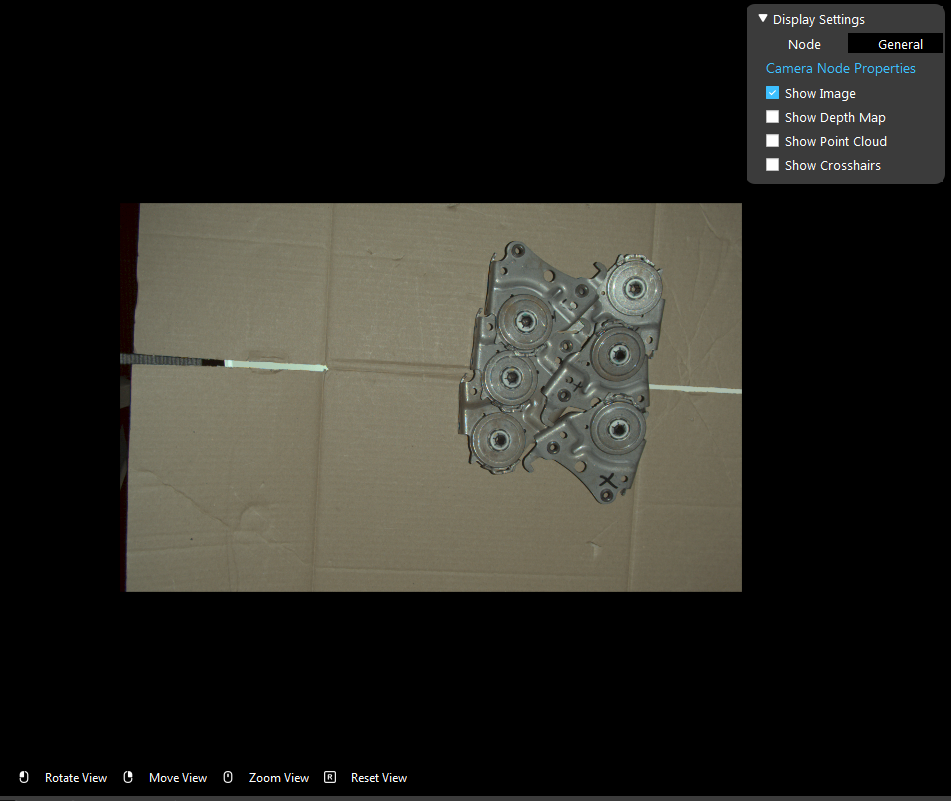
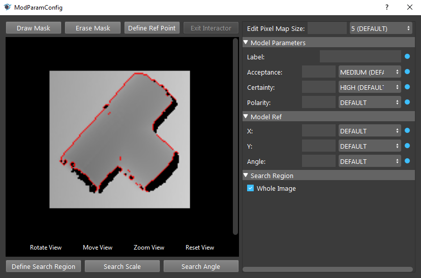

Display
**********

They are multiple different display windows in the Vision software to help users visualize the result.

Flowchart Display
--------------------

Flowchart display is the main display of the Vision software. It is able to display in both 2D or 3D mode.
Usually it is used to display the result of a selected node. 
When displaying a node's result, user can change the node's display operation by checking/unchecking Display Properties on the top right of the display window.

The flowchart displayed is also used when a node requires user interaction. For example, cloud process node may require user to define a bounding box on the point cloud to filter out the point cloud. At this moment the 
flowchart display will enter interactor mode, asking the user to draw  a bounding box on the point cloud. You can press "Exit Interactor" button or press key 0 to exit interaction.

Config Display
---------------------------

   
Config display visualizes detailed configuration of a node. For example, the mod finder node's config page of the model will has a display window on the left.
From this window the user can see what is the defined model. The config display shares the interaction action with the flowchart display. However, it does not have
display properties to control which item to display.