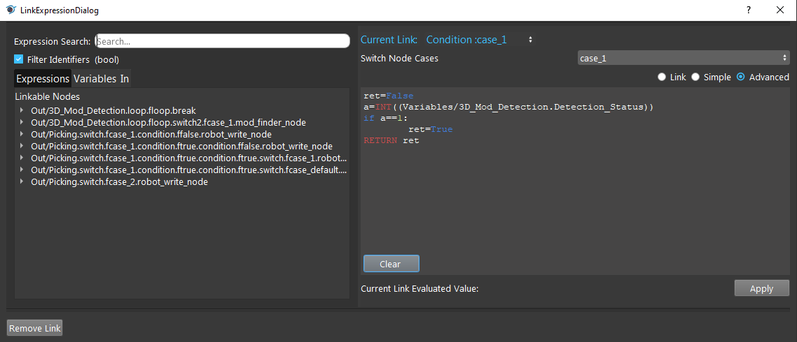

Advanced Link Value
===========

Advanced link value allows users to input Python codes in the link. This can simplify the flowchart if this node is used in any other branches but just taking different values for different branch. RETURN is for the final link value, without this action the link would not be success. 
