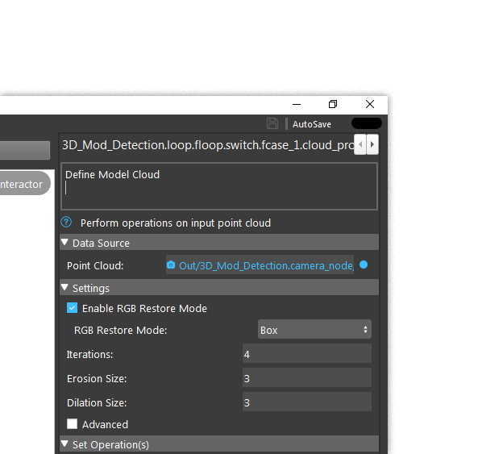

Link 
**********

Links are the communications between nodes. All the nodes have inputs and outputs. Links are important for the node input. Link value indicates what would be the input for the node. For example, as the image shown below: 

The data source (in content view window) is the input for node Cloud Process. We can see that Cloud Process Node takes a Point Cloud type input. Clicking on the blue dots on the right opens up Link Expression Dialog. 

.. image:: image/link_dialog.png
   :width: 650

The Link Expression Dialog has Linkable List and Link Value. Expressions are showing the linkable nodes for this selected node. Link Value is on the right side of the dialog box, it has Link, Simple and Advanced link value. 

.. toctree::
   :maxdepth: 2
    
   Link Value
   Simple Link Value
   Advanced Link Value